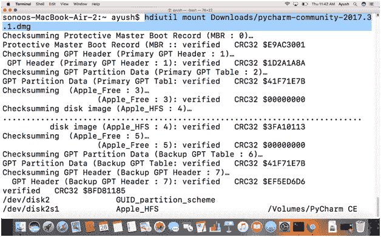
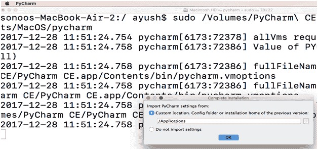
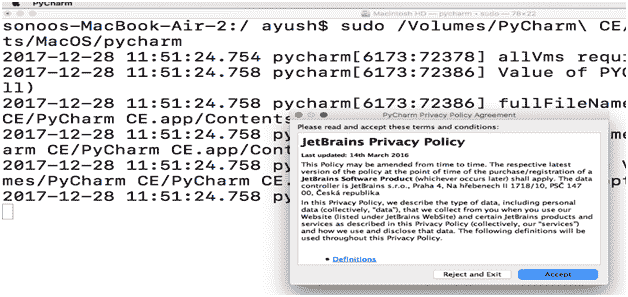
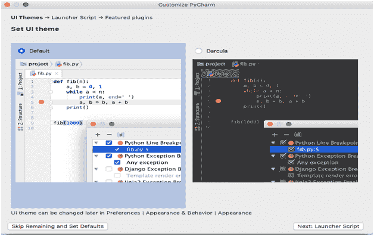
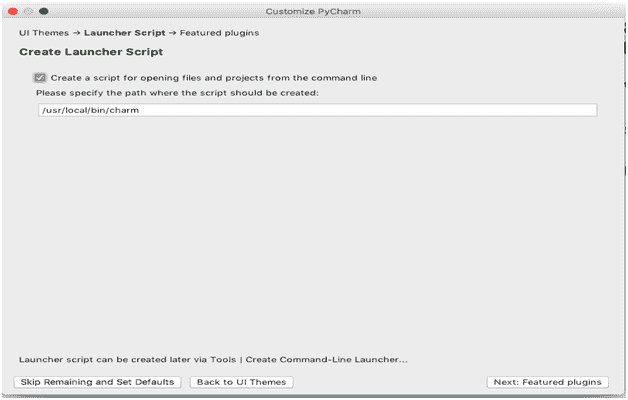
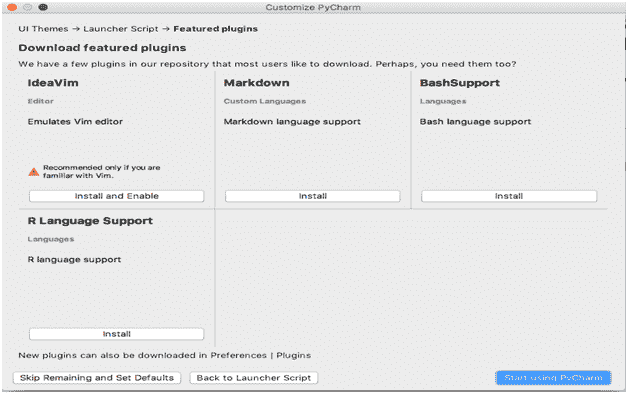
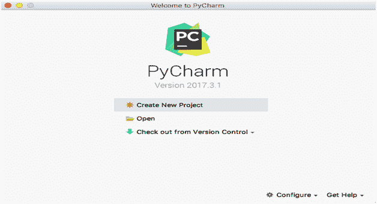

# 如何在 MacOS 上安装 PyCharm

> 原文：<https://www.javatpoint.com/how-to-install-pycharm-on-mac>

### 介绍

Pycharm 可以定义为主要用于 Python 编程的IDE(IDE)。它是由捷克公司开发的。PyCharm 是一个跨平台的代码编辑器，这意味着它也可以在各种版本的 Linux、MacOS 和 Windows 上使用。社区版是在 Apache 许可下发布的。

在本教程中，我们将在 MacOS 上安装 PyCharm。

### 先决条件

1.  苹果
2.  以管理员身份登录终端

## 装置

以下步骤用于在 MacOS 上安装 PyCharm。

1) **下载最新版本**

为了在 MacOS 上安装 PyCharm，我们首先要通过访问其官方网站或在浏览器的搜索栏中粘贴以下链接来下载最新版本:[https://www . jet brains . com/py charm/download/download-thanks . html？平台=mac &代码=PCC](https://www.jetbrains.com/pycharm/download/download-thanks.html?platform=mac&code=PCC) 。

2) **挂载文件**

下载的文件为 **dmg** 格式，即磁盘镜像文件。我们需要将此文件装载到卷目录中。为此，使用以下命令

```

$ hdiutil mount Downloads/pycharm-community-2017.3.1.dmg

```



3） **运行温度：**

运行以下命令开始 PyCharm 的安装过程。

```

$sudo /Volumes/PyCharm\ CE/PyCharm\ CE.app/Contents/MacOS/pycharm

```

这里， **Pycharm** 是一个二进制可执行文件。它开始在 MacOS 上安装 PyCharm。

选择自定义位置**/应用**并按回车键。



该步骤提示用户**接受**软件的隐私策略。点击**接受**继续。



这一步提示我们设置一个 UI 主题。我们可以从两者中选择任何一个。选择一个，点击**下一步。**



在这一步中，窗口提示设置创建脚本的路径。我的情况是/ **usr/local/bin/charm。**设置路径，点击下一步进入下一步。



这提示我们安装特色插件。我们可以安装所需的功能，如果我们希望它们与我们的编辑器兼容。当我们安装完插件后，我们点击开始使用 PyCharm 来开始使用 PyCharm。



现在，我们已经在我们的 MacOS 上安装了 PyCharm community 2017.3，我们可以使用它以任何语言进行编码，但主要是 Python。


我们可以点击**创建新项目**开始新项目的工作。



因此，我们成功地在 MacOS 上安装了 PyCharm。