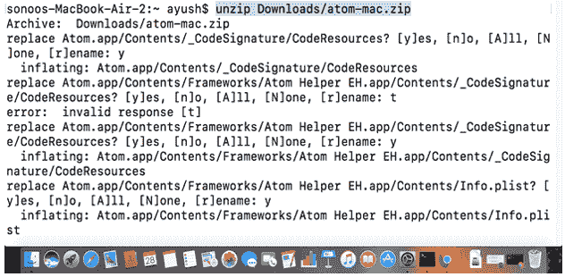
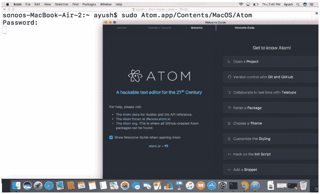
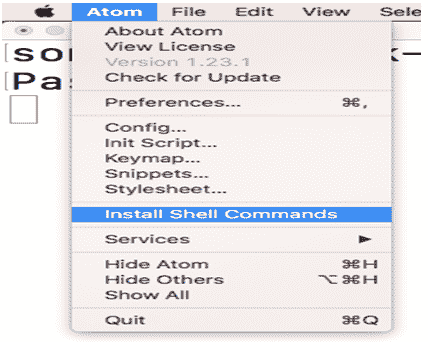
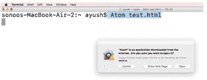
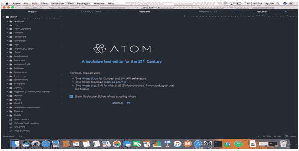

# 如何在苹果电脑上安装 Atom

> 原文：<https://www.javatpoint.com/how-to-install-atom-on-mac>

### 介绍

Atom 是一个免费的开源文本编辑器，可以用于 Linux、Windows 和 MacOS。它为用 Node.js 编写的插件提供支持。它基于 electron，这是一个可以使用 chromium 和 Node.js 实现跨平台桌面应用的框架。它的第一个版本于 2015 年 1 月 25 日发布。它也可以用作集成开发环境(IDE)。

在本教程中，我们将学习 Atom 在 MacOS 上的安装过程。

### 先决条件

1.  苹果
2.  以管理员身份登录终端

## 装置

以下步骤用于在 MacOS 上安装 Atom。

1.**下载并解压文件:**

只需将链接 https://Atom . io/download/macinto 粘贴到浏览器的搜索栏中，即可通过 Atom [官网 http://www.atom.ioor](http://www.atom.ioor) 下载 zip 文件。下载的文件将是一个存档文件(。zip)，安装 Atom 时需要提取该文件。使用以下命令提取归档文件。

```

$ unzip Downloads/atom-mac.zip  

```



2.**运行原子:**

为了启动 Atom 应用程序，需要执行位于 Atom.app/Contents/MacOS/**Atom 的可执行文件。**

```

$sudoAtom.app/Contents/MascOS/Atom

```



3.**安装外壳命令**

为了在系统上全局运行软件，我们需要安装 Atom 的 Shell 命令。为此，请转到计算机屏幕左上角的 atom 图标，并从下拉菜单中选择安装 Shell 命令。

这将安装与软件相关的所有 shell 命令。



4.**测试应用程序**

为了测试 atom 是否成功安装在系统上，我们可以简单地在终端上输入**Atom test.html**。这将创建一个名为 test.html 的文件。

```

$ Atom test.html

```

 

嗯，我们已经成功地在我们的 MacOS 上安装并测试了 Atom。