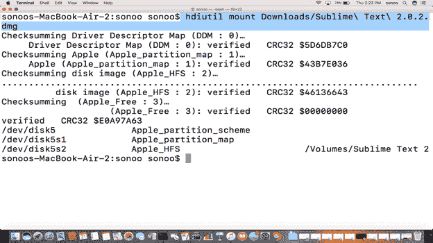
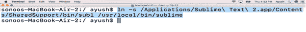
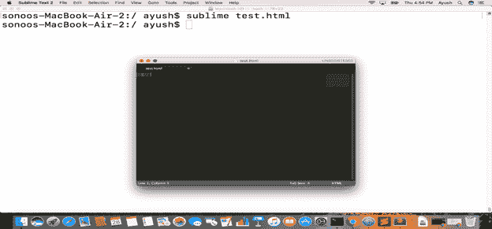

# 如何在苹果电脑上安装崇高文字

> 原文：<https://www.javatpoint.com/how-to-install-sublime-text-on-mac>

### 介绍

崇高文本是一个专有的跨平台源代码编辑器，具有 python 应用程序编程接口。它支持许多编程语言。崇高文本 2.0.2 于 2013 年 7 月 8 日发布。它包含 22 个不同的主题，可以选择下载其他主题。在本教程中，我们将在苹果电脑上安装崇高的文本。

### 先决条件

1.  苹果
2.  以管理员身份登录终端

## 装置

这包括以下步骤。

1) **下载 dmg 文件**

为了安装崇高文本编辑器，我们必须通过访问其官方网站或在浏览器的搜索栏中简单粘贴链接 [https://download .升华文本. com/崇高%20Text%20Build%203143.dmg](https://download.sublimetext.com/Sublime%20Text%20Build%203143.dmg) 来下载磁盘图像文件。

2) **挂载文件:**

从崇高文本官方网站下载的 dmg 文件需要安装到一个卷上。这将通过以下命令来完成。

```

$ hdiutil mount Downloads/Sublime\ Text\ 2.0.2.dmg 

```



3) **创建崇高文本到 bin 的链接:**

崇高文本编辑器安装在/应用程序中。要在终端上全局运行升华，我们必须首先创建/Applications/“升华文本 2”/Contents/shared support/bin/subl 进入/usr/local/bin 的符号链接。因为它包含了所有在系统上被全局识别的二进制可执行文件，所以现在我们可以通过在终端上从任何位置简单地键入崇高来运行崇高文本编辑器。

可以使用以下命令创建链接。

```

$ ln -s /Applications/Sublime\ Text\ 2.app/Contents/SharedSupport/bin/subl /usr/local/bin/sublime

```



4) **测试升华**

现在我们可以创建任何带有崇高的文本文件，只需输入崇高和文件名。



5) **卸载文件**

当我们完成崇高的安装时，文件需要卸载。为此，请使用以下命令。

```

$ hdiutil unmount /Volumes/Sublime\ Text\ 2

```

因此，我们已经成功地在我们的苹果电脑上安装了崇高的文本 2。