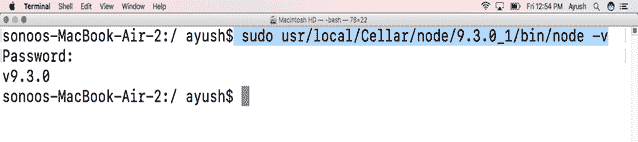
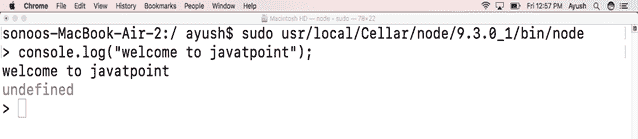

# 如何在 MacOS 上安装 Node.js

> 原文：<https://www.javatpoint.com/how-to-install-nodejs-on-mac>

### 介绍

Node.js 是一个开源的、跨平台的 JavaScript 运行时平台，它使 JavaScript 能够用于服务器端脚本。虽然。js 是 JavaScript 文件的扩展名，但它不代表框架的任何文件。现在它已经成为“随处 JavaScript”范例的基础元素。

在本教程中，我们将学习在 MacOS 上安装 Node.js 过程中涉及的步骤。

### 先决条件

*   苹果
*   自制程序必须安装在系统上。

* * *

## 装置

这包括以下步骤。

1) **更新自制包安装程序的库索引**

**自制包安装程序**的仓库索引需要先更新。这可以在以下命令的帮助下完成:

```

$ brew update

```

2) **安装 Node.js**

在更新自制软件包安装程序的存储库索引后，我们需要使用以下命令安装 Node.js:

```

$ brew install node.js 

```

这将在 **/usr/local/** 的 **Celllar** 目录中安装 Node.js。


为了验证我们已经安装了所需版本的 Node.js，我们可以运行命令 **node -v** 。它将显示安装在我们的苹果电脑上的版本。



要在 MacOS 上运行 node.js，只需执行 node 命令。它将提供我们可以运行 JavaScript 代码的开发环境。



嗯，我们已经成功地在 MacOS 上安装了 Node.js。