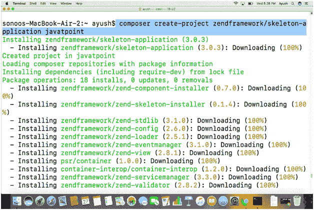
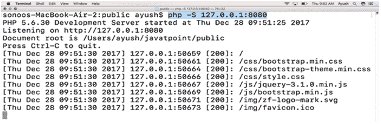
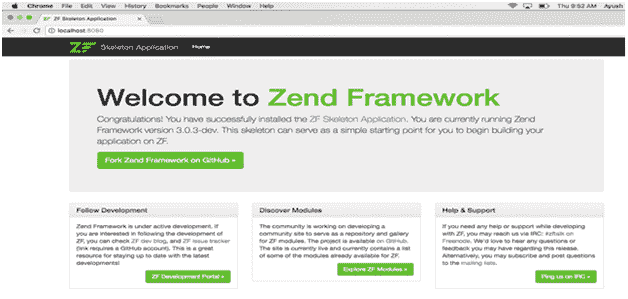

# 如何在 MacOS 上安装 Zend 框架

> 原文：<https://www.javatpoint.com/how-to-install-zend-framework-on-mac>

### 介绍

Zend 框架是一个基于 PHP5 的开源、面向对象的 web 应用框架，在新的 BSD License 下获得许可。Zend 框架为用户提供了模型视图控制器的支持。它基本上是基于 PHP 的包的集合。

在本教程中，我们将在我们的 MacOS 上安装 Zend 框架。

### 先决条件

1.  苹果
2.  PHP 版本 5 或更高版本
3.  系统上必须安装 Composer。

## 装置

以下步骤用于在 MacOS 上安装 Zend 框架。

1) **安装 Zend:**

在 MacOS 上安装 Zend 是一项非常简单的任务。这只需要一个命令就可以创建一个安装了 Zend 的项目目录(在我的例子中被命名为 JavaTpoint)。下面的命令用于这样做。

```

$ composer create-project zendframework/skelton-application javatpoint

```



2) **启动 PHP 开发服务器:**

当我们使用 composer 安装 Zend 框架时，我们会得到一个位于主目录中的目录，这是 Zend 的安装目录。要通过 localhost 访问浏览器上的 Zend，必须启动 PHP 开发服务器。首先，我们必须使用以下命令将工作目录更改为 **javatpoint/public** :

```

$ cd javatpoint/public 

```

然后我们使用以下命令启动开发服务器。

```

$ php -S 127.0.0.1:8080 

```

其中 8080 是服务器将侦听的端口号。



3) **从本地主机访问 Zend:**

在浏览器的搜索栏中键入 **localhost:8080** ，我们会得到我们新安装的 Zend Framework 的欢迎页面。



因此，我们已经成功地在我们的 MacOS 上安装了 Zend 框架。