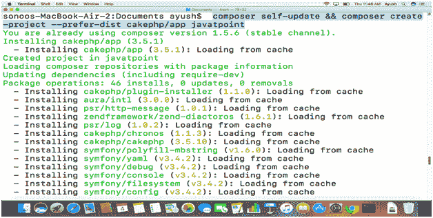
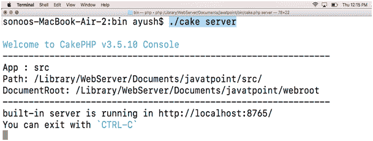
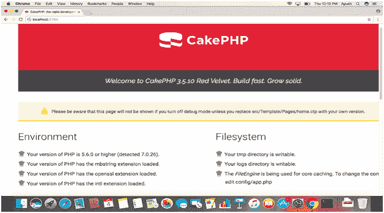

# 如何在 MacOS 上安装 CakePHP

> 原文：<https://www.javatpoint.com/how-to-install-cakephp-on-mac>

### 介绍

CakePHP 是一个遵循模型-视图-控制器方法的开源网络框架。它是用 PHP 编写的，并在麻省理工学院许可下分发。2005 年 4 月，它由一位波兰程序员 Michal Tatarynowicz 启动。其首个版本于 2006 年 5 月发布。在本教程中，我们将在 MacOS 上安装 CakePHP。

在本教程中，我们将在我们的 MacOS 上安装 Zend 框架。

### 先决条件

1.  苹果
2.  以管理员身份登录终端
3.  PHP 5.6 版或更高版本
4.  PHP mbstring 扩展
5.  PHP 国际扩展
6.  设计者

## 装置

安装包括以下步骤。

1) **使用 Composer** 安装 CakePHP

运行以下命令，使用 composer 安装 CakePHP。

```

$ composer self-update && composer create-project -prefer-distcakephp/app javatpoint

```



这将在位置/库/网络服务器/文档上安装 CakePHP

2) **配置阿帕奇**

运行以下命令在编辑器中打开 Apache 的配置文件。

```

$ vi /etc/apache2/httpd.conf 

```

在文件中找到以下代码

```
 Options Indexes FollowSymLinks
AllowOverride None
Require all granted 
```

并用下面的代码替换它。

```

<Directory />
Options Indexes FollowSymLinks
AllowOverride All
Require all granted
</Directory>

```

3) **重启服务器。**

我们现在需要重启服务器。为此，请使用以下命令。

```

$ sudoapachectl restart

```

4) **运行 CakePHP 服务器**

使用以下命令将当前工作目录更改为 CakePHP 的安装目录。

```

$ cd /Library/WebServer/Documents/javatpoint/bin 

```

要通过 localhost 在浏览器上访问 CakePHP，我们需要使用以下命令运行服务器。

```

$ ./cake server

```



它将启动监听端口 8765 的 CakePHP 服务器。

5) **在浏览器上访问**

要在浏览器上访问 CakePHP，我们在浏览器的搜索栏中键入 **localhost:8765** 。



因此，我们已经成功安装并开始使用 CakePPHP 3 . 5 . 10 版本。