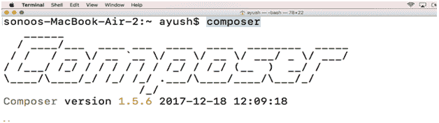
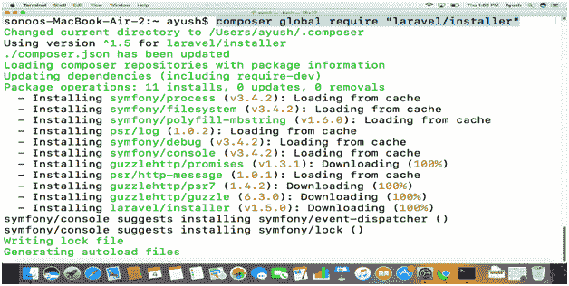
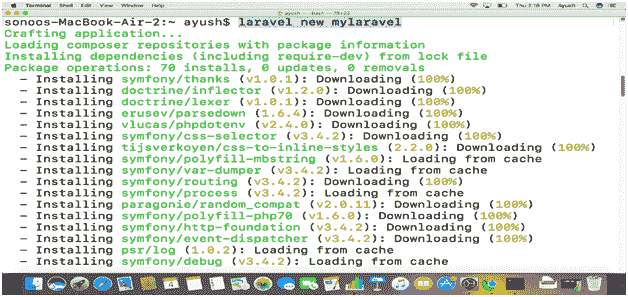
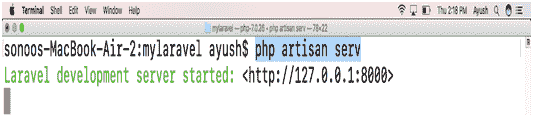
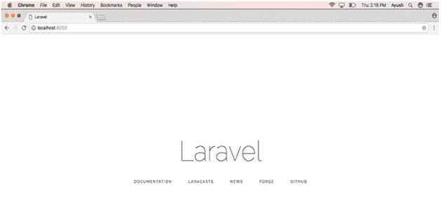

# 如何在 MacOS 上安装 Laravel

> 原文：<https://www.javatpoint.com/how-to-install-laravel-on-mac>

### 介绍

Laravel 是一个用 PHP 编写的免费开源网络框架。它是由泰勒·奥特韦尔创作的。它遵循 MVC 开发方法。截至 2015 年 3 月，Laravel 被认为是最流行的基于 PHP 的框架之一。它提供了 CodeIgniter 的高级替代方案，CodeIgniter 不打算内置用户授权。在本教程中，我们将在 MacOS 上安装 Laravel。

### 先决条件

1.  苹果
2.  XAMPP(洗发精)
3.  以管理员身份登录终端
4.  PHP >= 7.0.0
5.  扩展
6.  PDO PHP 扩展
7.  扩展
8.  令牌器 PHP 扩展
9.  XML PHP 扩展
10.  以超级用户身份登录终端
11.  设计者

## 装置

安装包括以下步骤。

1) **验证作曲者**

通过在终端上键入 **composer** ，验证 composer 是否在系统上全局安装。



2) **用 Composer 安装 Laravel】**

为了在 MacOS 上安装 Laravel，需要执行一个简单的命令。

```

$ composer global require "laravel/installer"

```



3) **编辑 bash 配置文件**

要在终端上全局运行 Laravel，我们需要编辑 bash 配置文件。键入以下命令在 vieditor 中打开 bash-profile。

```

$ vi ~/.bash_profile

```

并将下面一行添加到文件中。

```

$ export PATH=~/.composer/vendor/bin:$PATH

```

使用以下命令获取文件。

```

$ source ~/.bash_profile

```

4) **创建新应用程序**

现在，我们可以在终端上全球运行 Laravel。为此，我们需要运行以下命令。

```

$ laravel new mylaravel

```



这将在当前用户的主目录中创建一个名为**my rawl 的应用程序。**

5) **启动服务器**

Laravel 提供自己的服务器，需要启动该服务器才能访问 localhost 上的 **Laravel** 。首先，我们需要通过在终端上键入**光盘播放器来更改目录，然后运行以下命令来启动服务器。**

```

$ php artisan serv

```



6) **本地主机上的访问**

我们只需简单地输入 **localhost:8000** 即可在浏览器上访问 Laravel。



因此，我们已经安装并开始使用 Laravel。