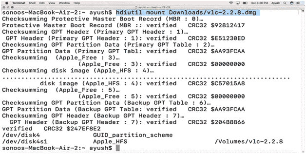
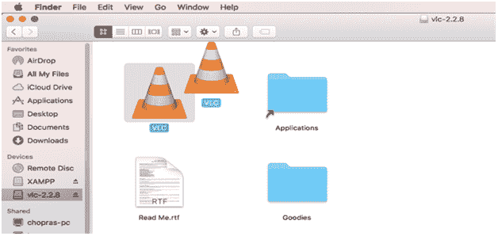
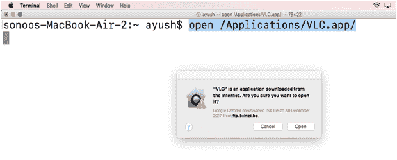
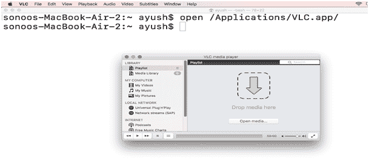
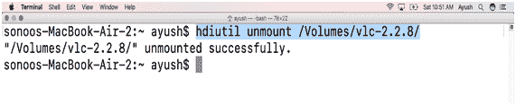

# 如何在苹果电脑上安装 VLC

> 原文：<https://www.javatpoint.com/how-to-install-vlc-on-mac>

### 介绍

VLC 是一个开源的，跨平台的媒体播放器，支持许多视频和音频压缩方法和文件格式。它由 VideoLan 开发，并于 2001 年 2 月在 GNU 公共许可下首次发布。在本教程中，我们将学习在苹果电脑上安装 VLC 的过程。

### 先决条件

1.  苹果
2.  以管理员身份登录终端

## 装置

安装包括以下步骤。

1) **下载最新 VLC 版**

为了在 MacOS 上安装 VLC，我们必须通过 VLC 的官方网站或者简单地将链接[https://get.videolan.org/vlc/2.2.8/MacOSx/vlc-2.2.8.dmg](https://get.videolan.org/vlc/2.2.8/MacOSx/vlc-2.2.8.dmg)粘贴到浏览器的搜索栏中来下载最新版本的。

2) **挂载文件**

从互联网下载的文件，存在于磁盘映像中()。dmg)格式。这需要装载到/Volumes 目录。这可以通过使用简单的命令来完成。

```
$ hdiutil mount Downloads/vlc-2.2.8.dmg 

```



3) **拖放应用文件**

当我们将磁盘映像文件装入**/卷目录**时，我们会得到一个应用程序文件**(。储存在 **/Volumes/vlc-2.2.8 中的**。**要在应用程序目录中正确安装 VLC，我们必须将该应用程序文件拖放到应用程序目录中。整个过程如下图所示。



4) **打开应用程序**

我们可以使用下面给出的简单命令打开应用程序。

```
$ open /Applications/VLC.app

```




5) **卸载文件**

使用以下命令卸载安装程序文件。

```
$ hdiutilunmount /Volumes/vlc-2.8.8/

```



因此，我们已经成功安装并开始使用 VLC 媒体播放器。现在，我们可以使用它播放音频和视频文件。