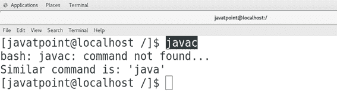
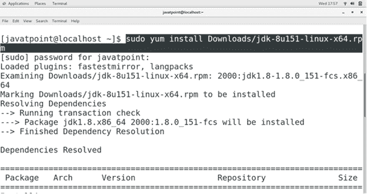
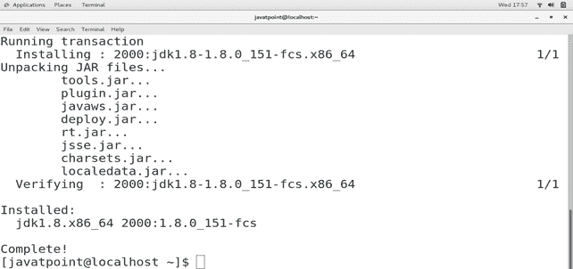
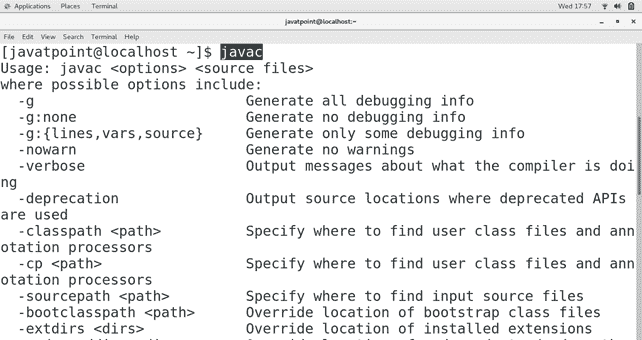

# 如何在中央操作系统上安装 Java

> 原文：<https://www.javatpoint.com/how-to-install-java-on-centos>

## 介绍

Java 是最流行的、通用的、面向对象的、安全的、健壮的、可移植的编程语言，它是由太阳微系统公司在 1995 年开发的。它的发展是由**詹姆斯·高斯林、迈克谢里丹**和**帕特里克诺顿**发起的。Java 遵循“**写一次运行在任何地方**”的范式，这意味着一个 Java 代码不需要在各种机器上反复编译。Java 最新版本是 Java 9，发布于**2017 年 9 月 21 日**。在本教程中，我们将学习 java 在 CentOS 上的安装过程。

### 先决条件

*   CentOS 7
*   以管理员身份登录终端。
*   **Yum** 必须在系统上配置。

## 装置

1) **更新百胜**的本地存储库索引

使用以下命令更新 yum 的本地存储库索引。

```

$ yum update

```

2) **检查 Java**

使用以下命令检查 java 是否已经安装在系统上。

```

$ javac

```



3) **下载 JDK8**

访问[http://www . Oracle . com/tech network/Java/javase/downloads/JDK 8-downloads-2133151 . html](http://www.oracle.com/technetwork/java/javase/downloads/jdk8-downloads-2133151.html)下载 64 位 centos 7 JDK 8 的 rpm 包。

4) **安装 Java**

使用以下命令安装 Java。

```

$ sudo yum install Downloads/jdk-8ul5l-linux-x64.rpm

```




5) **验证 Java**

在终端上输入 **javac** 进行验证，如果 Java 安装在我们的 CentOS 上。它给出如下回答。



因此，我们已经成功地在 CentOS 上安装了 Java。