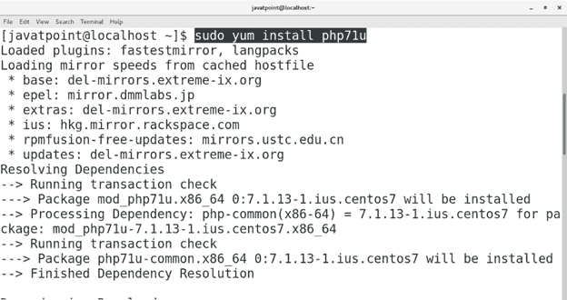
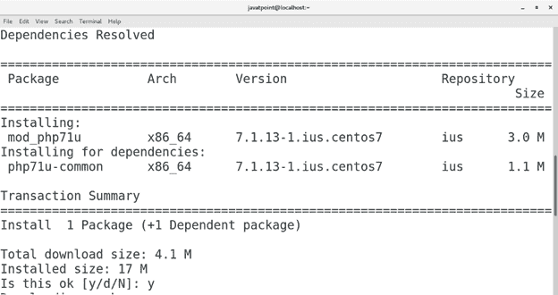
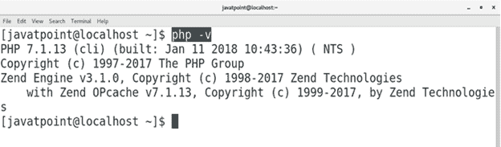

# 如何在 CentOS 上安装 PHP

> 原文：<https://www.javatpoint.com/how-to-install-php-on-centos>

## 介绍

PHP 是一种服务器端脚本语言。最初它是为 web 开发而设计的，但也可以用作通用语言。它是由拉斯马斯·勒德尔夫于 1994 年在 T2 创造的。原本代表**个人主页**，现在代表**超文本预处理器**。PHP 代码可以嵌入到 HTML 中。PHP 基本上是一种由 web 服务器或 CGI 可执行文件实现的解释语言。在本教程中，我们将学习在 CentOS 上安装 PHP 的步骤。

### 先决条件

*   CentOS 7
*   以管理员身份登录终端
*   必须在系统上配置 Yum。
*   ius-发布存储库必须存在。

## 装置

安装包括以下步骤。

1.**检查 PHP**

只需在终端上输入 **php** 即可检查系统上是否存在 php。就我而言，它不存在。

2.**安装 PHP**

在 centos7 上安装 php 需要 ius-release 存储库，可以通过执行以下命令来安装。

```

$ sudo yum install ius-release

```

一旦 ius-release 的安装完成，我们只需执行以下命令即可安装 PHP 7.1 版本。

```

$ sudo yum install php71u

```

 

3.**验证 PHP**

我们可以通过检查 php 的版本来检查 PHP 是否已经成功安装在系统上。为此，请执行以下命令。

```

$ php ?v 

```



因此，我们已经在 CentOS 上安装并开始使用 PHP。