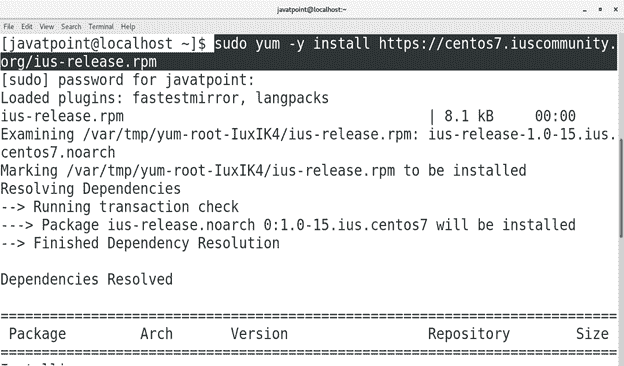
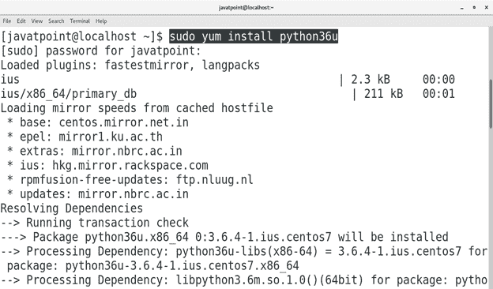
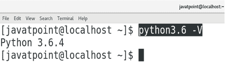
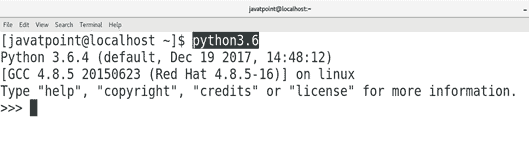

# 如何在 CentOS 上安装 Python 3

> 原文：<https://www.javatpoint.com/how-to-install-python-on-centos>

## 介绍

Python 是一种高级、动态、通用的语言。它是由圭多·范·罗森在 1991 年的《T2》中开发的。Python 的语法允许开发人员比任何其他编程语言使用更少的代码行。它主要关注程序的代码可读性。Python 2.7 默认安装在 CentOS 上，但是我们可以安装其他版本，比如 Python 3.5 和 3.6。在本教程中，我们将学习如何在 CentOS 上安装 Python 3.6.3。

### 先决条件

*   CentOS
*   以管理员身份登录终端
*   必须在系统上配置 Yum。

## 装置

安装包括以下步骤。

1.**安装 IUS 社区资源库**

为了在 CentOS 上安装 Python 3.6，我们需要首先安装 IUS 社区存储库，它为企业 Linux 提供了额外的软件包。执行以下命令安装 IUS 社区存储库。

```
$ sudo yum -y install https://centos7.iuscommunity.org/ius-release.rpm 

```



2.**安装 Python 3**

执行以下命令在 CentOS 上安装 python 3.6。

```
$ sudo yum install python36u 

```



3.**验证 Python**

为了验证我们是否安装了正确版本的 python，我们只需要在终端上键入 **python3.6 -V** 。该命令将显示安装的版本，在我的例子中是 3.6.4。



4.**在 Python 的脚本模式下工作**

只需在终端上键入 python3.6 即可进入 python 的脚本模式。我们可以在这个外壳上执行 python 语句。因为默认情况下 python 2 安装在 CentOS 上，所以在终端上键入 python 会将我们带到 python2 shell，因此我们必须键入 python3.6 来处理所需的 python shell。



执行得到解释的有效 python 语句，并在终端上显示所需的输出，如下所示。


因此，我们已经安装并开始使用 Python 3。