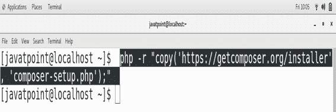
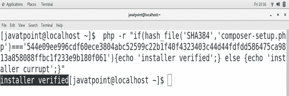
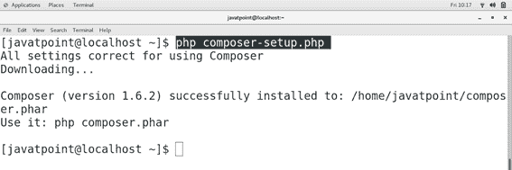
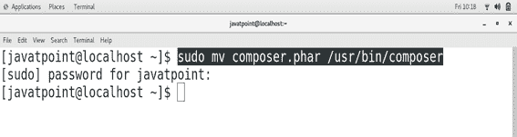
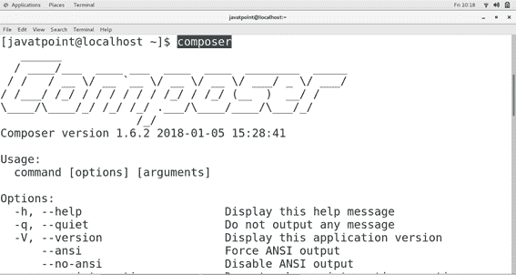

# 如何在CentOS上安装编辑器

> 原文：<https://www.javatpoint.com/how-to-install-composer-on-centos>

## 介绍

Composer 是一个 PHP 的应用程序包管理器。它为 PHP 软件和所需库的依赖关系管理提供了标准格式。它是由尼尔斯·阿德曼和 T2·乔迪·博加尼亚诺开发的。于**2012 年 3 月 1 日**发布。在本教程中，我们将学习 Composer 在 CentOS 上的安装过程。

### 先决条件

*   CentOS
*   服务器端编程语言（Professional Hypertext Preprocessor 的缩写）
*   以管理员身份登录终端

## 装置

安装包括以下步骤。

1) **下载**

执行以下命令，在 CentOS 上下载 **composer-setup** 。



2) **验证安装程序**

**composer-setup.php**的哈希文件代码需要验证。我们可以通过编写如下所示的 PHP 代码来验证它。



3) **运行编写器-设置**

执行名为 composer-setup.php 的文件，在 CentOS 上启动 composer 的安装过程。

```

$ php composer-setup.php

```



4) **将 Composer.phar 移动到/usr/bin/composer**

要在终端上全局访问 composer，需要将 Composer 的二进制可执行文件 composer.phar 复制到 **/usr/bin/** 中。为此，请使用以下命令。

```

$ sudo mv composer.phar /usr/bin/composer 

```



5) **验证作曲者**

只需在终端上键入 **composer** 即可检查 composer 是否全局安装在系统上。



因此，我们已经在终端上成功安装并开始使用 Composer。