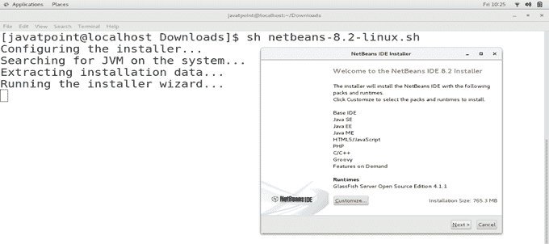
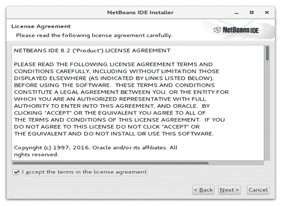
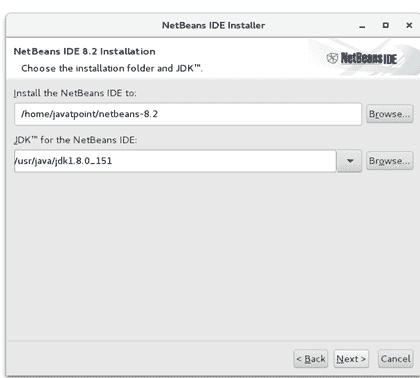
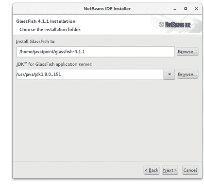
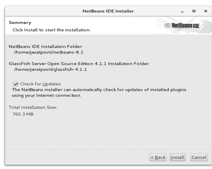
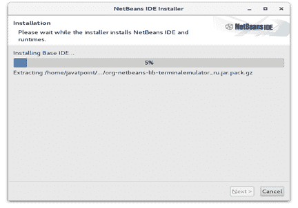
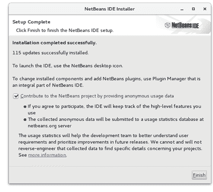
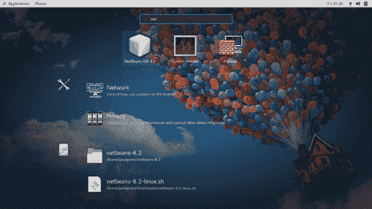
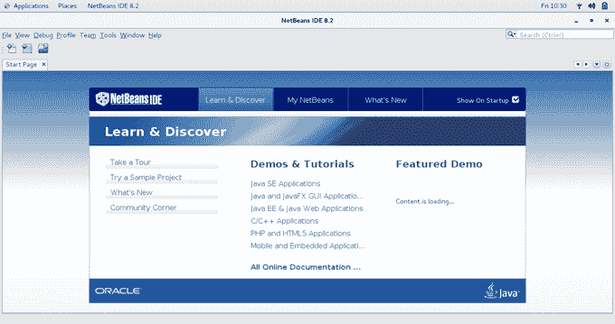

# 如何在 CentOS 上安装 NetBeans

> 原文：<https://www.javatpoint.com/how-to-install-netbeans-on-centos>

## 介绍

NetBeans 是用 Java 编写的软件开发平台，由**太阳微系统公司**开发。这是一个用于 Java 开发的**官方 IDE**。后来被**甲骨文**收购。NetBeans 的最新版本即 **NetBeans 8.2** 于 2016 年 10 月 2 日**发布**。在本教程中，我们将在 CentOS 上安装 NetBeans。

### 先决条件

*   CentOS
*   以管理员身份登录终端
*   必须在系统上配置 JDK。

## 装置

安装包括以下步骤。

1) **下载最新版本**

点击链接[https://netbeans.org/downloads/start.html?platform=linux&郎=恩&选项=全部下载最新版本的 NetBeans。](https://netbeans.org/downloads/start.html?platform=linux&lang=en&option=all)

2) **运行安装程序**

下载的文件是一个脚本文件 **netbeans-8.2-linux.sh** ，需要在终端上执行，才能在 CentOS 上启动 netbeans 的安装过程。

```

$ sh netbeans-8.2-linux.sh

```



接受许可协议，点击**下一步**继续。



该窗口简单提示输入 NetBeans 和 JDK 的安装位置，输入信息后点击**下一步**。



浏览需要安装 glassfish 的位置，并输入 glassfish 服务器将使用的 JDK 路径。



现在，我们都准备在 CentOS 上安装 NetBeans。只需点击**安装**即可开始安装。




点击**完成**完成安装并启动应用。



也可以通过在应用栏中搜索应用来启动应用。双击图标启动 NetBeans。




因此，我们已经成功安装并开始使用 NetBeans。