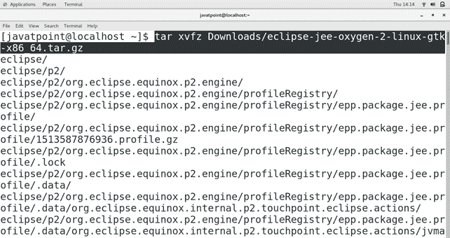
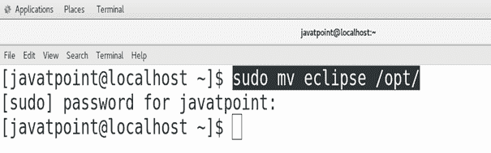
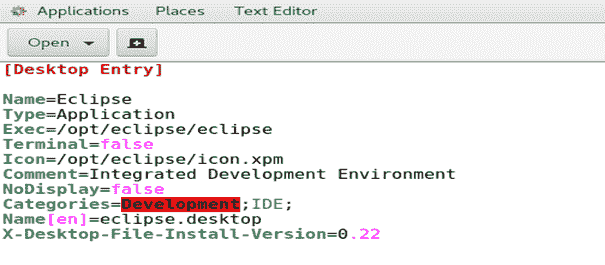
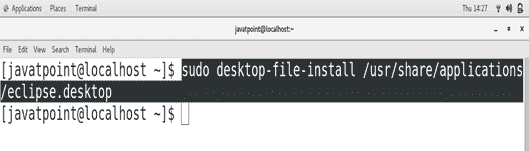
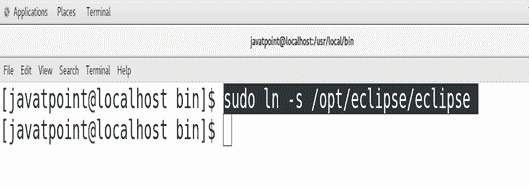
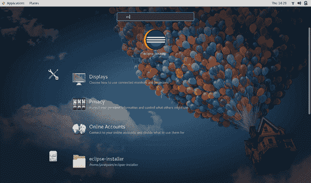
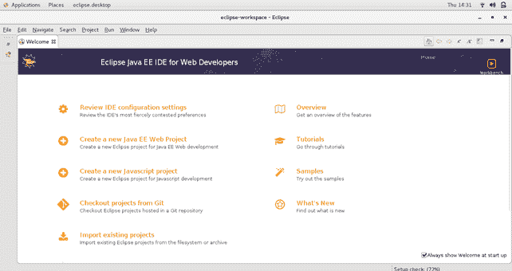

# 如何在 CentOS 上安装 Eclipse

> 原文：<https://www.javatpoint.com/how-to-install-eclipse-on-centos>

## 介绍

Eclipse 是一个**IDE(IDE)** ，主要用于 **Java 开发**。它包含一个基本工作空间和一个用于定制环境的可扩展插件系统。主要是**用 Java** 写的。也可以用 C、C++、C#、COBOL、D、Fortran、Haskell、JavaScript 等多种编程语言进行开发。在本教程中，我们将在 CentOS 上安装 Eclipse。

### 先决条件

*   以管理员身份登录终端
*   系统上必须安装 JDK。

## 装置

安装包括以下步骤。

1) **下载 Eclipse**

点击链接[https://www.eclipse.org/downloads/download.php?下载最新版本的月食(氧气)file =/oomph/EPP/oxygen/R/eclipse-inst-linux64 . tar . gz&mirror _ id = 1093](https://www.eclipse.org/downloads/download.php?file=/oomph/epp/oxygen/R/eclipse-inst-linux64.tar.gz&mirror_id=1093)。

2) **提取文件**

使用以下命令提取刚从互联网下载的文件。

```

$ tar xvfz Downloads/eclipse-jee-oxygen-2-linux-gtk-x86_64.tar.gz

```



3) **将 Eclipse 移动到/opt**

使用以下命令将提取的文件夹**移动到**/选择**中。**

```

$ sudo mv eclipse /opt/ 

```



4) **创建桌面文件**

在 **/usr/share/applications/** 中创建一个名为 **eclipse.desktop** 的桌面文件。为此，请使用以下命令。

```

$ sudo gedit /usr/share/applications/eclipse.desktop  

```

并在里面输入以下信息。



5) **安装文件**

使用以下命令安装桌面文件。

```

$ sudo desktop-file-install /usr/share/applications/eclipse.desktop

```



6) **创建符号链接**

将工作目录更改为 **/usr/local/bin** ，并运行以下命令在那里创建 eclipse 的符号链接。

```

$ sudo ln ?s /opt/eclipse/eclipse

```



7) **启动应用**

在应用目录中搜索 **eclipse** ，双击 eclipse 图标启动应用。



当我们启动应用时，eclipse 的欢迎页面出现了。



因此，我们已经成功安装并开始使用 Eclipse Oxygen。