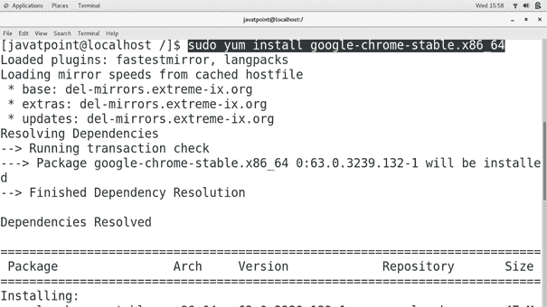
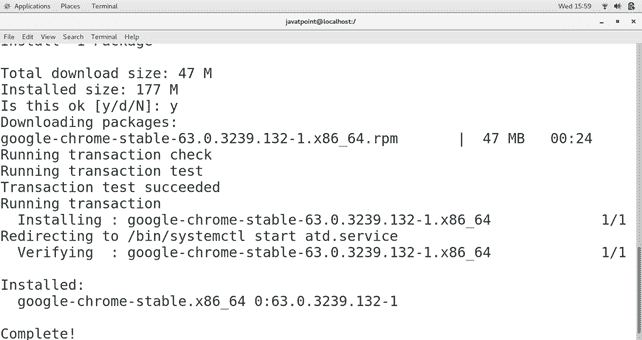

# 如何在 CentOS 上安装谷歌 Chrome

> 原文：<https://www.javatpoint.com/how-to-install-google-chrome-on-centos>

## 介绍

**谷歌 Chrome** 是由**谷歌**开发的免费网络浏览器，于 2008 年 9 月**发布**。它是 Chrome OS 的主要组件。最初是为**微软 Windows** 开发的，后来移植到 **Linux、MacOS、iOS、安卓**。谷歌在 **Chromium** 开源项目下发布其源代码。在本教程中，我们将在 CentOS 上安装谷歌 Chrome。

### 先决条件

*   CentOS
*   在终端上以 root 用户身份登录
*   **Yum** 必须在系统上配置。

## 装置

安装包括以下步骤。

1) **更新百胜**的本地存储库索引

使用以下命令更新 Yum 安装程序的本地存储库索引。

```

$ yum update 

```

2) **添加谷歌百胜资源库**

在**/etc/yum . repo . d/**中创建一个名为 **google-chrome.repo** 的文件，并在其中添加以下代码行。

```

[google-chrome]
name=google-chrome
baseurl=http://dl.google.com/linux/chrome/rpm/stable/$basearch
enabled=1
gpgcheck=1
gpgkey=https://dlssl.google.com/linux/linux_signing_key.pub

```

3) **安装谷歌 Chrome**

使用以下命令在 CentOS 上安装谷歌 Chrome。

```

$ sudo yum install google-chrome-stable.x86_64

```




4) **启动应用程序**

键入**谷歌浏览器&T1，在 CentOS 上启动谷歌浏览器应用程序。**


因此，我们已经成功安装并开始使用谷歌浏览器。