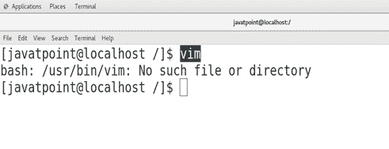
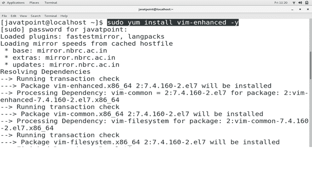
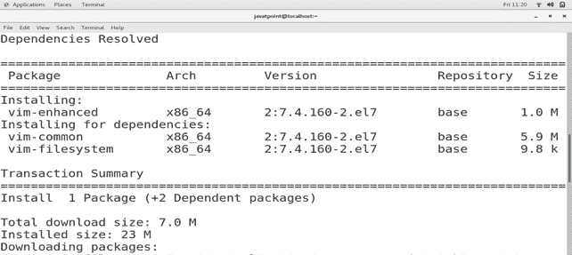
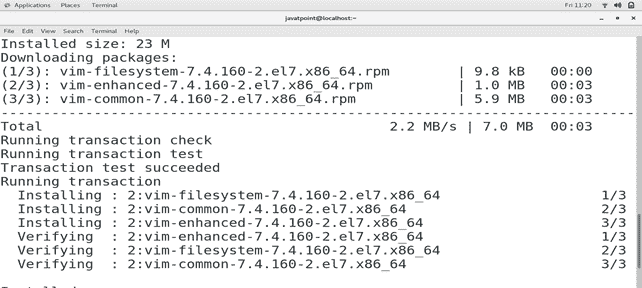
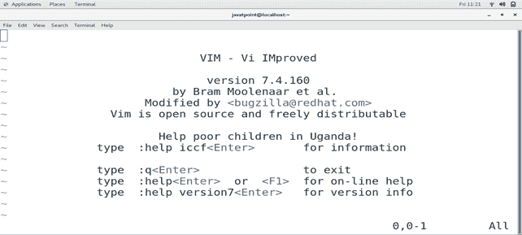

# 如何在 CentOS 上安装 VIM 编辑器

> 原文：<https://www.javatpoint.com/how-to-install-vim-on-centos>

## 介绍

VI 是最初为 **UNIX 操作系统**创建的面向屏幕的文本编辑器。它是由**布莱姆·米勒**在 **1991** 中创建的，并在许可证下发布，其中包括一些鼓励用户帮助**乌干达**贫困儿童的慈善条款。基本是 **Vi 编辑器**的增强版。Vim 代表 **Vi 改进后的**。在本教程中，我们将在 CentOS 上安装 VI 编辑器。

### 先决条件

*   CentOS
*   以管理员身份登录终端

## 装置

安装包括以下步骤。

1) **检查我来**

在终端上输入 **vim** ，检查 vim 是否已经安装在 CentOS 上。



2) **安装 VIM**

运行以下命令在 CentOS 上安装 vim。

```

$ sudo yum install vim-enhanced -y

```





3) **验证 VIM**

只需在终端上输入 **vim** ，检查是否正确安装在系统上。



因此，我们已经成功安装并开始使用 VIM。