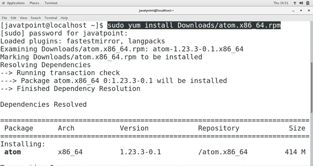
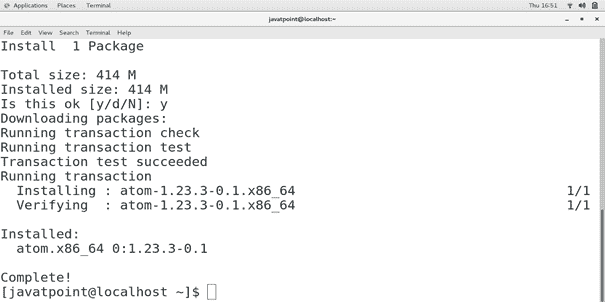
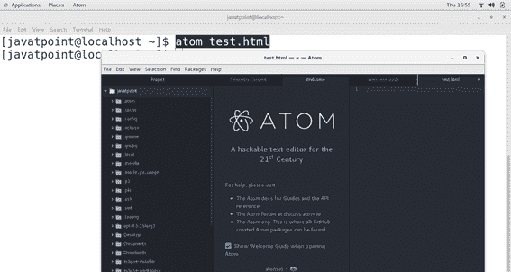

# 如何在中央操作系统上安装 Atom

> 原文：<https://www.javatpoint.com/how-to-install-atom-on-centos>

## 介绍

Atom 是一个免费的开源文本和 **MacOS、Linux 和微软 Windows** 的**源代码编辑器**。它基于电子，这是一个负责使用 Chromium 和 Node.js 实现跨平台应用的框架。它的第一个版本于 2015 年 1 月 25 日**发布。也可以作为集成开发环境。在本教程中，我们将学习 Atom 在 CentOS 上的安装过程。**

### 先决条件

*   CentOS
*   必须在系统上配置 Yum。
*   以管理员身份登录终端

## 装置

安装包括以下步骤。

1) **下载原子**

点击链接[https://atom.io/download/rpm](https://atom.io/download/rpm)下载最新版本的 atom

2) **用百胜**安装转速包

使用以下命令在 CentOS 上安装 Atom。

```
$ sudo yum install Downloads/atom.x86_64.rpm 

```




3) **验证原子**

键入**atom test.html**创建一个 HTML 文件。该命令打开文件进行编辑。



因此，我们已经在 CentOS7 上成功安装并开始使用 Atom。