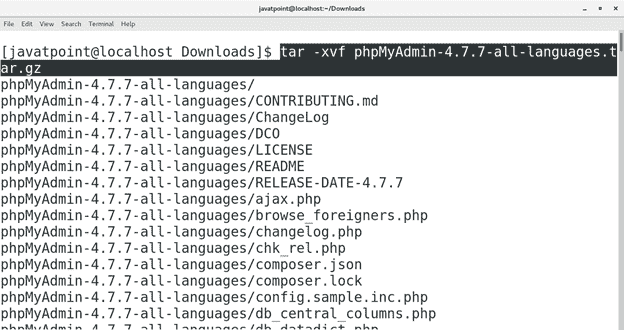
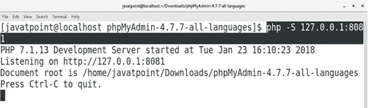
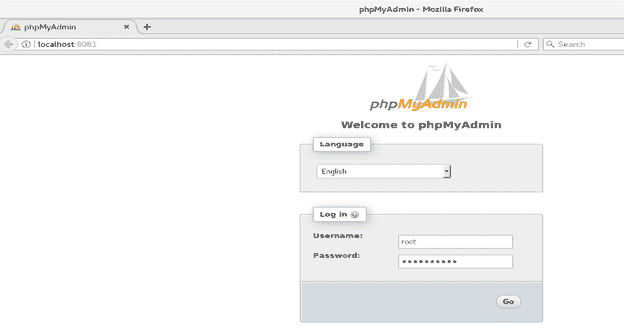
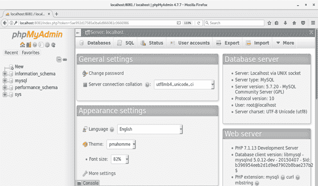

# 如何在 CentOS 上安装 phpMyAdmin？

> 原文：<https://www.javatpoint.com/how-to-install-phpmyadmin-on-centos>

## 介绍

PhpMyAdmin 是管理 **MySQL** 和 **MariaDB** 的免费开源工具。作为一个用 **PHP** 编写的可移植网络应用程序，它已经成为 MySQL 最流行的管理工具之一。在本教程中，我们将学习在 CentOS 上安装 phpMyAdmin 所涉及的步骤

### 先决条件

*   CentOS 7
*   在终端上以 root 用户身份登录
*   PHP 的最新版本

## 装置

安装包括以下步骤。

1.**下载并解压压缩文件**

为了访问 phpMyAdmin，我们必须通过点击链接下载其最新版本 https://files . phpMyAdmin . net/phpMyAdmin/4 . 7 . 7/phpMyAdmin-4 . 7 . 7-all-languages . tar . gz 这是一个需要提取的**tar.gz**格式的压缩文件。为此，请执行以下命令。

```

$ tar ?xvf phpMyAdmin-4.7.7-all-languages.tar.gz 

```



2.**启动 PHP 开发服务器**

通过键入**CD phpMyAdmin-4 . 7 . 7-全语言**将当前工作目录更改为**phpMyAdmin-4 . 7 . 7-全语言**，然后执行以下命令启动 PHP 开发服务器监听端口 8081。

```

$ php ?S 127.0.0.1:8081

```



3.**在浏览器上访问**

我们可以通过在浏览器的搜索栏中键入 **localhost:8081** 来访问 phpMyAdmin。浏览器显示如下外观。



输入数据库用户名和密码。按回车键继续。这将登录到一个名为 phpMyAdmin 的界面，在那里我们可以执行我们的 SQL 查询。



因此，我们已经在 CentOS 上安装并开始使用 phpMyAdmin。