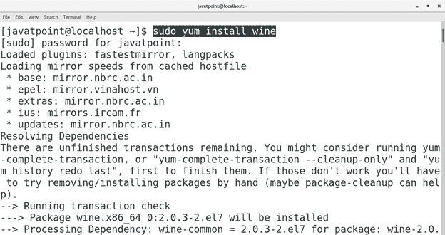
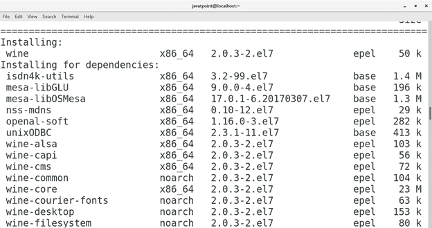
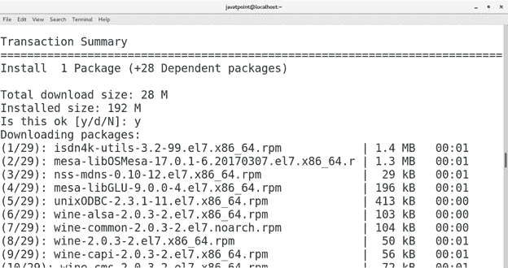

# 如何在 CentOS 上安装葡萄酒

> 原文：<https://www.javatpoint.com/how-to-install-wine-on-centos>

## 介绍

Wine 是一款允许我们在基于 Unix 和 Linux 的系统上运行 windows 应用的软件。它还包含 **winlib** ，开发者可以在其中编译 windows 应用程序。

它由**亚历山大·朱利亚德**设计开发，并于 **1993** 首次发布。

在本教程中，我们将在 CentOS 7 上的 Ubuntu 上安装 Wine。

### 先决条件

*   CentOS 7
*   以管理员身份登录终端
*   必须在系统上配置 Yum。
*   安装 EPEL 版本
*   安装 ius 存储库。

## 装置

安装包括以下步骤。

1.**装酒**

在 CentOS 7 上安装 Wine 真的非常简单。它只需要执行一个简单的命令。命令如下。

```

$ sudo yum install wine 

```

  

2.**跑酒**

只需在终端上键入葡萄酒即可运行 wine。为了正确运行葡萄酒，需要在启动时进行两次安装。执行安装即可。


我们也可以通过在应用程序中搜索来打开葡萄酒。


因此，我们已经安装并开始使用 Wine。现在我们可以在 CentOS 上安装记事本++等 windows 兼容软件。