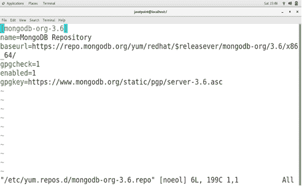
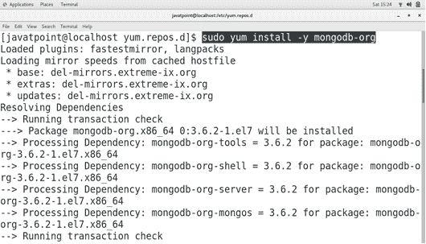
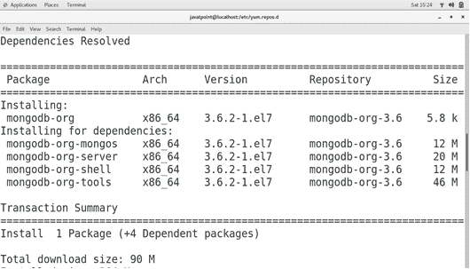
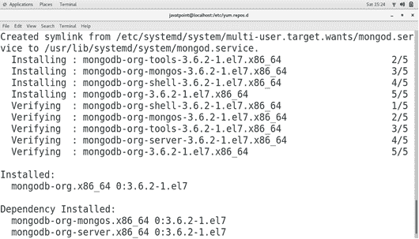
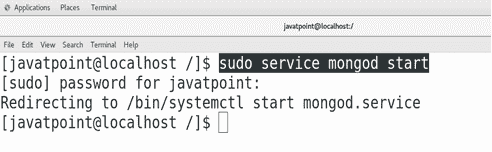
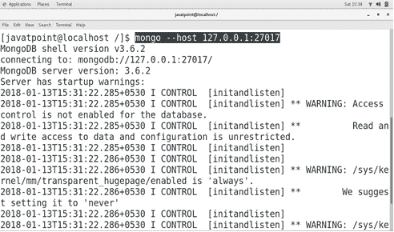
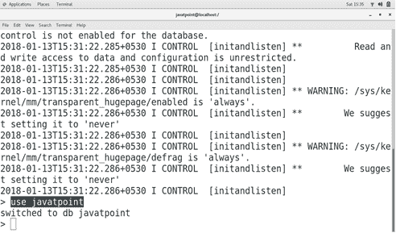
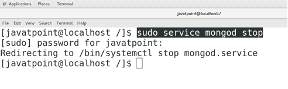
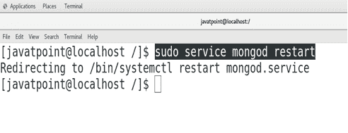

# 如何在 CentOS 上安装蒙古数据库

> 原文：<https://www.javatpoint.com/how-to-install-mongodb-on-centos>

## 介绍

MongoDB 是由 **MongoDB INC** 开发的跨平台、免费、开源、面向文档的 NoSQL 数据库管理系统。它使用类似 JSON 的带有模式的文档。它是在 **GNU Affero 通用公共许可证和 Apache 许可证**下发布的。在本教程中，我们将在 CentOS 7 上安装 MongoDB。

### 先决条件

*   CentOS 7
*   以管理员身份登录终端
*   必须在系统上配置 Yum。

## 装置

安装包括以下步骤。

1) **启用 MongoDB 存储库**

创建一个名为/etc/yum . repo . d/MongoDB-org-3.6 . repo 的文件，并添加图像中显示的文本详细信息。



2) **安装蒙戈布**

现在，启用了 MongoDB 存储库。我们可以使用以下命令安装它，

```
$ sudo yum install -y mongodb-org

```





3) **启动蒙戈布**

使用以下命令启动 MongoDB 服务器。

```
$ sudo service mongod start  

```



4) **在 MongoDB 外壳上工作**

使用以下命令连接 MongoDB 服务器。

```
$ mongo -host 127.0.0.1:27017

```



只需输入**使用<数据库-名称>** (在我的例子中是 javatpoint)来创建一个 MongoDB 数据库。



5) **停止服务器**

使用以下命令停止 MongoDB 服务器。



## 额外信息

使用以下命令重新启动服务器。

```
$ sudo service mongod restart 

```



因此，我们已经成功安装并开始使用 MongoDB。