# 如何在 CentOS 上安装 MariaDB？

> 原文：<https://www.javatpoint.com/how-to-install-mariadb-on-centos>

## 介绍

MariaDB 是一个开源的数据库管理系统。MariaDB 打算保持与 MySQL 的高兼容性。它是世界上最受欢迎的数据库之一。玛利亚数据库是以其创始人 T2 的小女儿玛利亚的名字命名的。在本教程中，我们将学习在 CentOS 上安装 MariaDB 过程中涉及的步骤。

### 先决条件

*   CentOS 7
*   以管理员身份登录终端
*   Yum 必须在系统上配置并更新。

## 装置

安装包括以下步骤。

1.**添加马里亚数据库库**

创建一个文件**/etc/yum . repo . d/Maria db . repo**，并将下面的代码放在里面。

```
[mariadb]

name = MariaDB

baseurl = http://yum.mariadb.org/10.1/centos7-amd64

gpgkey=https://yum.mariadb.org/RPM-GPG-KEY-MariaDB

gpgcheck=1

```

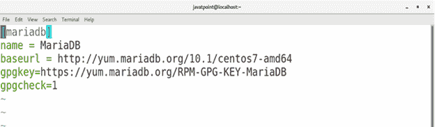

2.**安装马里亚数据库服务器**

由于 MariaDB 存储库已经被添加到 yum 包安装程序中，因此现在我们可以通过执行下面给出的一个简单命令来安装 MariaDB 服务器。

```

$ sudo yum install mariadb-server

```

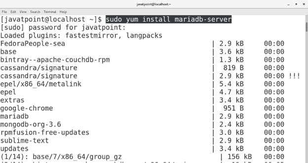 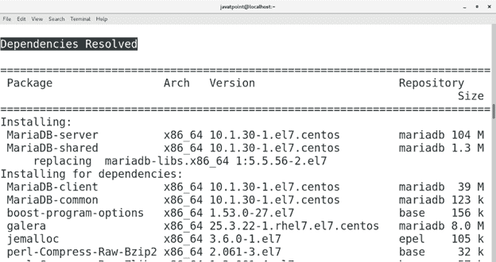 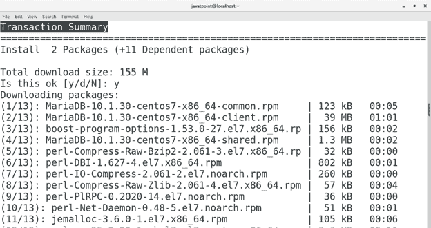 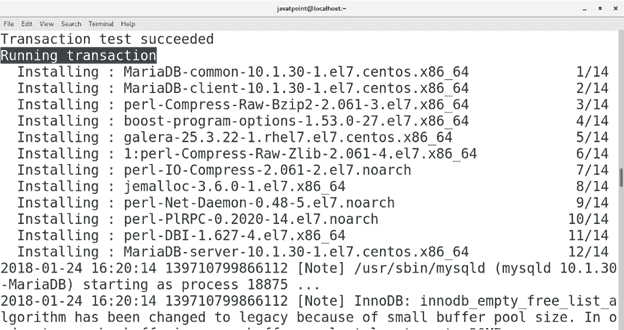 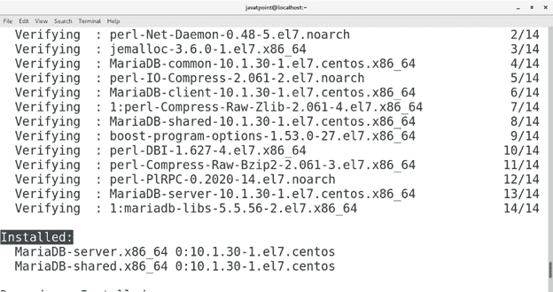

3.**启动 Mariadb-服务器**

现在，已经安装了 MariaDB 服务器。我们需要启动服务器，以便在终端上访问 MariaDB shell。为此，请执行以下命令。

```

$ systemctl start mariadb 

```

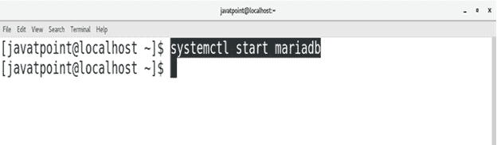

我们还可以通过执行以下命令在启动时启用 MariaDB-server。

```

$ systemctl enable mariadb 

```

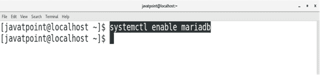

现在，如果我们检查服务的状态，那么我们将在系统上激活 MariaDB，并在启动时启用，如下所示的命令输出。

```

$ systemctl status mariadb 

```

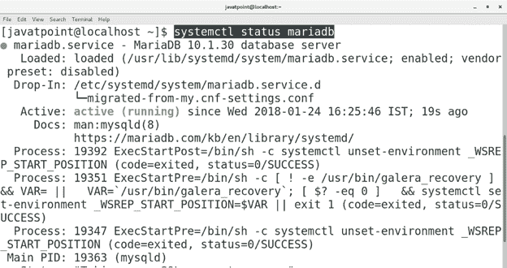

4.**服务器配置**

在终端上运行**MySQL _ secure _ installation**配置 MariaDB-server。这将提示用户输入用户根目录的密码。我们可以直接点击**进入**，因为我们是第一次安装。

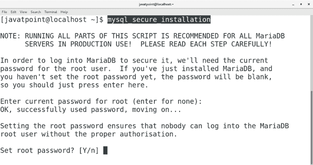

我们可以在这里设置默认情况下不设置的根密码。只需填写一个易于记忆的密码，按**进入**。


只需在所有选项中输入**‘y’**即可正确配置服务器。

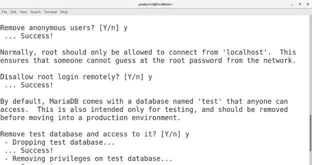 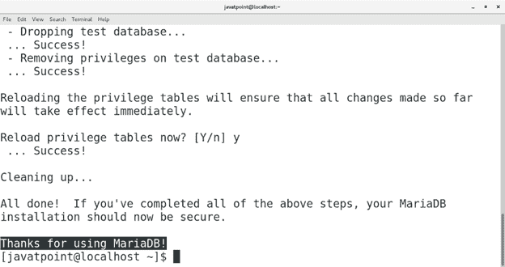

现在，我们都完成了在终端上访问 MariaDB shell 并执行查询。

5.**接入终端**上的马里亚数据库外壳

执行以下命令访问终端上的 MariaDB 外壳。

```

$ mysql -u root -password 

```

这将提示填写用户 root 的密码。只需输入我们刚刚设置的密码。按回车键继续。

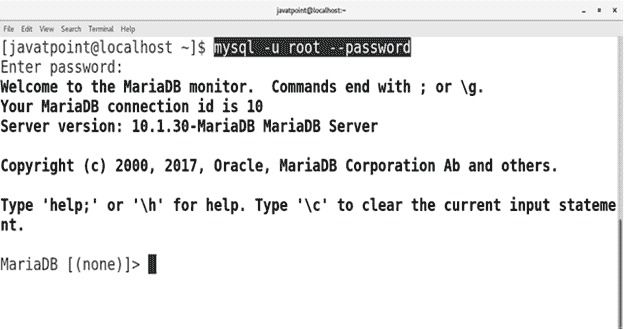

现在，打开了一个名为 MariaDB monitor(或 shell)的界面。在这里，我们可以执行与数据库相关的查询。通过执行以下查询，我创建了一个名为 **javatpoint** 的数据库。

```

> create database javatpoint;

```

我们也可以通过输入**显示数据库来列出我们创建的数据库；**在外壳上。这将显示服务器上存在的所有数据库。

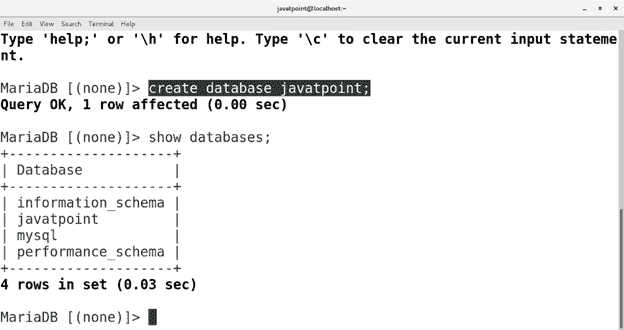

执行以下命令停止 MariaDB 服务器。

```

$ systemctl stop mariadb 

```

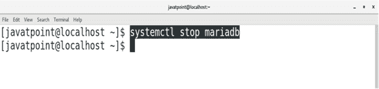

因此，我们已经在 CentOS 上安装并开始使用 MariaDB。