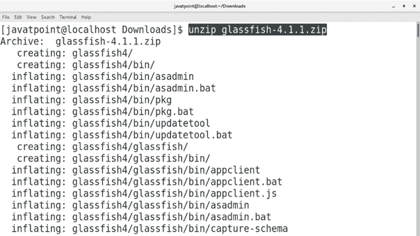
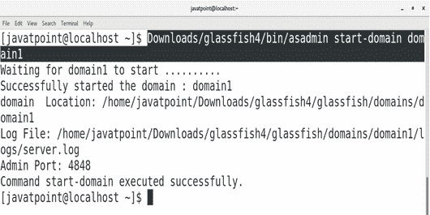
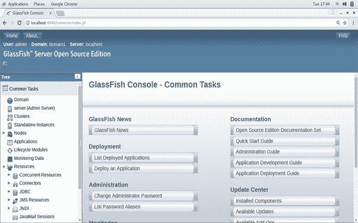
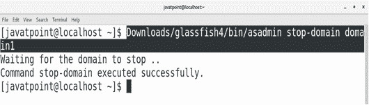

# 如何在 CentOS 上安装 Glassfish

> 原文：<https://www.javatpoint.com/how-to-install-glassfish-on-centos>

## 介绍

GlassFish 是由**太阳微系统公司为 Java 企业版**启动的应用服务器，现在被**甲骨文公司**收购。这是一个自由软件，在两个自由软件许可证下发布。一种是通用开发和发行许可证，另一种是 GNU 通用公共许可证。太阳微系统公司于 2005 年 6 月 6 日在**启动了这个项目。该项目的第一版于 2006 年 5 月 4 日发布。在本教程中，我们将在 CentOS 上安装 Glassfish**

### 先决条件

*   CentOS
*   以管理员身份登录终端

## 装置

1) **下载并提取 Glassfish**

点击链接[下载 glassfish 4 http://download . Oracle . com/glassfish/4 . 1 . 1/release/glassfish-4 . 1 . 1 . zip](https://download.oracle.com/glassfish/4.1.1/release/glassfish-4.1.1.zip)这将下载一个包含 glassfish 4 . 1 . 1 版本的 zip 文件。我们需要使用以下命令提取这个文件。

```
$ unzip glassfish-4.1.1.zip 

```



2) **启动 Glassfish 域**

名为 **asadmin** 的可执行脚本文件位于**下载/glassfish4/bin/** 中。要启动 glassfish 服务器，我们需要执行该文件。为此，我们可以更改目录，也可以将文件的绝对路径作为命令给出。

```
$ Downloads/glassfish4/bin/asadmin start-domain domain1

```



3) **在浏览器上访问 Glassfish**

我们只需要在浏览器的搜索栏中键入 **localhost:4848** 就可以在浏览器上访问 glassfish。



因此，我们在浏览器上访问了 glassfish。现在我们可以部署和管理我们的 web 应用程序了。

4) **停止 Glassfish 域**

要停止 Glassfish 域，请使用以下命令:

```
$ downloads/glassfish4/bin/asadmin stop-domain domain1

```



因此，我们已经安装并开始使用 Glassfish 版本 4。