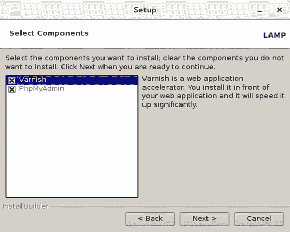
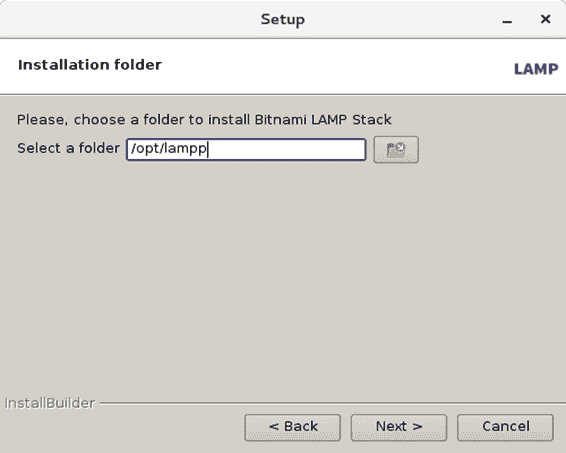
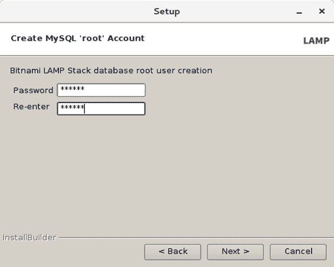
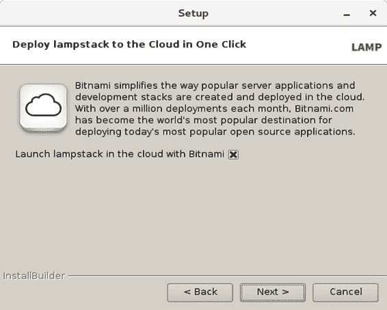
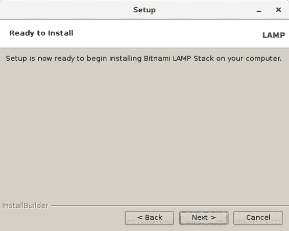
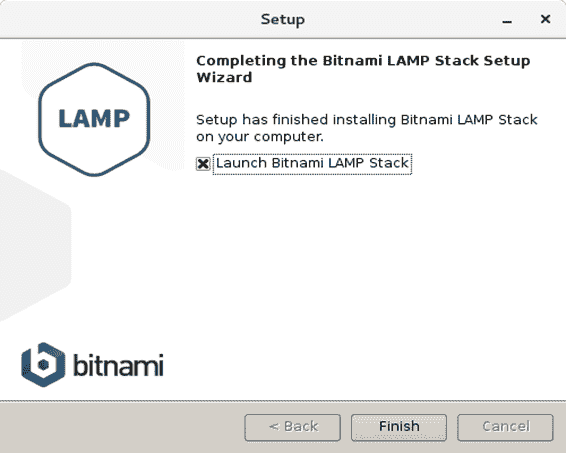
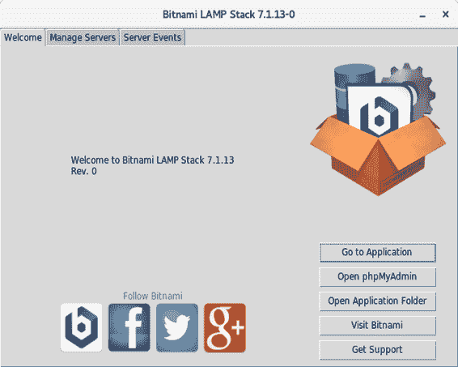
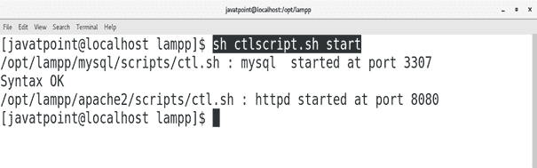
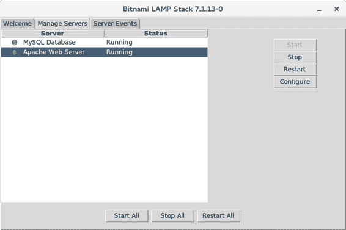
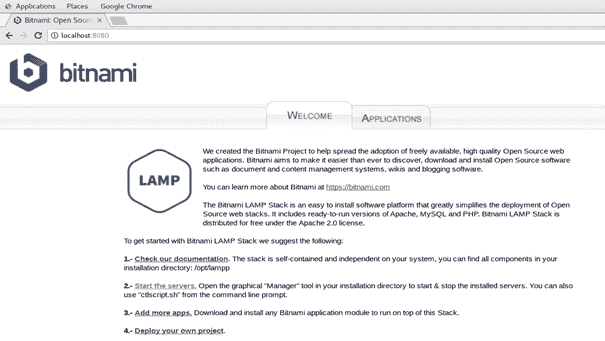

# 如何在 CentOS 上安装 LAMP？

> 原文：<https://www.javatpoint.com/how-to-install-lamp-on-centos>

## 介绍

LAMP 是用来指代软件套装的首字母缩略词，包含 Linux 操作系统、Apache web 服务器、MySQL 数据库和 PHP 编程语言。它也被称为 LAMP 堆栈，用于开发动态 web 应用程序。

它是一组软件，所以，我们可以独立安装所有的组件软件，也可以作为一个单元安装。在本教程中，我们将在 CentOS 上安装 LAMP。

### 先决条件

*   CentOS 7
*   以管理员身份登录终端

## 装置

1.**下载并执行安装程序**

点击链接下载二进制文件在 CentOS 上安装 LAMP:https://bitnami . com/redirect/to/172954/bitnami-LAMP stack-7 . 1 . 13-0-Linux-x64-installer . run .这是一个可以在终端上执行的二进制文件。为了执行文件，我们需要给文件赋予执行权限。为此，请执行以下命令。

```

$ chmod +x bitnami-lampstack-7.1.13-0-linux-x64-installer.run 

```

执行以下命令运行安装程序脚本。

```

$ ./bitnami-lampstack-7.1.13-0-linux-x64-installer.run 

```

当我们运行安装脚本时，会打开一个窗口，提示在 CentOS 上设置 LAMP。只需选择我们想要安装的所有组件，点击**下一步**。



下一个窗口提示浏览我们要安装 LAMP 的文件夹。就我而言，我选择了 **/opt/lamp** 。



这一步是最重要的一步，因为它需要根用户的数据库服务器密码。这个密码是用来在命令行上访问 MySQL 的，因此我们需要记住这个密码。只需输入一个易于记忆的密码，点击**下一步**。



这一步提示我们是否要在云上部署我们的灯栈。如果需要，勾选该选项并点击**下一步**。



现在，我们已经填写了所有需要的细节。安装程序已准备好开始安装过程。只需点击**下一步**即可开始流程。



现在，LAMP 正在安装我们的 CentOS。


现在，LAMP 已经安装在我们的 CentOS 上。选择**启动**选项启动 LAMP 堆栈管理器。



因此，Bitnami LAMP 堆栈已经推出。我们可以在图形用户界面模式下管理 Apache 和 MySQL 服务器。我们还可以在命令行上管理服务器。



2.**在 MySQL 命令行上工作**

将工作目录更改为**/opt/lampp/mysql/support-files**，执行以下命令启动 MySQL 服务器。

```

$ ./mysql.server start 

```

我们需要将工作目录更改为 **/opt/lampp/mysql/bin** ，并执行以下命令访问 MySQL shell。

```

$ ./mysql -u root -password 

```

只需输入我们在安装 LAMP 时输入的密码，它就会将我们带到 MySQL shell，在那里我们可以执行查询。在这里，我们通过执行以下查询创建了一个名为 **javatpoint** 的数据库。

```

> create database javatpoint;

```

3.**从命令行启动 Apache 和 MySQL】**

Apache 和 MySQL 也可以通过下面给出的简单命令启动。

```

$ sh ctlscript.sh start 

```



我们还可以通过在命令中提到名称来启动或停止单个服务器，如下所示。

```

$ sh ctlscript start mysql 

```

```

$ sh ctlscript start apache

```



我们可以通过在浏览器的搜索栏中键入 **localhost:8080** 来测试 Apache web 服务器在系统上是否运行良好。

浏览器显示如下所示的响应。



因此，我们已经在 CentOS 上安装并开始使用 LAMP。