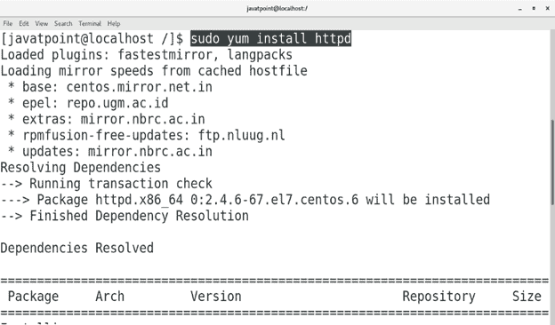
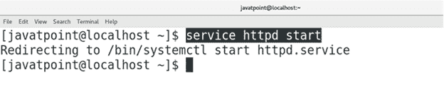
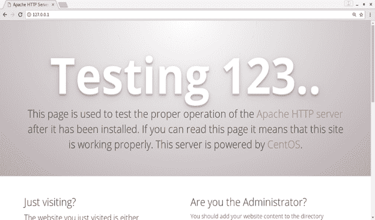
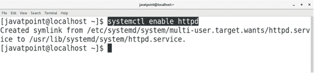

# 如何在CentOS上安装阿帕奇网络服务器

> 原文：<https://www.javatpoint.com/how-to-install-apache-web-server-on-centos>

## 介绍

Apache HTTP 服务器是在 **Apache 2.0** 许可下发布的开源、跨平台的 web 服务器。它是由 apache 软件基金会下的开放开发者社区开发和维护的。在本教程中，我们将学习在 CentOS 上安装 Apache 过程中涉及的步骤。

### 先决条件

*   CentOS 7
*   以管理员身份登录终端
*   必须在系统上配置 Yum。

## 装置

1.**安装阿帕奇**

在 CentOS 7 上安装 Apache 网络服务器非常容易。它只需要下面给出的一个命令。

```

$ sudo yum install httpd 

```



2.**启动阿帕奇服务**

执行以下命令启动 Apache 服务。

```

$ service httpd start 

```



3.**测试阿帕奇**

我们可以检查 Apache 是否已经在我们的 CentOS 上成功配置。我们只需要在浏览器的搜索栏中键入 **127.0.0.1** (localhost IP 地址)。我们还可以使用以下命令检查系统的 IP 地址。

```

$ ip addr sh

```

如果系统上的 Apache 网络服务器配置正确，浏览器将给出如下响应。



4.**启用阿帕奇服务**

要在启动时启用 apache 服务，请执行以下命令。

```

$ systemctl enable httpd 

```



### 额外信息

执行以下命令停止 Apache 服务。

```

$ service httpd stop 

```

要在启动时禁用 Apache 服务，请执行以下命令。

```

$ systemctl disable httpd 

```

因此，我们已经在 CentOS 上安装并开始使用 Apache。