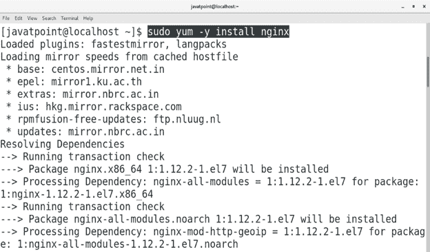
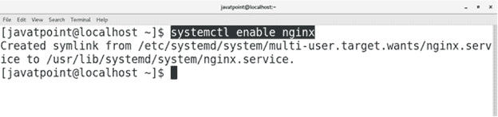
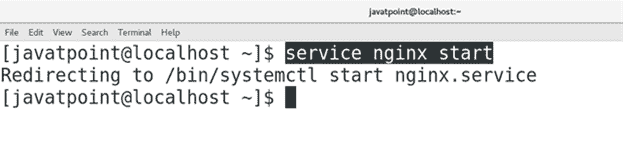
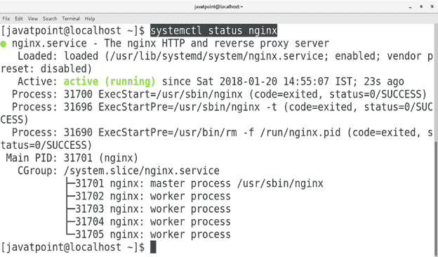
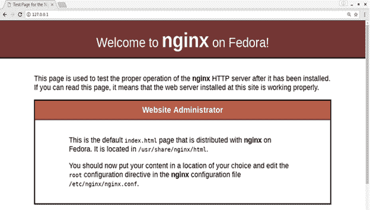

# 如何在 CentOS 上安装 Nginx

> 原文：<https://www.javatpoint.com/how-to-install-nginx-on-centos>

## 介绍

Nginx 是一个 web 服务器，也可以作为 HTTP 缓存、负载均衡器和反向代理。这是由**伊戈尔·塞索耶夫**首次创建，并于 **2004** 发布，其条款与许可类似 **BSD** 。在本教程中，我们将学习在 CentOS 上安装 Nginx 所涉及的步骤。

### 先决条件

*   CentOS 7
*   以管理员身份登录终端。
*   必须在系统上配置 Yum。

## 装置

1.**安装 engine**

执行以下命令在 CentOS 上安装 Nginx。

```

$ sudo yum ?y install nginx  

```



2.**启动时启用 Nginx**

执行以下命令，在启动时启用 nginx。

```

$ systemctl enable nginx 

```



3.**start engine**

执行以下命令启动 nginx。

```

$ service nginx start 

```



4.**检查服务器状态**

我们可以通过执行以下命令来检查 nginx 服务的状态。

```

$ systemctl status nginx 

```

显示状态**激活**，表示系统成功配置了 Nginx。



5.**在浏览器上访问**

我们也可以在浏览器上通过输入系统的 ip 地址来访问 nginx，在我这里是 **127.0.0.1** 。



因此，我们已经成功安装并开始使用 Nginx。