# 如何在CentOS上安装 WordPress

> 原文：<https://www.javatpoint.com/how-to-install-wordpress-on-centos>

## 介绍

WordPress 是一个基于 PHP 和 MySQL 的免费开源内容管理系统。为了开发和测试基于网络的应用，我们必须在网络服务器上安装 WordPress。截至**2018 年 1 月**，前 1000 万网站中**使用 WordPress 的比例为 29.3 %** 。WordPress 于 2003 年 5 月 27 日由创始人马特·莫楞威格和迈克·利特尔在 T4 发布。它是在 **GPLv2** 许可下发布的。在本教程中，我们将在 CentOS 上安装 WordPress。

### 先决条件

*   CentOS7
*   以管理员身份登录终端
*   必须在系统上配置灯。

## 装置

这包括以下步骤。

1.**下载压缩文件**

使用以下命令在 **/var/www/html** 位置获取 WordPress 压缩文件。

```

$ wget http://wordpress.org/latest.tar.gz

```

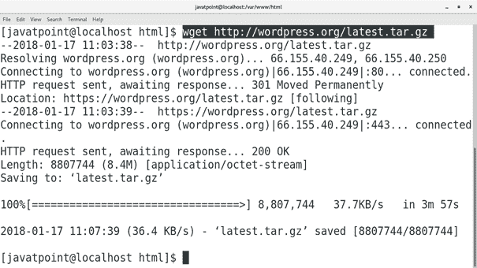

使用以下命令提取下载的文件。

```

$ tar xvfz latest.tar.gz

```

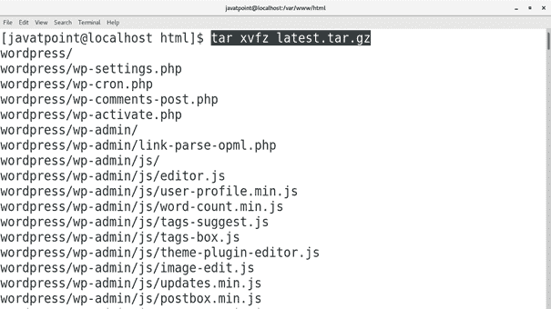

2) **创建数据库**

登录到 MySQL 命令外壳，创建一个供 WordPress 使用的数据库。为此，请使用以下查询。

```

$ create database wordpress; 

```

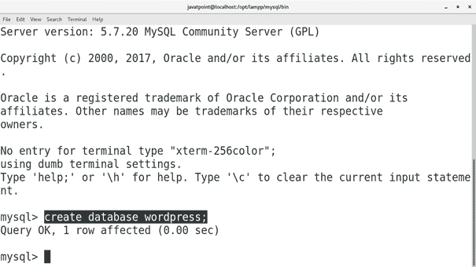

3) **启动 PHP 开发服务器**

将工作目录更改为 WordPress 目录，并执行以下命令来启动 PHP 开发服务器。

```

$ php -S 127.0.0.1:8082

```

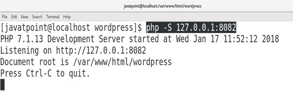

4.**在浏览器上访问 WordPress**

只需在浏览器上输入 **localhost:8082** 即可访问 WordPress。这将启动系统上的安装过程。

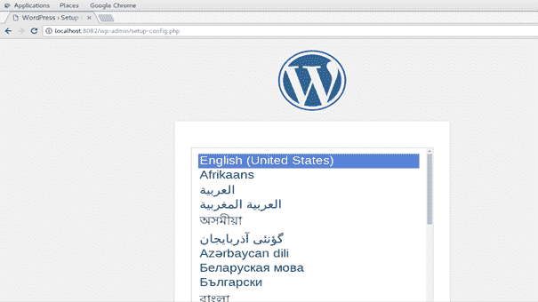

选择语言，点击**提交**

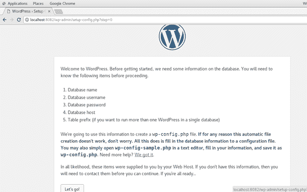

只需点击**我们走！**继续进行。

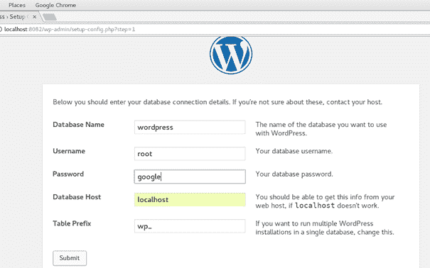

输入数据库凭证(在我的例子中，用户名是**根**，密码是**谷歌**)并点击**提交**。

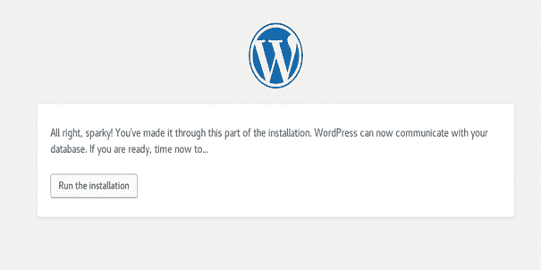

点击**运行安装**开始安装过程。

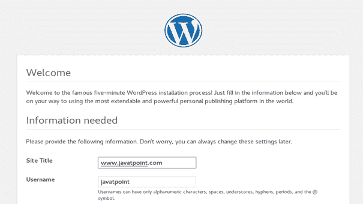

这部分安装涉及到我们网站的配置。只需输入标题、用户名、密码、电子邮件等网站详细信息，点击**安装 WordPress** 。

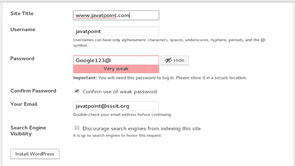

最后，我们在 CentOS 上安装了 WordPress。

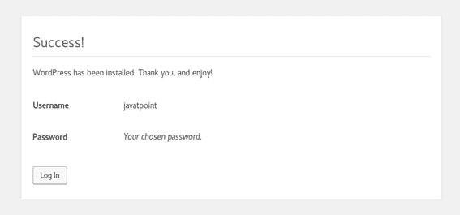

点击**登录**进入我们的网站。我们只需要输入用户名和密码，按**进入**。

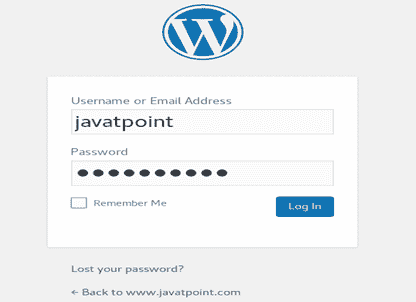 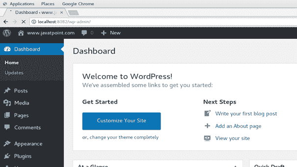

因此，我们已经安装并开始使用 WordPress。现在，我们可以定制和管理我们的网站。