# 如何在 CentOS 上安装 Drupal

> 原文：<https://www.javatpoint.com/how-to-install-drupal-on-centos>

## 介绍

Drupal 是一个基于 PHP 的免费开源内容管理框架。它是在开源 **GNU** 通用公共许可证下发布的。截至 2017 年 11 月，Drupal 社区由 130 多万成员组成。在本教程中，我们将学习在 CentOS 上安装 Drupal 的过程。

### 先决条件

*   CentOS7
*   以管理员身份登录终端。
*   必须在系统上配置灯。

## 装置

安装包括以下步骤。

1.**下载压缩文件**

执行以下命令下载 Drupal 的压缩文件。

```
$ wget https://ftp.drupal.org/files/projects/drupal-8.3.7.tar.gz

```

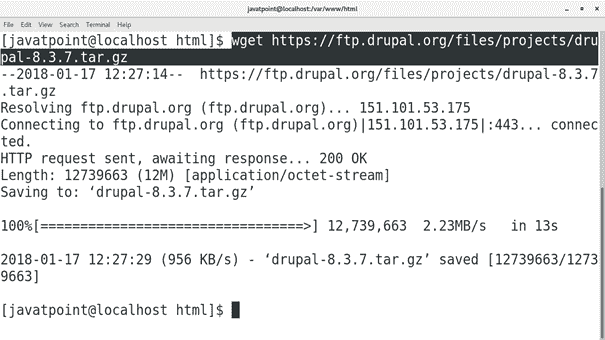

执行以下命令提取从互联网下载的文件。

```
$ tar xvfz drupal-8.3.7.tar.gz 

```

2.**创建数据库**

在 MySQL 外壳上执行以下查询，创建 Drupal 要使用的数据库。

```
$ create database; 

```

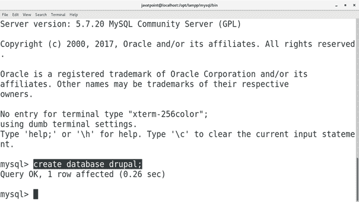

3.**启动开发服务器**

将当前工作目录更改为 Drupal 目录，并执行以下命令来启动正在监听端口 8082(在我的例子中)的 PHP 开发服务器

```
$ php -S 127.0.0.1:8082 

```

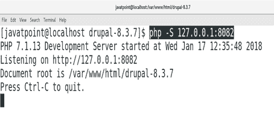

4.**在浏览器上访问 Drupal**

只需在浏览器的搜索栏中键入 **localhost:8082** 即可在浏览器上访问 Drupal。

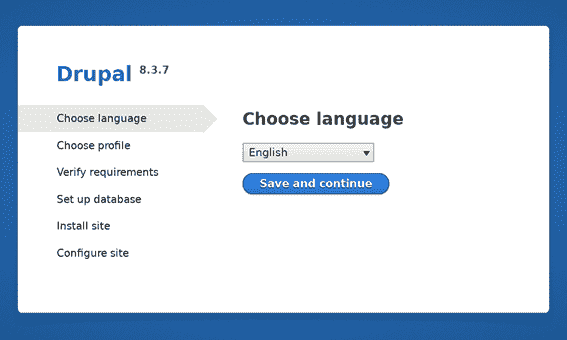

选择语言，点击**保存并继续**

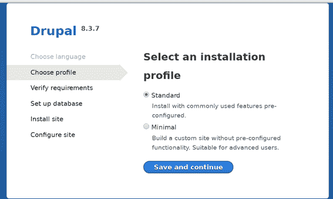

此步骤提示选择标准或最小安装配置文件。我们可以选择任何人，只需点击**保存并继续**继续。

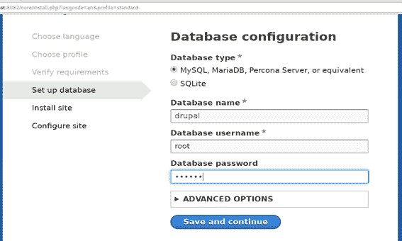

该步骤提示输入数据库详细信息。填写数据库详细信息，点击**保存并继续**。

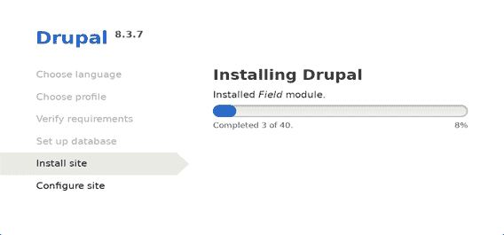

Drupal 现在正在我们的 CentOS 上安装。

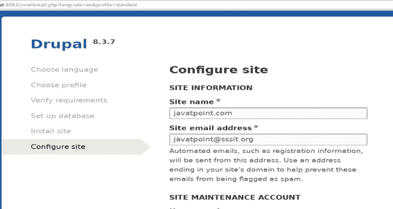

安装的这一部分包括我们网站的配置。只需填写网站详细信息，如用户名、密码和电子邮件地址。点击**保存并继续**继续。

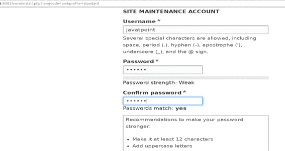 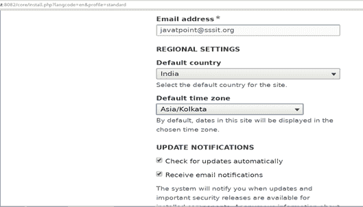 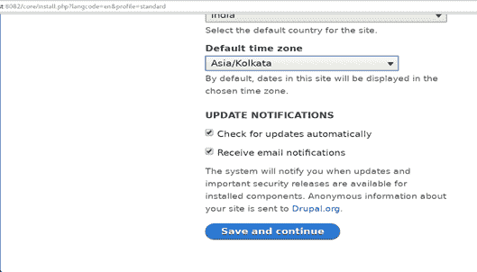

现在，我们的 CentOS 上安装了 Drupal。我们需要使用我们刚刚填写的凭据登录我们的网站，如用户名和密码。

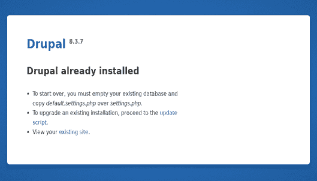

只需填写用户名和密码即可登录 Drupal。

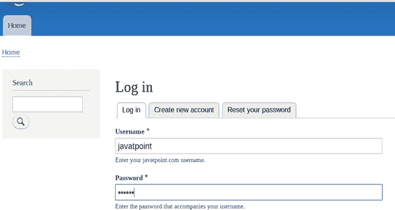 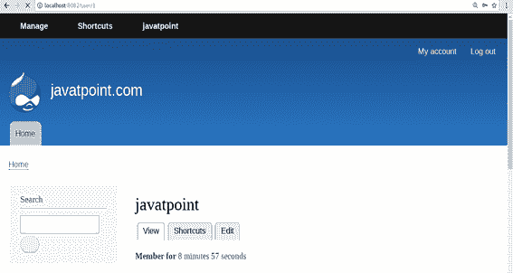

因此，我们已经成功安装并开始使用 Drupal。