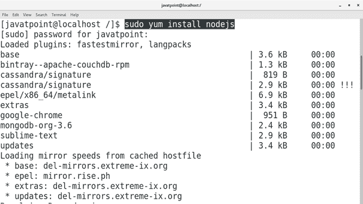
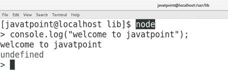
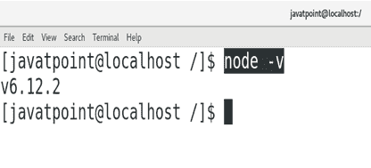

# 如何在 CentOS 上安装 Node.js

> 原文：<https://www.javatpoint.com/how-to-install-nodejs-on-centos>

## 介绍

Node.js 是一个开源的、跨平台的 JavaScript 运行时平台，它使 JavaScript 能够用于服务器端脚本。虽然。js 是 JavaScript 文件的扩展名，但它不代表框架的任何文件。现在它已经成为“随处 JavaScript”范例的基础元素。在本教程中，我们将学习在 CentOS 上安装 Node.js 过程中涉及的步骤。

### 先决条件

*   CentOS 7
*   以管理员身份登录终端
*   必须在系统上配置 Yum。

## 装置

安装包括以下步骤。

1.**更新百胜**的本地存储库索引

执行以下命令来更新 yum 包安装程序的本地存储库索引。

```

$ sudo yum update 

```

2.**安装 Node.js**

执行以下命令安装 node.js

```

$ sudo yum install nodejs

```



3.**验证节点 js**

只需在终端上输入**节点**即可让 node.js 工作。我们现在可以在 node.js 脚本模式下执行这些语句。



## 额外信息

只需输入 **node -v** 即可查看我们 CentOS 上安装的 node.js 版本。



因此，我们已经安装并开始使用 Node.js