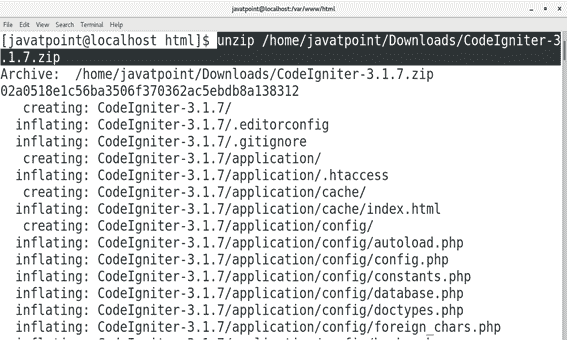
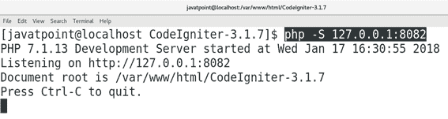
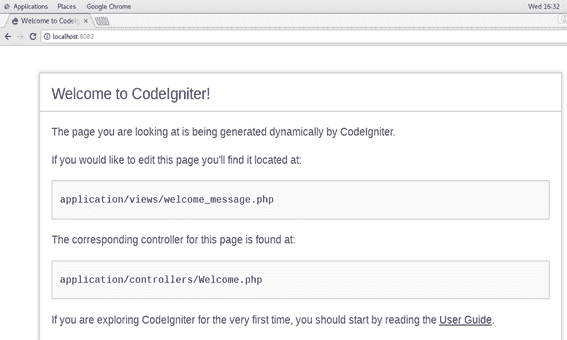

# 如何在 CentOS 上安装 CodeIgniter

> 原文：<https://www.javatpoint.com/how-to-install-codeigniter-on-centos>

## 介绍

CodeIgniter 是一个开源软件，负责用 PHP 快速开发动态网站。这是一个基于流行的模型视图控制器 **(MVC)** 开发模式的强大的 web 框架。CodeIgniter 的第一个公开版本由 **EliisLab** 于**2006 年 2 月 28 日**发布。

### 先决条件

*   CentOS 7
*   以管理员身份登录终端

## 装置

安装包括以下步骤。

1.**下载并解压 CodeIgniter 的压缩文件**

点击 https://github.com/bcit-ci/CodeIgniter/archive/3.1.7.zip.链接下载 CodeIgniter 的压缩文件下载的文件是一个 zip 文件，需要在 **/var/www/html** 里面提取才能访问 CodeIgniter。为此，我们执行以下命令。

```
$ unzip /home/javatpoint/Downloads/CodeIgniter-3.1.7.zip  

```



2.**启动 PHP 开发服务器**

将当前的工作目录更改为 CodeIgniter 目录，并执行以下命令来启动 PHP 开发服务器，在我的例子中是监听端口 8082。

```
$ php -S 127.0.0.1:8082

```



3.**在浏览器上访问 CodeIgniter**

我们只需要在浏览器的搜索栏中键入 **localhost:8082** 即可在浏览器上访问 CodeIgniter。



因此，我们已经安装并开始使用 CodeIgniter。