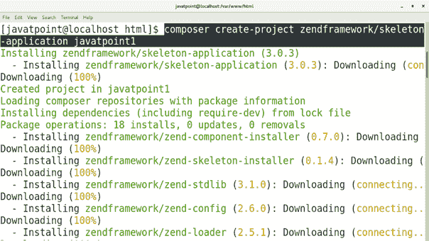
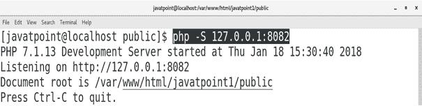
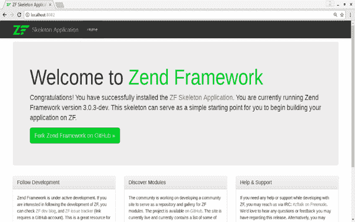

# 如何在中央操作系统上安装 Zend

> 原文：<https://www.javatpoint.com/how-to-install-zend-on-centos>

## 介绍

Zend 框架是一个基于 PHP5 的开源、面向对象的 web 应用框架，在新的 BSD License 下获得许可。Zend 框架为用户提供了模型视图控制器的支持。它基本上是基于 PHP 的包的集合。在本教程中，我们将在我们的 CentOS 上安装 Zend 框架。

### 先决条件

*   CentOS 7
*   以管理员身份登录终端
*   阿帕奇服务器或灯
*   设计者
*   服务器端编程语言（Professional Hypertext Preprocessor 的缩写）

## 装置

安装包括以下步骤。

1.**使用 Composer** 安装 Zend

安装 Zend 框架非常容易。我们只需要执行一个简单的命令，如下所示。

```

$ composer create-project zendframework/skeleton-application javatpoint1

```



2.**启动开发服务器**

通过键入**CD javapoint 1/public**将当前工作目录更改为**javapoint 1/public**，并执行以下命令。

```

$ php -S 127.0.0.1:8082 

```



3.**本地主机上的访问**

我们只需在浏览器的搜索栏中输入 **localhost:8082** ，就可以在 localhost 上访问 Zend。



因此，我们已经安装并开始使用 Zend 框架。