# 如何在CentOS上安装 YII。

> 原文：<https://www.javatpoint.com/how-to-install-yii-on-centos>

## 介绍

YII 是一个用 PHP 编写的开源、面向对象、基于组件的 MVC web 框架。它的 alpha 版本于 2006 年 10 月发布。它的第一个正式版本 1.0 于 2008 年 12 月发布。YII 的当前版本是 2.0.0，它也支持 PHP 7。它可以是**的首字母缩略词，是的，它是**。在本教程中，我们将在 CentOS 上安装 YII2。

### 先决条件

*   CentOS 7
*   以管理员身份登录终端
*   PHP 5.4.X 或更高版本
*   PCR 扩展
*   反射扩展
*   SPL 扩展
*   CType 扩展
*   MBString 扩展
*   OpenSSL 扩展
*   Intl 延伸

## 装置

安装包括以下步骤。

1.**安装 fxp/composer-资产-插件**

执行以下命令安装 fxp/composer-asset-plugin，这是创建新的 YII 应用程序所必需的。

```

$ composer global require "fxp/composer-asset-plugin:^1.3.1"

```

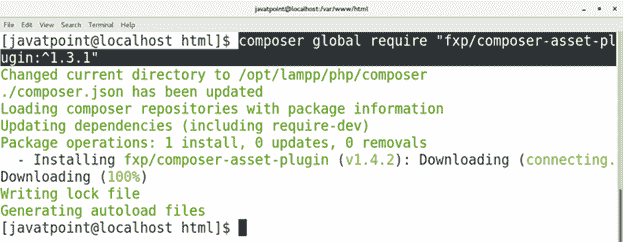

2.**创建项目**

执行以下命令创建一个新的 YII 驱动的应用程序(在我的例子中命名为 javatpoint3)。

```

$ composer create-project -prefer-dist yiisoft/yii2-app-basic javatpoint3

```

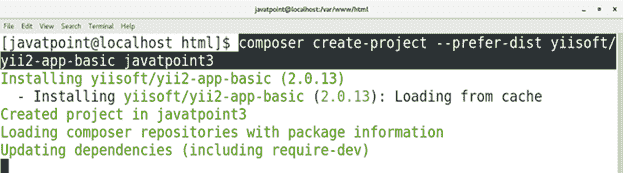

3.**提供隐藏令牌**

该过程提示我们输入 YII 令牌，这需要使用我们的 github 帐户生成。

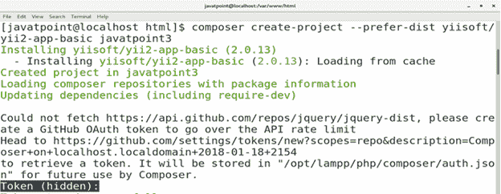

为了生成我们的个人访问令牌，我们需要登录我们的 github 帐户并转到**用户配置文件- >选择设置- >开发者设置- >个人访问令牌- >生成新令牌**。

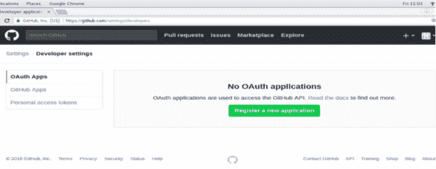

填写**yii-代币**代替代币描述。选择所有选项，点击**生成令牌**。

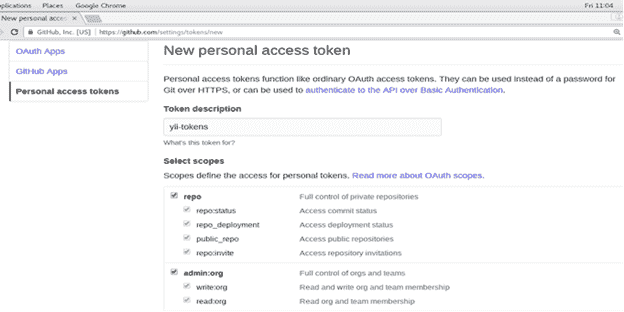 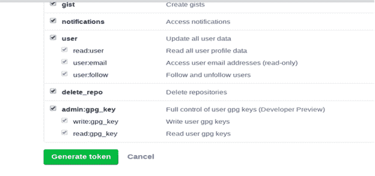

现在，我们的个人访问令牌生成了。复制这个并粘贴在终端上。

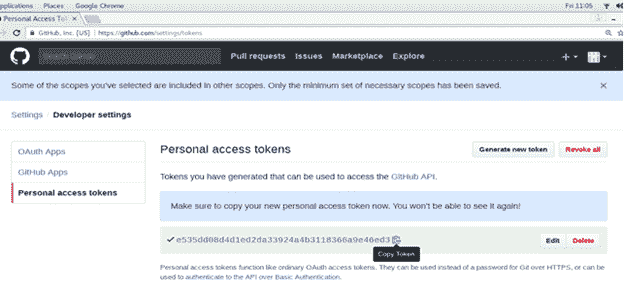

因为令牌是隐藏的，所以我们不会看到它。只需粘贴令牌，按**进入**。该过程将显示消息**令牌存储成功**。

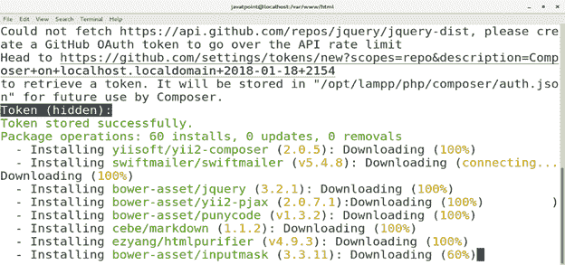 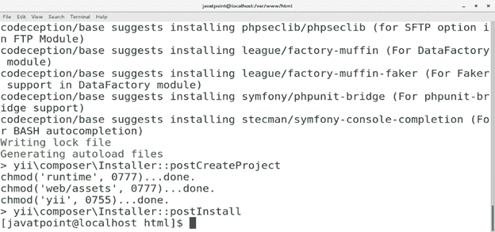

4.**启动 PHP 开发服务器**

经过这个过程，我们只需要启动 PHP 开发服务器。首先通过键入**CD javapoint 3**更改当前工作目录，然后执行以下命令。

```

$ php yii serve 

```

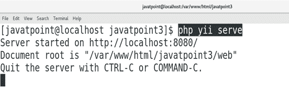

5.**在浏览器上访问**

在浏览器的搜索栏中输入 **localhost:8080** 即可在浏览器上访问 YII。

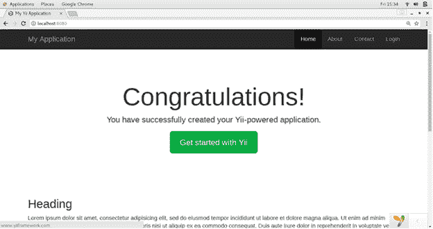

因此，我们已经在 CentOS 上安装并开始使用 YII。