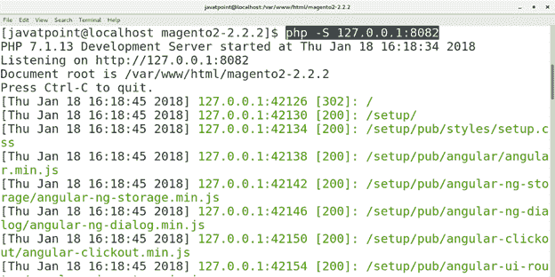
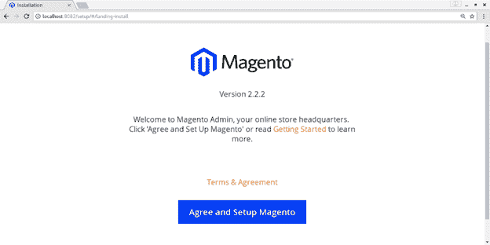
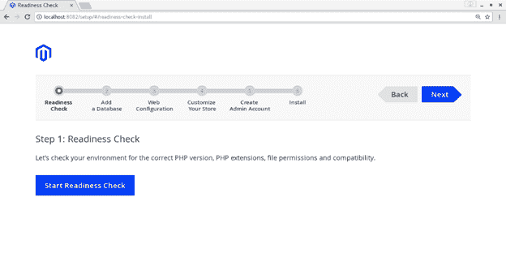
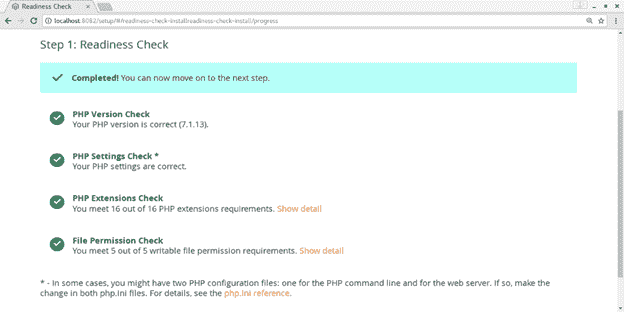
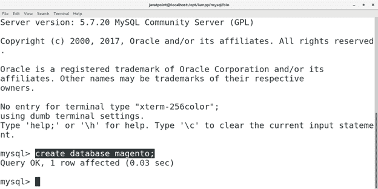
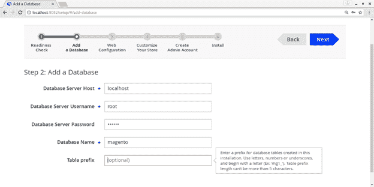
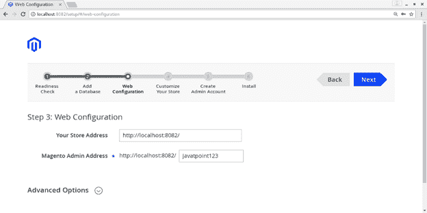
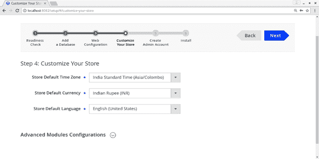
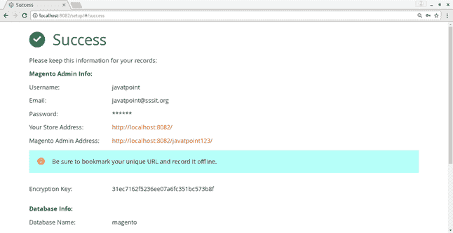
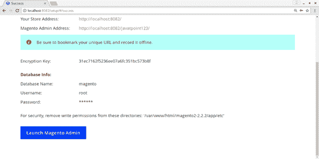

# 如何在 CentOS 上安装 Magento

> 原文：<https://www.javatpoint.com/how-to-install-magento-on-centos>

## 介绍

Magento 是由**Varien Inc .**开发的开源电商平台。它完全是用 PHP 编写的，于 2008 年 3 月 31 日**发布。被 2015 年 11 月 17 日发布 Magento2 的 e-bay 收购。在本教程中，我们将在 CentOS 上安装 Magento。**

### 先决条件

*   CentOS7
*   Linux Apache MySQL PHP

### 遵循 PHP 扩展

*   PHP 扩展 dom。
*   PHP 扩展卷曲。
*   PHP 扩展 mcrypt。
*   PHP 扩展 simplexml。
*   PHP 扩展 spl。
*   PHP 扩展 xsl。
*   PHP 扩展国际。
*   PHP 扩展 mbstring。
*   PHP 扩展 ctype。
*   PHP 扩展哈希。
*   PHP 扩展 openssl。
*   PHP 扩展 zip。
*   PHP 扩展 xmlwriter。
*   PHP 扩展 gd。
*   PHP 扩展图标。

## 装置

安装包括以下步骤。

1.**下载并提取 Magento**

访问 Magento https://magento.com/tech-resources/download 官方网站，下载最新的 Magento 压缩源代码文件。使用以下命令提取下载的文件。

```

$ tar xvfz magento2-2.2.2.tar.gz 

```

2.**运行作曲安装**

将工作目录更改为 Magento 目录，并运行以下命令。

```

$ composer install 

```


3.**启动 PHP 开发服务器**

只需键入 **cd magento2-2.2.2** 即可将当前工作目录更改为 Magento 的安装目录，然后执行以下命令启动 PHP 开发服务器。

```

$ php -S 127.0.0.1:8082 

```



4.**在浏览器上访问**

为了在系统上安装 Magento，我们只需要在浏览器的搜索栏中键入 **loalhost:8082** 就可以通过浏览器进行访问。

浏览器窗口将如下所示。



点击**同意并设置 Magento** 进行 Magento 安装。



点击**开始锐度检查**让 magento 检查 PHP 版本等需求。



现在，马根托已经检查了所有符合要求的东西。现在我们需要创建一个名为 **magento** 的数据库。打开 MySQL 外壳，输入**创建数据库 magento**创建数据库。

 

安装的这一部分提示我们填写刚刚创建的数据库的所有细节。输入数据库服务器用户名、密码、数据库名称等所有详细信息，点击**下一步**。



这一步提示我们设置网络配置，如商店地址和磁管理地址，应该是唯一的。选择地址(我已经选择了 javatpoint123)，点击**下一步**。



现在，我们必须通过设置默认时区和货币详细信息来定制我们的网站。设置所有需要的细节，点击**下一步**。


填写该步骤中要求的所有所需步骤，如新用户名、电子邮件和密码。点击**下一步**，我们将为 Magento 安装准备好设置。点击**立即安装**开始安装过程。



现在，Magento 已经成功安装在我们的 CentOS 上。下一页显示了所有的数据库信息，存储地址和登录凭证。



因此，我们已经安装并开始使用 Magento。点击**启动 Magento 管理**启动应用程序。