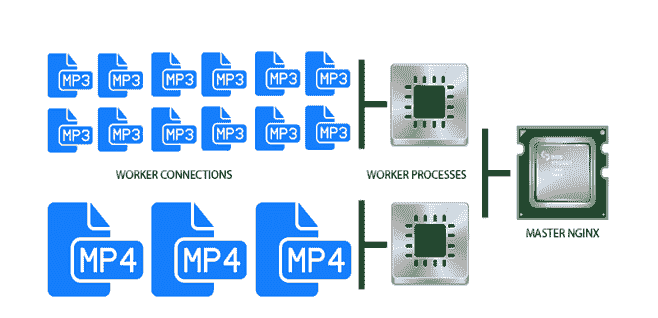

# 什么是 NGINX？

> 原文：<https://www.javatpoint.com/nginx-introduction>

*   **NGINX** 发音为“engine-ex”。
*   它是一个开源、快速、轻量级和高性能的 web 服务器，可用于服务静态文件。
*   NGINX 被认为是继 Apache web 服务器和微软 IIS 之后最受欢迎的 web 服务器。
*   在最初的版本中，NGINX 用于 HTTP 网络服务。然而今天，它也作为 HTTP、HTTPS、SMTP、IMAP、POP3 协议的反向代理服务器，另一方面，它也用于 HTTP 负载平衡器、HTTP 缓存以及 IMAP、POP3 和 SMTP 的电子邮件代理。
*   NGINX 改善了内容和应用交付，提高了安全性，并促进了互联网上最繁忙网站的可扩展性和可用性。
*   简而言之，我们可以说 Nginx 只是一种用于网络服务器的软件，用来服务并发请求。
*   以前我们在 web 服务器上安装 Apache 来处理这些功能，但是随着世界的发展，同时对更多东西的需求，并发这个术语出现了，nginx 也是为了同样的事情而推出的。
*   Nginx 由伊戈尔·塞索耶夫创建，于 2004 年 10 月 1 日首次公开发布，试图解决 T2 C10k 问题。其中 C10k 是同时管理 10，000 个连接的挑战。如今，web 服务器需要处理的连接甚至更多了。由于这个原因，nginx 提供了事件驱动和异步架构。这一特性使 nginx 成为可扩展性和速度方面最可靠的服务器。
*   一些使用 Nginx 的知名公司包括 IBM、谷歌、Atlassian、Autodesk、GitLab、DuckGo、T-Mobile、微软、Adobe、Salesforce、VMware、LinkedIn、思科、Twitter、苹果、英特尔、脸书等等。

## 为什么要用 NGINX？

NGINX 提供各种服务，如反向代理、负载均衡器和速率限制网络服务。如果我们有多个 web 服务在不同的端口上侦听，并且我们需要一个公共端点在内部重新路由请求，那么反向代理就很有用。这将允许我们在端口 80 上托管多个域名，同时使用不同的 NodeJs、Go 和 java 的组合在幕后为单独的 web 服务提供动力。

Nginx 可以处理日志记录、黑名单、负载平衡和服务静态文件，而 web 服务专注于它们需要做的事情。

Nginx 的配置比 Apache httpd 容易。Nginx 是为高并发设计的，速度非常快。

## NGINX 是如何工作的？

在了解 NGINX 的流程之前，我们先来看看 web 服务器是如何工作的。当我们请求打开网页时，浏览器会联系服务器。然后，服务器为页面查找请求的文件，并将其发送到浏览器。这是请求的唯一最简单的工作。

上面的例子也被认为是单线程。传统上，像 Apache 这样的网络服务器为每个请求创建一个线程，但是 Nginx 不是这样工作的。Nginx 采用异步、事件驱动的架构。它巧妙地跟踪一个过程的事件。

Nginx 将其工作分为**工人流程**和**工人联系**。这里，工作连接用于管理用户在 web 服务器上发出的请求和获得的响应；同时，这些请求被传递给它的父进程，这个父进程被称为工作进程。

让我们看一个 Nginx 服务器处理并发 MP3 和 MP4 文件请求的例子:-

从上图中，我们可以看到单个工作连接一次可以处理大约 1024 个连接。这是工人联系的最佳能力。根据我们拥有的服务器类型，Nginx 中可能有“n”个工作进程，每个工作进程处理不同的作业，这样它就可以处理更多数量的并发请求。

最后，工作进程将请求转移到 Nginx 主进程，后者只直接响应唯一的请求。

因为工作连接可以处理多达 1024 个类似的请求。正因为如此，Nginx 可以毫无困难地处理数千个请求。这也是 Nginx 成为电子商务、搜索引擎和云存储等繁忙网站的优秀服务器的原因。

## NGINX 的特点

Nginx 的一些特性如下:

*   带缓存的反向代理
*   IPV6
*   负载平衡
*   网络套接字
*   静态文件、索引文件和自动索引的处理
*   FastCGI 支持缓存
*   网址重写和重定向

## NGINX 和 NGINX Plus 能为你做些什么？

Nginx 和 Nginx plus 是网飞、Dropbox 和 Zynga 等高流量网站使用的最佳网络服务器和应用交付解决方案。谷歌、网飞、推特、脸书等最繁忙的网站。依靠 Nginx 和 Nginx Plus 安全、可靠、快速地交付内容。

*   Nginx 使硬件负载平衡器过时- Nginx 是开源的，比硬件负载平衡器更便宜，更可配置，并且是为现代云架构设计的。
    Nginx plus 提供动态重新配置支持，并与现代 DevOps 工具集成，便于监控。
*   NNginx 是一个多功能工具——通过使用 Nginx，我们可以使用与我们的负载平衡器、内容缓存、反向代理和网络服务器相同的工具。它最大限度地减少了我们组织需要维护的工具数量。
    Nginx Plus 包括对客户支持的快速响应，因此我们可以轻松获得诊断我们堆栈中使用 Nginx Plus 和 Nginx 的任何部分的帮助。
*   NGINX 不断发展。在过去的十年里，NGINX 一直站在现代网络发展的最前沿，并帮助引领了从 HTTP/2 到微服务支持的一切。
    随着 web 应用程序的开发和交付不断发展，NGINX Plus 不断增加功能，实现无瑕疵的应用交付。

* * *