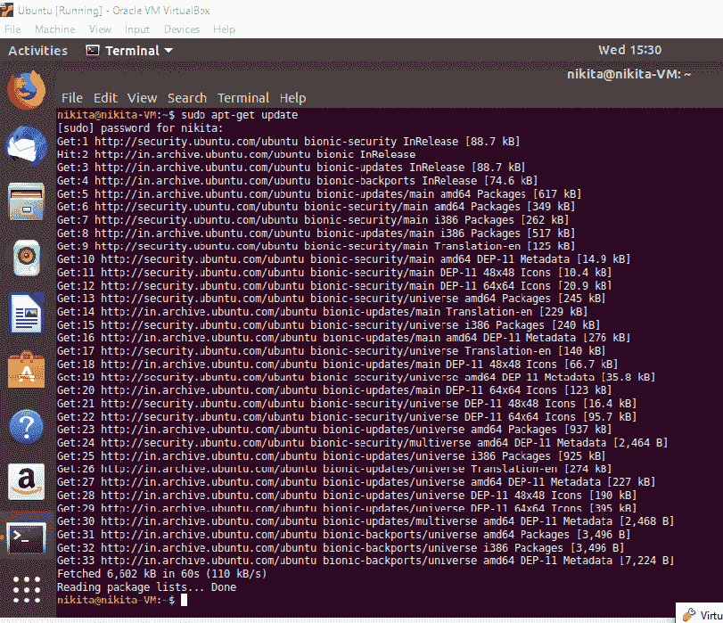
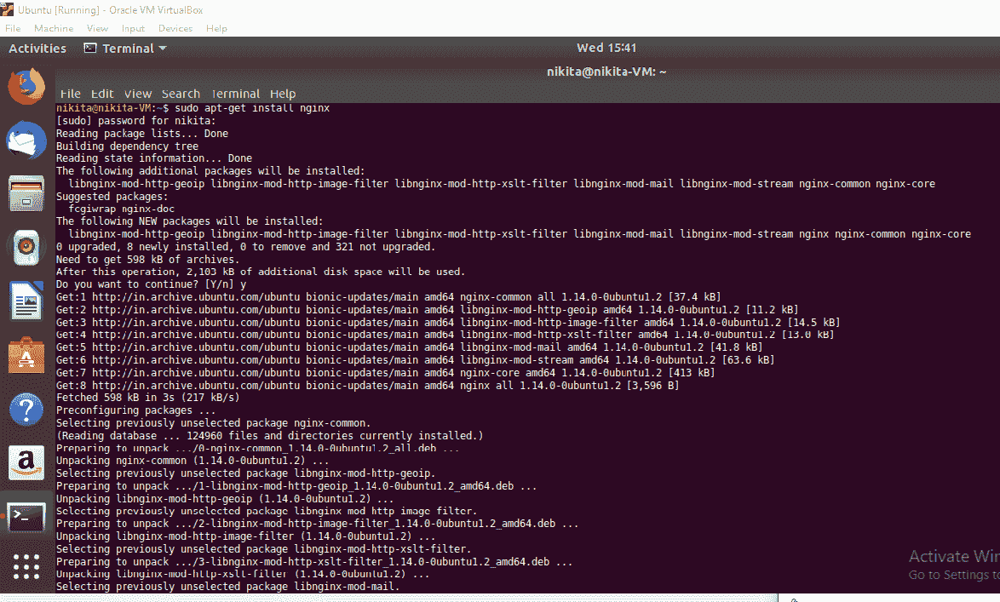
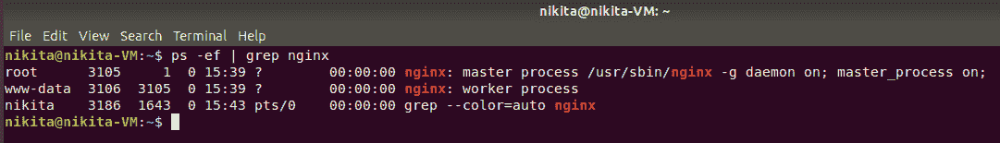
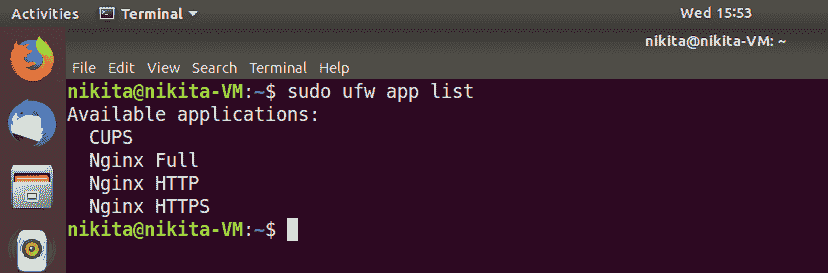
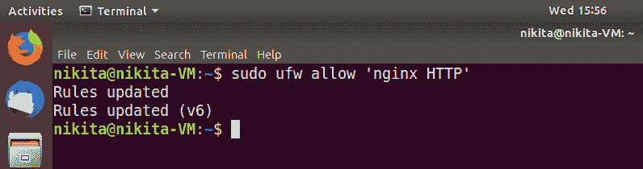
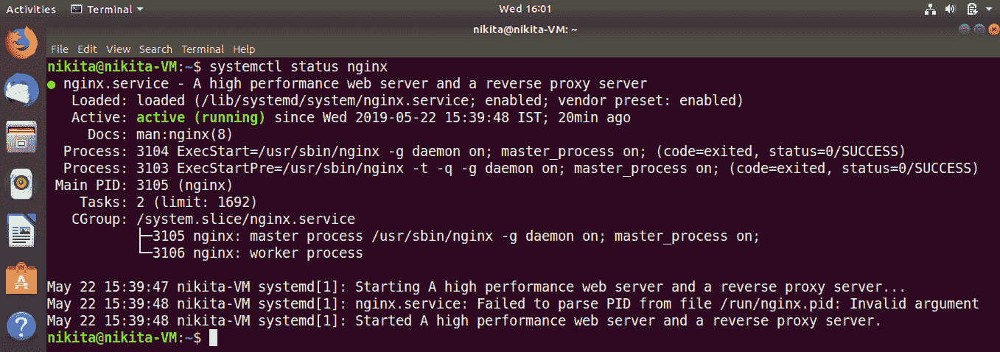
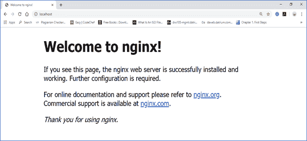

# 在 Debian/Ubuntu 上安装 NGINX

> 原文：<https://www.javatpoint.com/how-to-install-nginx-on-debian-ubuntu>

安装 NGINX 有两种方法:

*   **使用预先构建的二进制:-** 这个方法是最简单快捷得多的方法。
*   **从源代码构建:-** 这种方法提供了包含各种第三方模块的能力，使 Nginx 更加强大。

以下步骤将向我们展示如何在我们的 Debian 或 Ubuntu 系统上安装 Nginx:

**步骤 1:** 首先，让我们更新我们的本地包索引，这样我们就可以访问最新的包列表。

在 Ubuntu 或 Debian 上打开终端，并运行以下命令，以确保操作系统上的所有包都是最新的:

```

sudo apt-get update

```



由于 Nginx 在默认的 Debian 或 Ubuntu 存储库中是可用的，所以可以使用 apt 打包系统从这些存储库中安装它。

```

sudo apt-get install nginx

```



完成后，使用以下命令查看处于运行状态的 web 服务器的进程。

```

ps ?ef | grep nginx

```



## 调整防火墙以访问 Nginx

为了从网络服务器访问 Nginx，我们必须允许从外部访问服务。

要查看防火墙允许的配置文件列表，请使用以下命令:



在这里，

**Nginx Full:** 它同时允许端口 80 和 443。

**Nginx HTTP:** 它只允许端口 80。

**Nginx HTTPS:** 只允许端口 443。

要同时允许端口 HTTP 80 和 HTTPS 443，请使用以下命令:

```

sudo ufw allow 'Nginx Full'

```

要仅允许 Nginx HTTP 端口 80，请使用以下命令:

```

sudo ufw allow 'Nginx HTTP'

```



要仅允许 Nginx HTTPS 端口 443，请使用以下命令:

```

sudo ufw allow 'Nginx HTTPS'

```

## 检查 NGINX 服务状态

默认情况下，安装 Ubuntu 后，Nginx 会自动启动，我们可以借助以下命令检查 Nginx 的状态:

```

systemctl status nginx

```

**nginx.service -** 高性能 web 服务器和反向代理服务器

**已加载:**已加载(/lib/system d/system/nginx . service；已启用；供应商预设:已启用)

**激活:**自美国东部时间 2016-04-18 周一 16:14:00 起激活(运行)；4 分 2 秒前

**主 PID:**12857(engine x)

**CGroup:**/system . slice/nginx . service

**├─12857 nginx:** 主进程/usr/sbin/nginx -g 守护进程开启；主进程开启

**└─12858 nginx:** 工人流程



从上面我们可以看到，服务似乎已经成功启动。然而，最好的测试方法是向 Nginx 请求一个页面。

我们可以访问默认的 Nginx 页面，以确保软件运行正常。我们可以通过服务器的域名或 IP 地址来访问它。或者我们可以在 Windows 上使用 http://localhost。

我们应该看到“欢迎使用 Nginx”的默认页面。如果我们看到那个页面，那么我们可以确定 Nginx 已经正确安装。



该页面通常包含在 Nginx 中，向我们显示服务器运行正常。

* * *