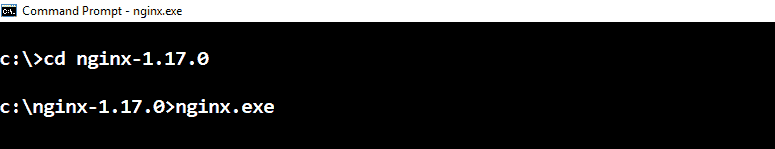
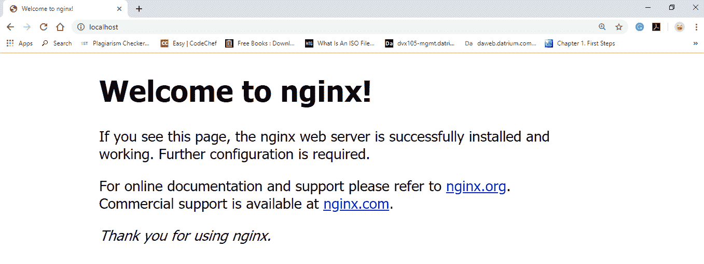

# 在 Windows 上安装 NGINX

> 原文：<https://www.javatpoint.com/how-to-install-nginx-on-windows>

Nginx 附带了预编译的 windows 二进制文件，这使得它非常容易上手。如果它不是预编译的，我们需要在我们的计算机上安装一个完整环境的编译器。幸运的是，事实并非如此。

要下载适用于 Windows 的最新版本的 Nginx，请使用以下链接:[https://nginx.org/en/download.html](https://nginx.org/en/download.html)

下载完成后，我们可以从任何文件夹中提取它。这里，我使用的是 c:\nginx-1.17.0 目录。

**重要位置:**

*   confis in-> c:\ nginx-1 . 17 . 0 \ conf \
*   默认配置-> c:\ engine x-1 . 17 . 0 \ conf \ engine x . conf
*   日志将在-> c:\ nginx-1 . 17 . 0 \日志中
*   默认的 webroot 是-> c:\ nginx-1.17.0\html\
*   默认监听地址-> http://localhost

## 验证 Nginx 窗口安装

要确保 Nginx 工作正常或安装成功，请在 windows 上打开命令提示符，然后键入以下内容，如果您已经安装在另一个文件夹中，请确保更新了环境路径。

*c:\ engine x \ engine x . exe*

我们应该可以去 **http://localhost** ，应该会看到“欢迎来到 Nginx”默认页面。如果我们看到那个页面，那么我们可以确定 Nginx 已经正确安装。

要对 nginx 进行操作，请使用以下命令:

| 命令 | 描述 |
| **engine-s 停止** | 快速关断 |
| **nginx -s 退出** | 正常关机 |
| **engine-s 重装** | 更改配置，用新配置启动新的工作进程，正常关闭旧的工作进程 |
| **nginx -s 重新开启** | 重新打开日志文件 |

* * *