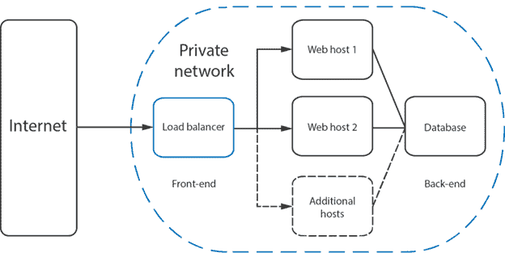

# NGINX 负载平衡

> 原文：<https://www.javatpoint.com/nginx-load-balancing>

为了确保适当的速度和优化的功能，传入的网络流量分布在一组服务中。这些后端服务通常被称为服务器池或服务器场。随着服务器之间的分布越来越广，由于服务器负载过重而导致速度变慢的可能性就越来越小。

高流量网站每天服务数千甚至数百万人。这项服务的一部分是在几秒钟内为用户显示图像、文本和视频等内容。服务器需要识别所需的数据，并每次都可靠地执行它。

负载平衡用于防止服务器在请求溢出时瘫痪。负载平衡器将请求发送到能够高效处理它们的服务器，以最大限度地提高速度和性能。

负载平衡是一种常用的技术，也是资源利用、最大化吞吐量、减少延迟和确保跨多个应用程序实例的容错配置的绝佳方式。

这是一种有用的机制，可以将传入的流量分布在几个有能力的虚拟专用服务器上。

Nginx 是一个流行的网络服务器软件，可以用来配置为一个简单而强大的负载平衡器，以提高服务器的资源可用性和效率。



## 设置引擎负载平衡

**1。通过 SSH 登录**

首先，以 root 用户身份登录您的 nginx 服务器。

```

ssh root@IP_address

```

**2。更新所有包**

其上安装的所有软件包必须是最新的:

```

apt-get update && apt-get upgrade

```

**3。安装 Nginx 网络服务器**

我们需要在虚拟专用服务器(VPS)上安装 nginx web 服务器。使用以下命令安装 Nginx:

```

apt-get install nginx

```

安装 Nginx 后，使用以下命令检查 Nginx 是否正在运行:

```

service nginx status

```

**4。添加负载平衡配置**

现在，在任何文本编辑器中打开网站的 Nginx 配置文件:

```

vim /etc/nginx/sites-available/yourdomain.com.conf

```

然后在文件顶部附加负载平衡配置:

```

upstream loadbalancer {
server vps1.yourdomain.com;
server vps2.yourdomain.com;
server vps3.yourdomain.com;
}

```

我们应该在上面列出的所有服务器上安装 Nginx 并监听 80 端口号。

**5。添加上游模块**

要设置循环负载平衡器，我们必须使用 nginx 上游模块。在同一个配置文件即 yourdomain.com.conf 中，我们需要在虚拟主机配置中添加上游模块。

```

server {
location / {
proxy_pass http://loadbalancer;
}
}

```

**6。重启 Nginx 服务器**

保存配置文件并重新启动 nginx，以使更改生效:

```

service nginx restart

```

整个配置将在三个服务器(vps1.yourdomain.com、vps2.yourdomain.com、vps3.yourdomain.com)之间平均分配所有传入流量，nginx 也可以配置为更高效地分配流量。它带有平衡选项，如重量平衡、最大故障和 IP 哈希平衡。

**7。重量平衡**

我们可以使用权重平衡来指定分配给上游列出的每台服务器的流量比例:

例如:

```

upstream loadbalancer {
server vps1.yourdomain.com weight=1;
server vps2.yourdomain.com weight=2;
server vps3.yourdomain.com weight=5;
}

```

在上面的例子中，vps2.yourdomain.com 获得的流量是 vps2.yourdomain.com 的两倍，vps3.yourdomain.com 获得的流量是 vps1.yourdomain.com 的五倍。

**8。最大故障**

当我们看到 nginx 的默认设置时，即使服务器关闭，它也会向服务器发送数据。我们可以使用 Max 失败的选项来防止这种情况。

```

upstream loadbalancer {
server vps1.yourdomain.com max_fails=4  fail_timeout=20s;
server vps2.yourdomain.com weight=2;
server vps3.yourdomain.com weight=4;
}

```

在上面的例子中，nginx 服务器将尝试连接到 vps1.yourdomain.com，如果超过 20 秒没有响应，它将再次尝试。4 次尝试后，vps1.yourdomain.com 将被视为落后。

**9。IP 哈希平衡**

使用这种方法，访问者将总是被发送到同一个服务器。因此，如果访问者收到了 vps1.yourdomain.com 的内容，除非服务器关闭或无法访问，否则这些内容将一直传输到该服务器。

```

upstream loadbalancer {
ip_hash;
server vps1.yourdomain.com;
server vps2.yourdomain.com;
server vps3.yourdomain.com down;
}

```

在上面的例子中，已知 vps3.yourdomain.com 是不可访问的，并且它被标记为关闭。

* * *