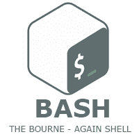

# Bash 脚本教程

> 原文：<https://www.javatpoint.com/bash>

Bash 脚本教程提供了 Bash Shell 脚本的核心和高级概念。我们的 Bash 教程是为初学者和专业人士设计的。

Bash(伯恩又是 shell)是一个 Shell 程序。它是布莱恩·福克斯写的，是伯恩外壳程序“sh”的增强版。这是一个开源的 GNU 项目。它为编程和交互使用提供了对伯恩外壳的功能改进。

我们的 Bash Shell 教程包括所有的 Bash 主题，如 Bash 脚本、变量、循环、条件语句、位置参数、算术、函数、字符串等。

## 先决条件

在学习 Bash Shell 之前，您必须具备 Linux 操作系统和任何编程语言的基本知识。

## 观众

我们的 Bash 脚本教程旨在帮助初学者和专业人士。

## 问题

我们向您保证，您在本教程中不会发现任何问题。但是如果你发现任何错误，请把问题贴在联系表上。

* * *