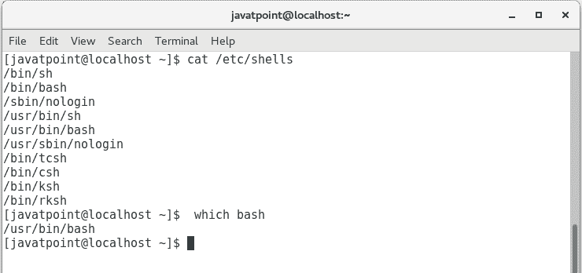

# 什么是 Bash？

> 原文：<https://www.javatpoint.com/bash-introduction>

BASH 是 Bourne more Shell 的首字母缩略词，这是一个双关的名字，是对 Bourne Shell(即史蒂文·伯恩发明的)的致敬。

Bash 是布莱恩·福克斯编写的 shell 程序，是伯恩 Shell 程序“ **sh** ”的升级版。这是一个开源的 GNU 项目。它于 1989 年发布，是 GNU/Linux 操作系统最流行的外壳发行版之一。它在编程和交互使用方面都提供了对伯恩外壳的功能改进。它包括命令行编辑、键绑定、无限大小的命令历史等。

基本而言，Bash 是一个命令行解释器，通常运行在文本窗口中，用户可以在其中解释命令以执行各种操作。这些命令在一个文件中作为一系列的组合称为外壳脚本。Bash 可以从 Shell 脚本中读取和执行命令。

Bash 是大多数 Linux 发行版和苹果 mac OS 的默认登录外壳。对于在 Solaris 11 中具有版本和默认用户外壳的 Windows 10，也可以访问它。

现在来看看壳牌以什么闻名。

**Shell:**UNIX Shell 是一个程序或命令行解释器，它解释用户直接输入的或可以从文件中读取的用户命令(即 Shall Script)，然后将它们传递给操作系统进行处理。重要的是要注意，Shall 脚本是解释的，而不是编译的，因为计算机系统解释它们，没有必要按照执行顺序编译 Shell 脚本。

Linux 操作系统中有不同类型的外壳。其中一些如下:

1.  伯恩·谢尔
2.  外壳
3.  谷物外壳
4.  GNU Bourne Shell

要知道您的操作系统支持哪种外壳类型，请将命令键入终端，如下所示:

```

cat /etc/shells  

```

要知道 bash 在您的操作系统中的位置，请键入以下命令，您将获得一个特定的位置:

```

which bash 

```

请看下面我的 centOS 支持什么类型的外壳，以及它的 bash 外壳在哪里。



* * *