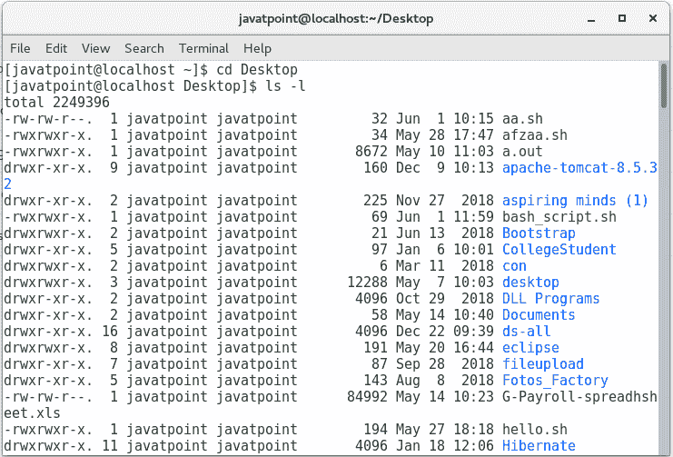
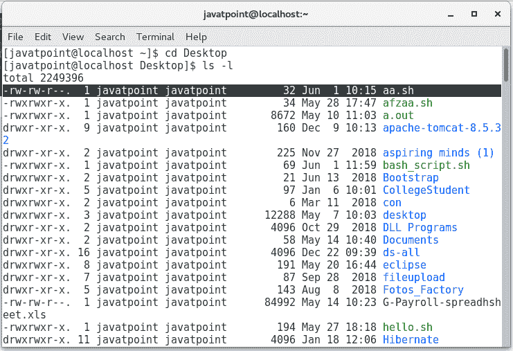
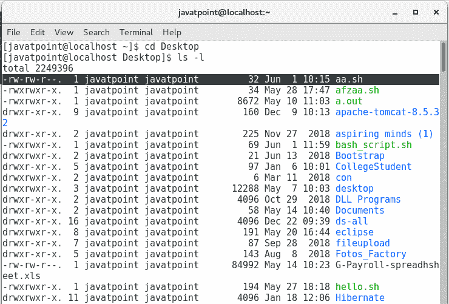
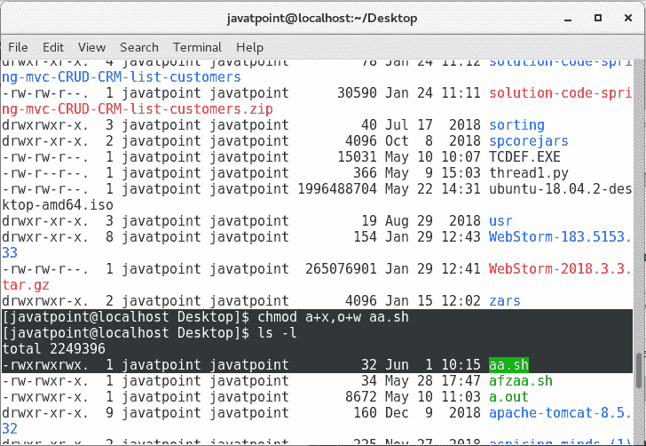
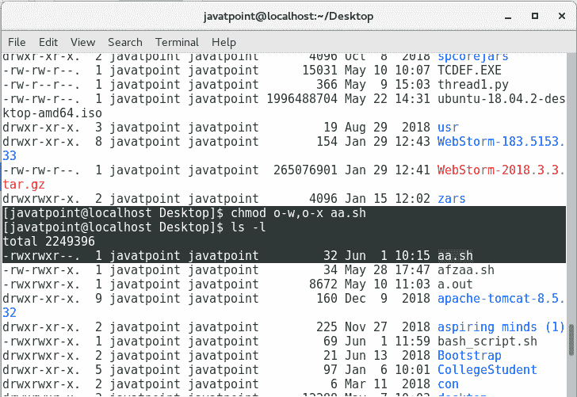

# 文件系统和文件权限

> 原文：<https://www.javatpoint.com/bash-filesystem-and-file-permissions>

**文件系统**是一种由文件或文件夹集合组成的结构。它决定了对数据的控制，即如何存储和检索数据？

Linux 文件系统是由许多目录组成的树状结构。这些目录只是包含其他文件列表的文件。Linux 对文件和目录没有区别。Linux 文件系统中的所有文件都称为目录，这些文件分类如下:

1.  *包含数据、文本、图像、程序指令的普通文件。*
**   *允许访问硬件设备的特殊文件。***   包含普通文件和特殊文件的目录*。***

 ***让我们来看看 Linux 文件系统。

使用 ls -l 命令列出所有文件和目录。



给定图像中有七列，定义如下:

*   ***第一列*** 代表文件类型和文件权限。每个文件行都以文件类型开始，然后指定与文件关联的访问权限。以下是具有特定字符的文件类型:
    1.  常规文件(-)
    2.  目录(d)
    3.  链接(l)
    4.  特殊档案(c)
    5.  插座
    6.  命名管道(p)
    7.  闭塞设备(b)
*   ***第二列*** 代表内存块的数量。
*   ***第三列*** 代表文件的所有者或超级用户，拥有管理权限。
*   ***第四列*** 代表所有者/超级用户组。
*   ***第五列*** 代表文件大小。
*   ***第六列*** 表示文件创建或最后修改的日期和时间。
*   ***最后一列*** 代表文件或目录的名称。

## 文件权限

尽管具有最好的安全特性，但基于 Linux 的操作系统需要文件权限来保护其文件系统，因为当用户为文件和目录分配不正确的权限时，会出现基于文件权限的问题。这些问题可能导致对文件系统的恶意或意外篡改。因此，Linux 使用如下两个授权属性来保护其文件系统:

### 1.许可

有三种类型的权限与文件相关联，如下所示:

**Read (r)** 权限，通过该权限可以查看文件的内容。

**写(w)** 权限，通过该权限可以修改文件内容。

**执行(x)** 权限，通过该权限可以运行编程文件或脚本。

#### 注意:在调用权限的情况下提供破折号(-)。

### 2.所有权

Linux 用户有三种类型，如下所示:

**所有者**是创建文件的超级用户。他可以访问与文件相关的所有权限，包括读取、修改和运行文件。

**组**被称为一组用户或多用户。超级用户创建它。组中的每个成员都具有与文件相关联的相同访问权限。

**其他用户，**即第三方用户可以是不属于超级用户/组成员的任何其他人。他们使用与超级用户/组成员创建或拥有的任何文件或目录相关联的权限。

让我们通过给出的例子来理解这个概念。



请参见暗行的第一列。它有十个插槽。

*   第一个插槽(-)代表一个由 aa.sh 命名的文件
*   接下来的三个插槽(rw-)指定分配的所有者使用的权限。这些权限包括读取和写入。在这里，执行权限被拒绝。
*   接下来的三个插槽(rw-)指定拥有该目录的组成员使用的权限。这些权限包括读写权限，但不包括执行权限。
*   接下来的三个插槽(r -)指定第三方用户使用的权限。这些权限包括只读权限。在这里，读写权限都被拒绝了。

## 更改权限

您可以使用 **chmod** 命令更改每个类(用户/组/其他)的文件权限。删除或添加任何类的任何权限的基本形式是:

```

chmod [class][operator][permission] file_name

chmod [ugoa][+or-][rwx] file_name

```

在哪里

**类**由指标- **u、g、o、**和 **a** 表示，其中 u 代表用户，g 代表组，o 代表其他，而 **a** 代表所有类。

**运算符** ( +或-)用于添加或删除权限。

**权限**由指示器 **r、w、x** 表示，分别允许读取、修改或运行脚本。

让我们更改下面给出的变暗 aa.sh 文件的权限:



**1。为所有类添加被拒绝的权限。**



**2。删除其他类的写和执行权限。**



因此，如果您发现任何需要，您可以更改任何类的任何权限。

* * ****