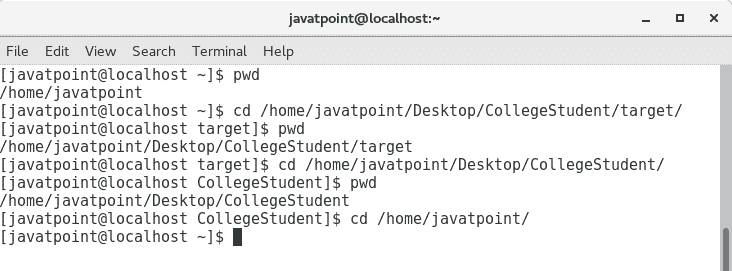
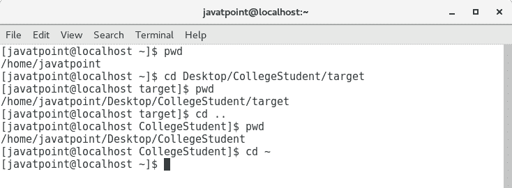
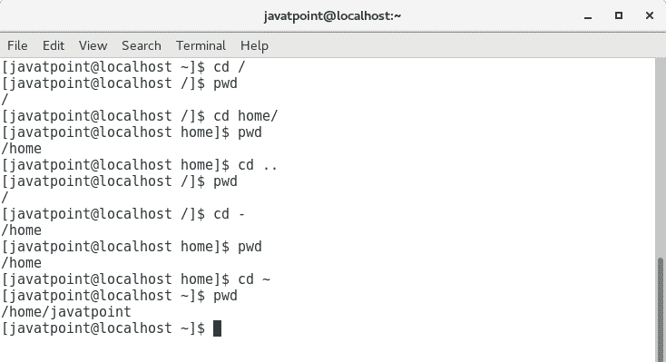

# 相对路径与绝对路径

> 原文：<https://www.javatpoint.com/bash-relative-vs-absolute-path>

在创建第一个 Bash Script 之前，您应该很好地了解 shell 导航以及预期文件的相对路径和绝对路径**之间的区别。让我们来了解一下它们是什么？**

 **## 什么是路径？

文件的**路径**是斜杠(/)和字母数字字符的合并形式。它确定文件或目录在操作系统文件系统中的唯一位置。

## 绝对路径

**绝对路径**是从根目录或实际文件系统开始指定文件或目录位置的完整路径。

**示例:**/home/javatpoint/Desktop/CollegeStudent

*   任何目录的绝对路径总是以代表根目录的斜杠(/)开头。除此之外，目录路径中的所有斜线分隔目录。
*   绝对路径中的所有目录名都是按层次顺序写入的。父目录名写在左侧。
*   绝对路径中的姓氏可能属于文件或目录。除了姓，所有的名字都属于目录。
*   当前目录的绝对路径可以通过使用 pwd 命令来确定。

## 相对路径

**文件的相对路径**是其相对于当前工作目录的位置。它从不以斜杠(/)开头。它从正在进行的工作目录开始。

**示例:桌面/学院学生**

*   单点(。)解析到当前目录。
*   双点(..)解析到当前工作目录的父目录。
*   波浪号(~)表示登录用户的主目录。

## 相对路径与绝对路径:

任何文件系统中最顶层的目录都是由斜杠(/)表示的根目录。您可以用绝对路径描述文件系统中任何文件或目录的位置。这意味着您将从根目录或文件系统的绝对开头开始执行每一步。

绝对路径是明确的，可能不方便使用，尤其是当您使用深度嵌套的目录时。要获得更简单的模式，可以使用相对路径。这样，如果您正在处理当前工作目录中或附近的文件，这可以省去您大量的键入工作。

每次仅通过文件名引用文件时，您都使用了相对路径。这是最直接的相对路径。shell 在当前目录中查找指定的文件名。

看这些例子，这样你就知道相对路径比绝对路径更方便。

1.绝对路径

2.相对路径

**贝壳导航:**

有两个命令( **cd** 和 **pwd** )有助于彻底导航 GNU/Linux 文件系统，其中，

1.  **cd** 用于更改目录，
2.  **打印当前工作目录的 pwd** 。

在这些命令的帮助下，我们可以使用相对路径和绝对路径轻松地浏览整个文件系统。只需遵循给定的基本示例。

在这里，您可以看到 cd 和 pwd 命令如何帮助导航不同的目录，即**根目录、父目录和主目录。**

* * ***