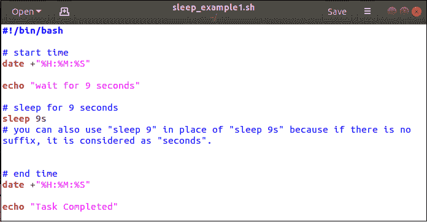
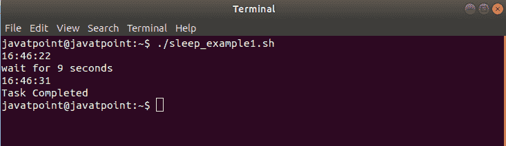

# 狂欢睡眠

> 原文：<https://www.javatpoint.com/bash-sleep>

在本主题中，您将了解如何通过使用不同的 bash 脚本来使用 sleep 命令。Sleep 是一个命令行实用程序，它允许我们在指定的时间内暂停调用过程。换句话说，Bash sleep 命令用于插入延迟或暂停执行一段指定的时间。

当程序员为了特定的目的需要暂停任何命令的执行时，这个命令可以和特定的时间值一起使用。可以通过**秒(s)、分钟(m)、小时(h)和天(d)** 设置延迟量。该命令在 bash shell 脚本中使用时特别有用。

### 睡眠命令语法

下面是 Bash 中睡眠命令的语法:

```

sleep number[suffix]

```

您可以使用任何正整数或小数作为时间值。后缀是可选部分。您可以将下列任一项作为后缀:

*   秒
*   m 分钟
*   小时
*   d 天

#### 注意:当没有后缀时，则认为数字以秒为单位(默认)。

当指定了两个或多个参数时，总时间将被视为等于它们的值之和的时间。

下面几个简单的例子展示了如何使用 sleep 命令:

*   睡眠 9 秒，使用
    **睡眠 9 或睡眠 9s**
*   睡眠 0.5 秒，使用
    **睡眠 0.5 或睡眠 0.5s**
*   睡眠 2 分 30 秒，使用
    **睡眠 2 米 30 秒**
*   睡 8 小时
    **睡 8 小时**
*   睡眠 2 天 9 小时 5 分 55 秒，使用
    **睡眠 2d 9h 5m 55s**

### Bash 脚本示例

我们将解释 Bash 中睡眠命令的最基本的例子。

**痛击脚本**

```

#!/bin/bash

# start time
date +"%H:%M:%S"

echo "wait for 9 seconds"

# sleep for 9 seconds
sleep 9s 
# you can also use "sleep 9" in place of "sleep 9s" because if there is no suffix, it is considered as "seconds".

# end time
date +"%H:%M:%S"

echo "Task Completed"

```

**Bash Console 视图** 

**输出**



## 剧本是如何运作的

当我们运行脚本时，它将以 HH:MM:SS 格式打印当前时间。然后 echo 命令将执行并打印消息“等待 9 秒钟”。然后 sleep 命令将执行并暂停脚本 9 秒钟。当指定的时间段过去后，脚本的下一行将再次打印当前时间。最后，回显命令将打印消息“任务已完成”。

同样，您可以运行睡眠命令几分钟、几小时和几天。

## 结论

在本主题中，我们讨论了如何将 bash 的执行延迟或暂停指定的时间。

* * *