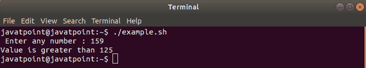
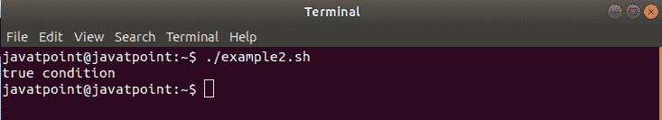
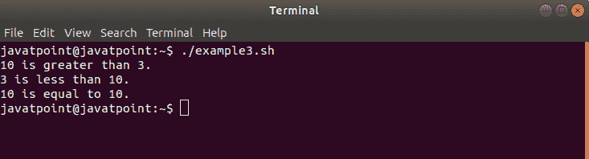
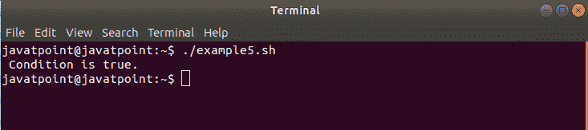
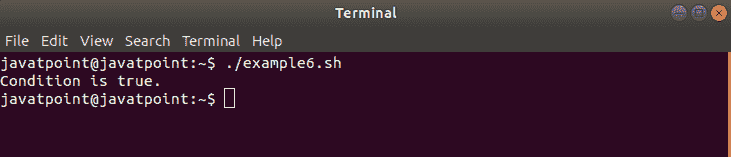
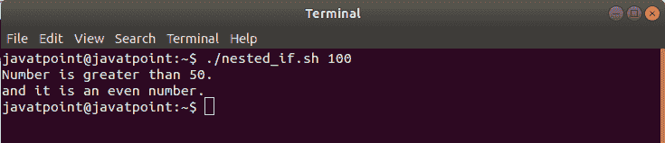

# Bash If

> 原文：<https://www.javatpoint.com/bash-if-statement>

在本主题中，我们将了解如何在 Bash 脚本中使用 **if 语句**来完成我们的自动化任务。

Bash if 语句是有益的。它们用于在语句执行的顺序流程中执行条件任务。If 语句通常允许我们在 Bash 脚本中做出决策。它们帮助我们根据可能设置的条件来决定是否运行一段代码。

## 基本 if 语句

一个基本的 if 语句命令如果一个特定的条件为真，那么只执行一组给定的动作。如果不是真的，那么不要执行那些动作。如果语句基于以下格式:

### 句法

```

if [ expression ];
then
statements
fi

```

只有当表达式(在方括号之间)为真时，才会执行**然后**和**之间的语句(如果向后)。**

#### 注意:观察第一行使用的空格和第一行末尾的分号；两者都是强制使用的。 If 条件语句以 fi 结束。

*   对于使用“与”运算符的多个条件:

```

if [ expression_1 ] && [ expression_2 ];
then
statements
fi

```

*   对于使用“或”运算符的多个条件:

```

if [ expression_1 ] || [ expression_2 ];
then
statements
fi

```

*   对于带有 AND & OR 运算符的复合表达式，我们可以使用以下语法:

```

if [ expression_1 && expression_2 || expression_3 ];
then
statements
fi

```

以下是一些演示 if 语句用法的示例:

### 例 1

在本例中，取用户输入的任意数字，并检查该值是否大于 125。

```

#!/bin/bash

read -p " Enter number : " number

if [ $number -gt 125 ]
then
echo "Value is greater than 125"
fi

```

**输出**

如果我们输入数字 159，那么输出将如下所示:



### 例 2

在本例中，我们通过一个比较两个字符串的简单场景来演示 **if 语句**的用法:

```

#!/bin/bash

# if condition is true
if [ "myfile" == "myfile" ];
then
echo "true condition"
fi

# if condition is false
if [ "myfile" == "yourfile" ];
then
echo "false condition"
fi

```

**输出**



### 例 3

在本例中，我们演示了如何使用 if 语句比较数字:

```

#!/bin/bash

#if condition (greater than) is true
if [ 10 -gt 3 ];
then
echo "10 is greater than 3."
fi

#if condition (greater than) is false
if [ 3 -gt 10 ];
then
echo "3 is not greater than 10."
fi

#if condition (lesser than) is true
if [ 3 -lt 10 ];
then
echo "3 is less than 10."
fi

#if condition (lesser than) is false
if [ 10 -lt 3 ];
then
echo "10 is not less than 3."
fi

#if condition (equal to) is true
if [ 10 -eq 10 ];
then
echo "10 is equal to 10."
fi

#if condition (equal to) is false
if [ 10 -eq 9 ];
then
echo "10 is not equal to 9"
fi

```

**输出**



### 例 4

在本例中，我们将定义如何使用 AND 运算符在 if 表达式中包含多个条件:

```

#!/bin/bash

# TRUE && TRUE
if [ 8 -gt 6 ] && [ 10 -eq 10 ];
then
echo "Conditions are true"
fi

# TRUE && FALSE
if [ "mylife" == "mylife" ] && [ 3 -gt 10 ];
then
echo "Conditions are false"
fi

```

**输出**


### 例 5

在本例中，我们将定义如何使用 OR 运算符在 if 表达式中包含多个条件:

```

#!/bin/bash

# TRUE || FALSE
if [ 8 -gt 7 ] || [ 10 -eq 3 ];
then 
echo " Condition is true. "
fi

# FALSE || FALSE
if [ "mylife" == "yourlife" ] || [ 3 -gt 10 ];
then
echo " Condition is false. "
fi

```

**输出**



### 例 6

在本例中，我们将定义如何使用 AND 和 OR 在 if 表达式中包含多个条件:

```

#!/bin/bash

# TRUE && FALSE || FALSE || TRUE
if [[ 10 -eq 10 && 5 -gt 4 || 3 -eq 4 || 3 -lt 6 ]];
then
echo "Condition is true."
fi

# TRUE && FALSE || FALSE
if [[ 8 -eq 8 && 8 -gt 10 || 9 -lt 5 ]];
then
echo "Condition is false"
fi

```

**输出**



## Bash 脚本中 If 语句的选项

If 语句包含许多执行特定任务的选项。这些选项可用于文件操作、字符串操作等。以下是一些最常用的选项:

-

| 选项(运算符) | 描述 |
| ！表示 | 检查 EXPRESSION 是否为 false。 |
| -n STRING | 检查字符串的长度是否大于零。 |
| -z STRING | 检查字符串的长度是否为零(即，它是空的) |
| STRING1 == STRING2 | 检查 STRING1 是否等于 STRING2。 |
| STRING1！= STRING2 | 检查 STRING1 是否不等于 STRING2。 |
| INTEGER1 -eq INTEGER2 | 检查整数 1 在数字上是否等于整数 2。 |
| 英特尔 1 -gt 英特尔 2 | 检查整数 1 在数字上是否大于整数 2。 |
| 英特尔 1 -lt 英特尔 2 | 检查整数 1 在数字上是否小于整数 2。 |
| -d FILE | 检查文件是否存在并且它是一个目录。 |
| -e FILE | 检查文件是否存在。 |
| -r FILE | 检查文件是否存在，并授予读取权限。 |
| -s FILE | 检查文件是否存在，其大小是否大于零(这意味着它不是空的)。 |
| -w FILE | 检查文件是否存在以及是否授予了写权限。 |
| x FILE | 检查文件是否存在，并授予执行权限。 |

## 嵌套 If

您可以根据需要在 bash 脚本中应用任意多的“if 语句”。也可以在另一个“if 语句”中使用 if 语句。它被称为嵌套 If 语句。

### 例子

在这个例子中，我们将通过使用嵌套的 if 表达式找到“如果给定的数字大于 50，并且如果它是偶数”。

```

#!/bin/bash
#Nested if statement

if [ $1 -gt 50 ]
then
  echo "Number is greater than 50."

  if (( $1 % 2 == 0 ))
  then
    echo "and it is an even number."
  fi
fi

```

**输出**

如果我们将参数值输入为 100，那么输出将如下所示:



## 结论

在本主题中，我们讨论了如何使用 bash if 语句在语句的顺序执行流程中使用条件分支。

* * *