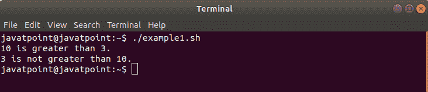
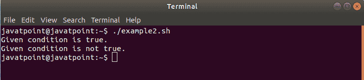
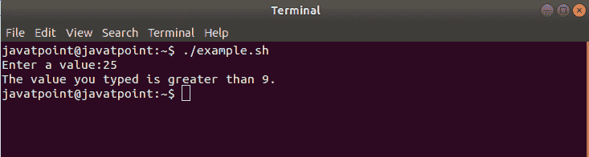
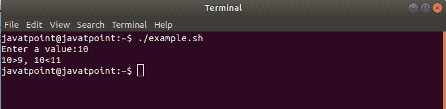

# Bash If Else

> 原文：<https://www.javatpoint.com/bash-if-else-statement>

在本主题中，我们将了解如何在 Bash 脚本中使用 if-else 语句来完成我们的自动化任务。

Bash if-else 语句用于在语句执行的顺序流程中执行条件任务。有时，如果一个条件为真，我们希望处理一组特定的语句，如果为假，我们希望处理另一组语句。为了执行这类操作，我们可以应用 if-else 机制。我们可以用“if 语句”来应用条件。

### Bash If Else 语法

Bash Shell 脚本中 if-else 语句的语法可以定义如下:

```

if [ condition ];
then
   <if block commands>
else
  <else block commands>
fi

```

### 需要记住的要点

*   我们可以使用一组使用条件运算符连接的一个或多个条件。
*   Else block 命令包括一组在条件为假时要执行的操作。
*   分号(；)后面的条件表达式是必须的。

查看以下示例，演示 Bash 脚本中 if-else 语句的使用:

### 例 1

下面的示例包含两种不同的情况，其中在第一个 if-else 语句中，条件为真，而在第二个 if-else 语句中，条件为假。

```

#!/bin/bash

#when the condition is true
if [ 10 -gt 3 ];
then
  echo "10 is greater than 3."
else
  echo "10 is not greater than 3."
fi

#when the condition is false
if [ 3 -gt 10 ];
then
  echo "3 is greater than 10."
else
  echo "3 is not greater than 10."
fi

```

**输出**



在第一个 if-else 表达式中，条件(10 -gt 3)为真，因此执行 if 块中的语句。而在另一个 if-else 表达式中，条件(3 -gt 10)为假，因此执行 else 块中的语句。

### 例 2

在这个例子中，我们解释了如何在 Bash 中使用 if-else 语句来使用多个条件。我们使用 bash 逻辑运算符来连接多个条件。

```

#!/bin/bash

# When condition is true
# TRUE && FALSE || FALSE || TRUE
if [[ 10 -gt 9 && 10 == 9 || 2 -lt 1 || 25 -gt 20 ]];
then
  echo "Given condition is true."
else
  echo "Given condition is false."
fi

# When condition is false
#TRUE && FALSE || FALSE || TRUE
if [[ 10 -gt 9 && 10 == 8 || 3 -gt 4 || 8 -gt 8 ]];
then
  echo "Given condition is true."
else
  echo "Given condition is not true."
fi

```

**输出**



## 一行中的 Bash If Else 语句

我们可以在一行中编写完整的 if-else 语句和命令。您需要遵循给定的规则在单行中使用 if-else 语句:

*   使用分号(；)放在 if 和 else 块中语句的末尾。
*   使用空格作为分隔符来附加所有语句。

下面给出了一个示例，演示如何在一行中使用 if-else 语句:

### 例子

```

#!/bin/bash

read -p "Enter a value:" value
if [ $value -gt 9 ]; then echo "The value you typed is greater than 9."; else echo "The value you typed is not greater than 9."; fi

```

**输出**

当我们输入一个值为 25 时，输出将如下所示:



## Bash 嵌套 If Else

就像嵌套的 if 语句一样，if-else 语句也可以用在另一个 if-else 语句中。它在 Bash 脚本中被称为嵌套 if-else。

下面是一个解释如何在 Bash 中使用嵌套 if-else 语句的示例:

### 例子

```

#!/bin/bash

read -p "Enter a value:" value
if [ $value -gt 9 ];
then
  if [ $value -lt 11 ];
  then
     echo "$value>9, $value<11"
  else
    echo "The value you typed is greater than 9."
  fi
else echo "The value you typed is not greater than 9."
fi

```

**输出**

如果我们输入 10 作为值，那么输出将如下所示:



## 结论

在本主题中，我们通过示例了解了 **Bash if-else** 语句的语法和用法。

* * *