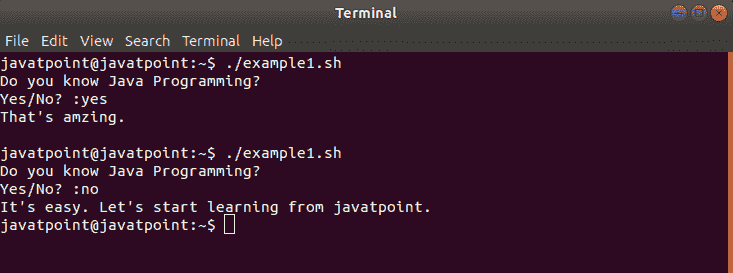
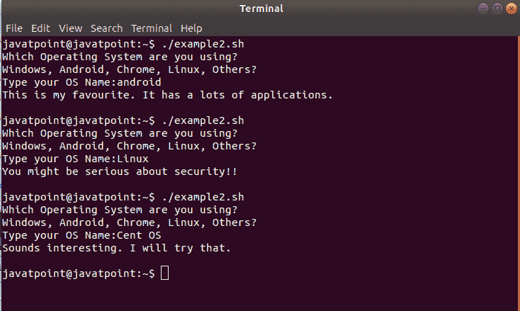

# 巴什案例

> 原文：<https://www.javatpoint.com/bash-case-statement>

在本主题中，我们将讨论案例语句的基础以及如何在 Bash 脚本中使用它们。

Bash case 语句是带有许多 ELIF 元素的 IF-THEN-ELSE 的最简单形式。使用 case 语句使我们的 bash 脚本更易读、更容易维护。这些通常用于简化具有多个不同选择的复杂条件。

Bash case 语句遵循与 Javascript 或 C switch 语句类似的逻辑。略有不同，如下所示:

*   Bash case 语句只取一次值，并多次测试该值。一旦找到模式并执行与之链接的语句，它就停止搜索模式，这与 C switch 语句的情况几乎相反。

### 案例语句语法

bash case 语句的语法如下:

```

case expression in
	pattern_1)
		statements
		;;
	pattern_2)
		statements
		;;
	pattern_3|pattern_4|pattern_5)
		statements
		;;
	pattern-n)
		statements
		;;
	*)
		statements
		;;
esac

```

bash 案例语句有一些要点:

*   bash 中的每个 case 语句都以' case '关键字开始，后面是 case 表达式和' in '关键字。case 语句由“esac”关键字结束。
*   我们可以应用由|运算符分隔的多个模式。)运算符指示模式列表的终止。
*   包含语句的模式称为子句，必须以双分号(；；).
*   星号(*)用作定义默认案例的最终模式。当用作最后一种情况时，它用作默认情况。

## 它是如何工作的

首先，case 语句扩展了表达式，并试图与每个包含的模式相匹配。当它发现匹配时，所有链接的语句被执行，直到双分号(；；).第一次匹配后，case 以最后执行的语句的退出状态终止。

如果没有匹配的模式，案例的退出状态为零。否则，返回状态是已执行语句的退出状态。

如果使用默认的星号模式，它将在没有匹配模式的情况下执行。

让我们借助几个例子来理解这个机制:

### 例 1

在这个例子中，我们定义了一个简单的场景来演示 case 语句的使用。

**痛击脚本**

```

#!/bin/bash

echo "Do you know Java Programming?"
read -p "Yes/No? :" Answer
case $Answer in
	Yes|yes|y|Y)
		echo "That's amazing."
		echo
		;;
	No|no|N|n)
		echo "It's easy. Let's start learning from javatpoint."
		;;
esac

```

**输出**



### 例 2

在这个例子中，我们定义了一个组合场景，当没有找到之前匹配的案例时，也有一个默认案例。

**痛击脚本**

```

#!/bin/bash

echo "Which Operating System are you using?"
echo "Windows, Android, Chrome, Linux, Others?"
read -p "Type your OS Name:" OS

case $OS in
	Windows|windows)
		echo "That's common. You should try something new."
		echo
		;;
	Android|android)
		echo "This is my favorite. It has lots of applications."
		echo
		;;
	Chrome|chrome)
		echo "Cool!!! It's for pro users. Amazing Choice."
		echo
		;;
	Linux|linux)
		echo "You might be serious about security!!"
		echo
		;;
	*)
		echo "Sounds interesting. I will try that."
		echo
		;;
esac

```

**输出**

我们已经用三种不同的输入运行了脚本，请查看下面的输出:



## 结论

In this topic, we have learned about the syntax and usage of Bash Case statement with the examples.

* * *