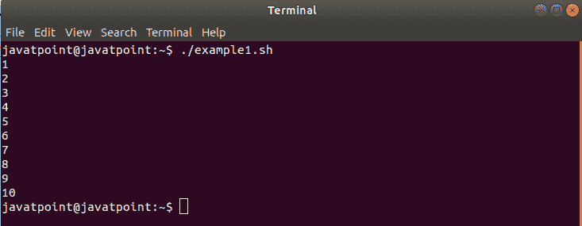
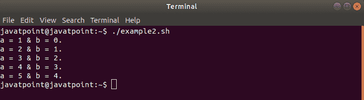

# 敲打直到循环

> 原文：<https://www.javatpoint.com/bash-until-loop>

在本主题中，我们已经定义了如何在 Bash 脚本中使用直到循环语句。

当某个条件评估为真时，while 循环是执行一组命令的绝佳选择。有时，我们需要执行一组命令，直到某个条件评估为真。在这种情况下，Bash 直到循环是有用的。

Bash 脚本中的 **Bash 直到循环**用于根据表达式的布尔结果重复执行一组命令。这组命令仅在表达式计算为真时执行。这意味着当表达式的计算结果为 false 时，会迭代执行一组命令。一旦表达式第一次计算为真，循环就终止。

简而言之，直到循环类似于 while 循环，但概念相反。

### 句法

直到循环的语法看起来几乎类似于 bash while 循环的语法。但是两者的功能有很大的不同。bash 直到循环的语法可以定义为:

```

until [ expression ];
do
command1
command2
. . .
. . . . 
commandN
done

```

如果表达式中有多个条件，则语法如下:

```

until [[ expression ]];
do
command1
command2
. . .
. . . . 
commandN
done

```

以下给出了直到循环的一些要点:

*   在执行命令之前会检查条件。
*   仅当条件评估为 false 时，才会执行命令。
*   一旦条件评估为真，循环就终止。
*   程序控制在终止后转移到' done '关键字后面的命令。

**while 循环和直到循环**

*   执行“直到循环”命令，直到返回非零状态。
*   执行“while 循环”命令，直到返回零状态。
*   直到循环包含至少要执行一次的属性。

## Bash 直到循环的例子

下面是 bash 直到循环的一些例子，说明了不同的场景，以帮助您理解它的用法和工作原理:

### 直到单条件循环

在本例中，直到循环在表达式中包含一个条件。这是直到循环的基本示例，它将打印从 1 到 10 的一系列数字:

**例**

```

#!/bin/bash
#Bash Until Loop example with a single condition

i=1
until [ $i -gt 10 ]
do
echo $i
((i++))
done

```

**输出**



### 多条件循环

下面是一个表达式中有多个条件的示例:

**例**

```

#!/bin/bash
#Bash Until Loop example with multiple conditions

max=5
a=1
b=0

until [[ $a -gt $max || $b -gt $max ]];
do
echo "a = $a & b = $b."
((a++))
((b++))
done

```

**输出**



## 结论

在本主题中，我们已经学习了 bash 脚本中的直到循环语句的语法，用于示例脚本的表达式中的单个和多个条件。

* * *