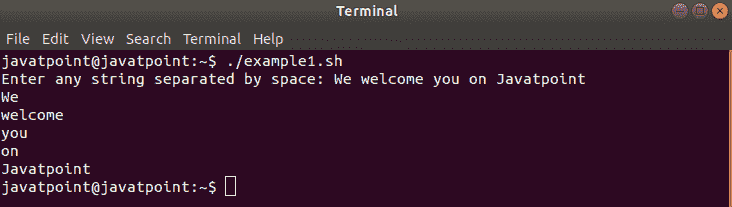
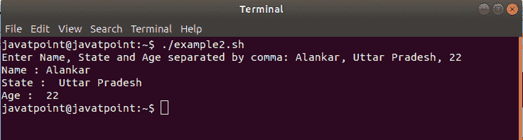
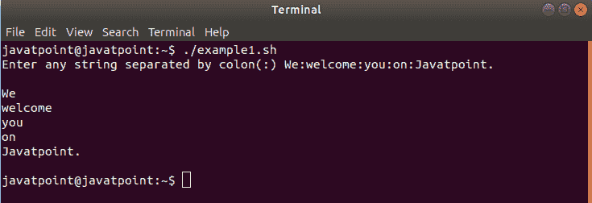
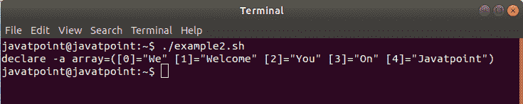
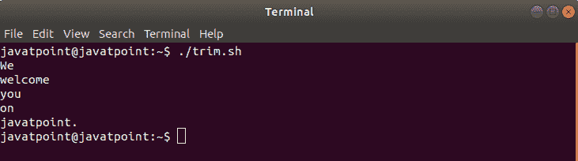

# Bash 拆分字符串

> 原文：<https://www.javatpoint.com/bash-split-string>

在本主题中，我们已经定义了如何在 bash shell 脚本中拆分字符串。

在某些情况下，我们可能需要拆分字符串数据来执行一些特定的任务。大多数编程语言都包含内置函数“split”，用于将任何字符串数据分成多个部分。然而，bash 不包含这种类型的内置函数。但是我们可以在 bash 脚本中使用分隔符来拆分任何字符串数据。分隔符可以是单个字符，也可以是包含多个字符的字符串。

查看下面的方法，了解如何在 bash shell 中拆分字符串:

## 使用$IFS 变量拆分

以下是在 bash 中使用$IFS 拆分字符串的步骤:

*   $IFS 是一个特殊的内部变量，用于将字符串拆分成单词。$IFS 变量被称为“**内部字段分隔符**，它决定了 Bash 如何识别边界。$IFS 用于分配用于分割字符串的特定分隔符[ **IFS=' <delimiter>'</delimiter>** ]。空白是$IFS 的默认值。但是，我们也可以使用诸如' \t '，' \n '，'-'等值。作为分隔符。
*   分配分隔符后，可以通过两个选项读取字符串:“-r”和“-a”。即**read-ra ARR<<<“$ str”**。
    在这里，选项“-r”用于定义反斜杠(\)是字符而不是转义字符。“-a”选项用于定义将单词(由$IFS 分隔)分配给从零开始的数组的顺序索引。
*   然后，我们应用 bash“for”循环来访问分成数组的令牌。

让我们借助一些例子来理解这个机制:

### 示例 1: Bash 按空间拆分字符串

在本例中，使用空格字符分隔符分割字符串。

**痛击脚本**

```

#!/bin/bash
#Example for bash split string by space

read -p "Enter any string separated by space: " str  #reading string value

IFS='' #setting space as delimiter
read -ra ADDR <<
```

**输出**

如果我们输入一个字符串“我们在 Javatpoint 上欢迎您”，输出将如下所示:



### 示例 2: Bash 按符号拆分字符串

在某些情况下，我们可能需要通过其他分隔符(如符号或特定字符)来拆分字符串。在本例中，使用逗号(，)符号字符作为分隔符来拆分字符串。

**痛击脚本**

```

#!/bin/bash
#Example for bash split string by Symbol (comma)

read -p "Enter Name, State and Age separated by a comma: " entry #reading string value

IFS=',' #setting comma as delimiter
read -a strarr <<
```

**输出**



## 不带$IFS 变量的拆分

在 bash 中，字符串也可以在不使用$IFS 变量的情况下进行划分。带有-d 选项的“readarray”命令用于拆分字符串数据。-d 选项用于定义命令中的分隔符，如$IFS。此外，bash 循环用于以拆分形式打印字符串。

让我们借助一些例子来理解这个逻辑:

### 示例 1: Bash 按符号拆分字符串

此示例定义了如何在不使用$IFS 的情况下拆分字符串值。根据脚本，文本值应该用冒号(:)符号输入，以便可以拆分。查看下面的 bash 脚本:

**痛击脚本**

```

#!/bin/bash
#Example for bash split string without $IFS

read -p "Enter any string separated by colon(:) " str #reading string value

readarray -d : -t strarr <<
```

**输出**



### 示例 2: Bash 用另一个字符串拆分字符串

在这个例子中，我们使用了惯用的表达式，其中参数扩展已经完成。

**痛击脚本**

```

#!/bin/bash
#Example for bash split string by another string

str="WeLearnWelcomeLearnYouLearnOnLearnJavatpoint"
delimiter=Learn
s=$str$delimiter
array=();
while [[ $s ]];
do
array+=( "${s%%"$delimiter"*}" );
s=${s#*"$delimiter"};
done;
declare -p array

```

在这个 bash 脚本中，我们使用了以下参数扩展:

*   **${parameter%%word}**
    删除最长匹配后缀模式。
*   **${parameter#word}**
    它删除了最短匹配前缀模式。

**输出**



### 示例 3:使用修剪命令敲打分割字符串

在这个例子中，我们使用了 trim (tr)命令来分割一个字符串。trim 命令用于在分隔符上拆分字符串，而不是使用 read 命令。

**痛击脚本**

```

#!/bin/bash
#Example to split a string using trim (tr) command

my_str="We;welcome;you;on;javatpoint."
my_arr=($(echo $my_str | tr ";""\n"))

for i in "${my_arr[@]}"
do
echo $i
done

```

**输出**



#### 注意:应该注意的是，如果我们应用一个 trim 命令来分割一个字符串，数组元素将在“空格分隔符”上被分割。例如，像“视窗操作系统”这样的元素将被视为两个不同的词。

## 结论

在本主题中，我们演示了如何在 bash 脚本中使用不同类型的场景(使用或不使用分隔符)拆分字符串。

* * *