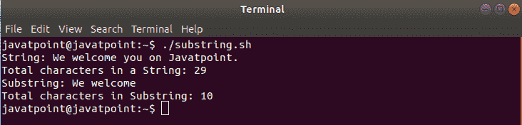

# Bash 子字符串

> 原文：<https://www.javatpoint.com/bash-substring>

在本主题中，我们已经解释了如何计算给定字符串的子字符串。

子字符串是字符串中的一系列字符。Bash 提供了一个从字符串本身提取信息的选项。您可以使用几种方法提取数字或给定的字符串。

**比如**“欢迎你上 Javatpoint。”是“我们在 Javatpoint 上欢迎你”的子字符串

### 句法

用于提取子字符串的命令是一个内置的 bash 命令，因此从性能角度来看，它非常好用。

子串提取的语法可以定义为:

```

${variable:offset:length}

```

**在哪里，**

变量是包含字符串的变量名。
Offset 用于指定开始提取字符串的位置。
长度用于指定从偏移量开始要执行的字符范围。

#### 注意:指定长度是可选的。如果未提供长度，则字符串的结尾将被视为子字符串的结尾。

让我们借助一些例子来理解从字符串中提取子字符串的概念:

### 示例 1:从开始提取特定字符

```

#!/bin/bash
#Script to extract first 10 characters of a string

echo "String: We welcome you on Javatpoint."
str="We welcome you on Javatpoint."

echo "Total characters in a String: ${#str} "

substr="${str:0:10}"

echo "Substring: $substr"
echo "Total characters in Substring: ${#substr} "

```

**输出**



### 示例 2:从特定字符开始提取

```

#!/bin/bash
#Script to print from 11th character onwards

str="We welcome you on Javatpoint."
substr="${str:11}"
echo "$substr"

```

**输出**

```
you on Javatpoint.

```

这里，字符串的结尾被认为是子字符串的结尾。

### 示例 3:提取单个字符

```

#!/bin/bash
#Script to print 11th character of a String

str="We welcome you on Javatpoint."
substr="${str:11:1}"
echo "$substr"

```

**输出**

```
y

```

### 示例 4:从最后提取特定字符

```

#!/bin/bash
#Script to extract 11 characters from last

str="We welcome you on Javatpoint."
substr="${str:(-11)}"
echo "$substr"

```

**输出**

```
Javatpoint.

```

## 结论

In this topic, we demonstrated how to extract a substring from a string in bash scripting with different types of scenarios and examples.

* * *