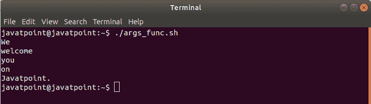
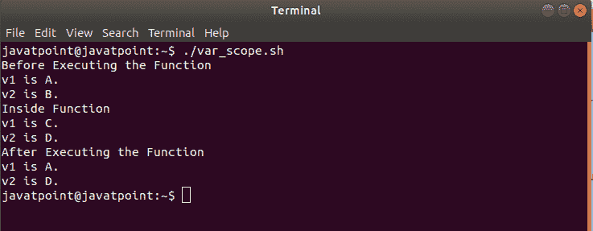
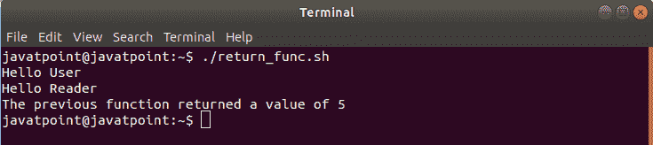
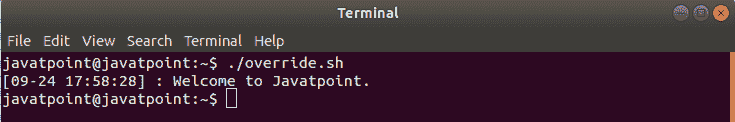

# Bash 函数

> 原文：<https://www.javatpoint.com/bash-functions>

在本主题中，我们演示了 bash 函数的基础知识以及它们在 bash shell 脚本中的工作方式。

bash 脚本中的函数是重用代码的绝佳选择。一个 bash 函数可以被定义为一组可以在 Bash 脚本中多次调用的命令。bash 中 function 的目的是帮助您提高脚本的可读性，避免反复编写相同的代码。它还允许开发人员将复杂冗长的代码分解成小部分，这些小部分可以在任何需要的时候调用。函数可以随时重复调用，这将使我们能够重用、优化和最小化代码。

以下是关于 bash 函数的一些要点:

*   函数必须在 shell 脚本中声明，然后我们才能使用它。
*   参数可以传递给函数，并在函数内部作为$1、$2 等进行访问。
*   局部变量可以在函数中赋值，并且这些变量的范围将只限于那个特定的函数。
*   Bash shell 的内置命令可以使用函数来覆盖。

### 句法

声明 bash 函数的语法可以用两种格式定义:

1.第一个方法以函数名开始，后面是括号。这是最优选和最常用的方法:

```

function_name () {
commands
}

```

单线版本可提及如下:

```

function_name () { commands; }

```

2.第二种方法从函数保留字开始，后跟函数名:

```

function function_name {
commands
}

```

单线版本可提及如下:

```

function function_name { commands; }

```

与大多数编程语言相比，Bash 函数有些有限。让？让我们借助一些例子来理解这个概念:

### 示例:方法 1

```

#!/bin/bash

JTP () {
	echo 'Welcome to Javatpoint.'
}

JTP

```

**输出**

```
Welcome to Javatpoint.

```

### 示例:方法 2

```

#!/bin/bash

function JTP {
	echo 'Welcome to Javatpoint.'
}

JTP

```

**输出**

```
Welcome to Javatpoint.

```

## 传递参数

像大多数编程语言一样，我们也可以在 bash 函数中传递参数和处理数据。我们可以像向 bash 脚本传递命令行参数一样，将数据插入到函数中。

为了将任意数量的参数传递给 bash 函数，我们需要将它们插入到函数名称的后面。我们必须在函数名和参数之间使用空格。在参数周围使用双引号也是一个很好的选择，以防止错误解析带有空格的参数。

以下是将参数传递给 bash 函数的一些要点:

*   给定的参数被访问为$1、$2、$3...$n，对应于函数名称后的参数位置。
*   $0 变量保留给函数名。
*   $#变量用于保存给函数的位置参数的数量。
*   $*和[【电子邮件保护】](/cdn-cgi/l/email-protection)变量用于保存给函数的所有参数。
    *   当$*与双引号(即“$*”)一起使用时，它会扩展为由空格分隔的单个字符串。例如，“1 美元 2 美元 n 美元等”。
    *   当[【邮件保护】](/cdn-cgi/l/email-protection)使用双引号时(即“[【邮件保护】](/cdn-cgi/l/email-protection)”)，它会扩展为单独的字符串。例如，“$ 1”“$ 2”“$ n”等。
    *   当$*和$#不与双引号一起使用时，它们是相同的。

下面是说明如何将参数传递给函数以及如何访问函数内部参数的过程的代码。

**痛击脚本**

```

#!/bin/bash
#Script to pass and access arguments

function_arguments()
	{
	echo $1
	echo $2
	echo $3
	echo $4
	echo $5
	}

#Calling function_arguments
function_arguments "We""welcome""you""on""Javatpoint."

```

**输出**



在这个脚本中，在我们调用了 function_arguments 之后，我们添加了值“we”、“welcome”、“you”、“on”和“Javatpoint”。这些值作为参数传递给**函数参数**，并存储在局部变量中。但是，与其他语言不同，解释器将传递的值存储到预定义的变量中，然后根据传递参数的顺序对这些变量进行命名。

**例如**

**“我们”**字被存储到变量 **1** 中。
**“欢迎”**字被存储到变量 **2** 中。
**“你”**字存储到变量 **3** 中。
**“开”**字存储到变量 **4** 中。
**“Javatpoint”**字存储到变量 **5** 中。

## 变量作用域

全局变量被定义为可以在脚本中的任何地方访问的变量，而与范围无关。默认情况下，所有变量都被定义为全局变量，即使它们是在函数内部声明的。我们也可以创建变量作为局部变量。局部变量可以用。本地的？首次分配时的关键字。它们只能在该函数中访问。我们可以在不同的函数中创建同名的局部变量。要添加局部变量，我们可以使用以下语法:

```

local var_name=  
```

为了更好地理解变量作用域在 Bash Scripting 中是如何工作的，请查看以下示例:

**痛击脚本**

```

#!/bin/bash

v1='A'
v2='B'

my_var () {
local v1='C'
v2='D'
echo "Inside Function"
echo "v1 is $v1."
echo "v2 is $v2."
}

echo "Before Executing the Function"
echo "v1 is $v1."
echo "v2 is $v2."

my_var
echo "After Executing the Function"
echo "v1 is $v1."
echo "v2 is $v2."

```

**输出**



根据输出，如果我们在函数体中设置一个与现有全局变量同名的局部变量，那么它将优先于全局变量。全局变量可以在函数中修改。

## 返回值

大多数编程语言都有为函数返回值的概念。这意味着函数必须将数据发送回原始调用位置。与“真实”编程语言中的函数不同，Bash 函数不支持在被调用时返回值。然而，它们允许我们设置一个返回状态，类似于程序或命令如何以退出状态退出。当 bash 函数完成时，它的返回值是函数中最后执行的语句的状态。成功状态返回 0，失败状态返回 1-255 范围内的非零十进制数。

返回状态可以通过使用“return”关键字来指示，并且它被分配给变量$？。return 语句终止函数，并作为函数的退出状态。

**例如，**考虑以下代码:

**痛击脚本**

```

#!/bin/bash
#Setting up a return status for a function

print_it () {
	echo Hello $1
	return 5
}

print_it User
print_it Reader
echo The previous function returned a value of $?

```

**输出**



从函数返回值的另一个更好的选择是使用**回声**或**打印**命令将值发送到**标准输出**，如下所示:

**痛击脚本**

```

#!/bin/bash

print_it () {
	local my_greet="Welcome to Javatpoint."
	echo "$my_greet"
}

my_greet="$(print_it)"
echo $my_greet

```

**输出**

```
Welcome to Javatpoint.

```

## 覆盖命令

我们可以通过创建一个与我们要覆盖的命令同名的函数来覆盖 bash 命令。例如，如果我们想要覆盖“echo”命令，那么我们必须创建一个名为“echo”的函数。

这种覆盖 bash 命令的概念在某些场景中可能会有帮助，比如当我们想要使用带有特定选项的命令时。此外，当我们不喜欢在脚本中多次为整个命令提供选项时。在这种情况下，我们可以用选项覆盖内置的 bash 命令。现在，让我们借助一些例子来理解在 Bash Shell 脚本中重写命令的概念:

### 例子

在本例中，我们已经覆盖了“echo”命令，并将时间戳以参数的形式添加到“echo”命令中。

**痛击脚本**

```

#!/bin/bash
#Script to override command using function

echo () {
	builtin echo -n `date +"[%m-%d %H:%M:%S]"` ": "
	builtin echo $1
}

echo "Welcome to Javatpoint."

```

**输出**



## 结论

在本主题中，我们演示了 Bash 函数。Bash 函数被认为是为执行特定操作而开发的可重用代码块。一旦定义了它，就可以在脚本中多次调用它。

* * *