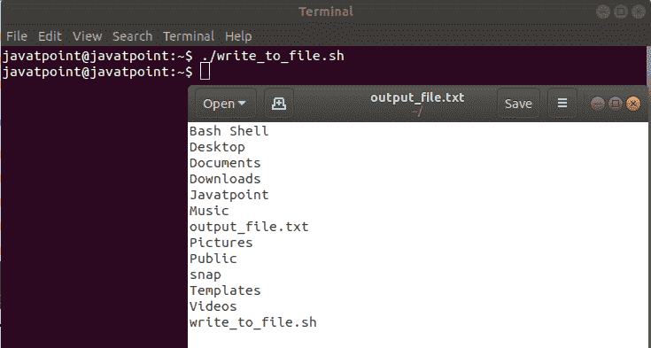
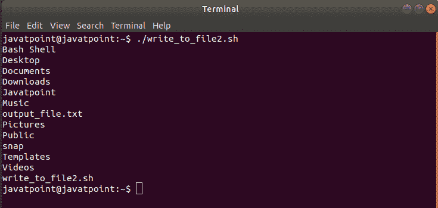
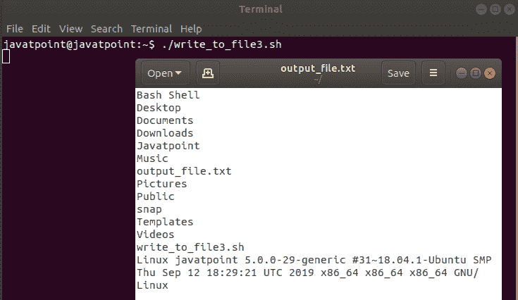
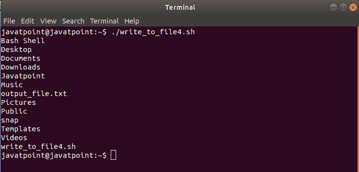
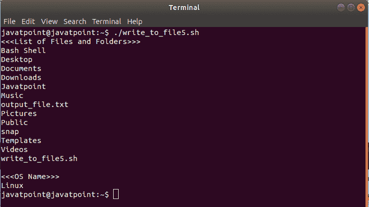

# 向文件写入

> 原文：<https://www.javatpoint.com/bash-write-file>

当我们在 bash shell 中运行任何命令时，它通常会将该命令的输出打印到终端，这样我们就可以立即读取它。但是 bash 还提供了一个选项，可以将任何 bash 命令的输出“重定向”到日志文件。它可以将输出保存到一个文本文件中，以便我们以后需要时可以查看它。

## 方法 1:仅将输出写入文件

要将 Bash 命令的输出写入文件，我们可以使用直角括号符号(>)或双直角符号(>>):

### 直角括号符号(>)

它用于将 bash 命令的输出写入磁盘文件。如果没有具有指定名称的文件，则它会创建一个具有相同名称的新文件。如果该文件以指定的名称存在，则该文件的内容将被覆盖。

### 双直角符号(>>)

它用于将 bash 命令的输出写入文件，并将输出附加到文件的现有内容中。如果文件不存在，它会用指定的名称创建一个新文件。

从技术上讲，这两个操作符都将“stdout(标准输出)”重定向到一个文件。

简单地说，当我们第一次写文件并且不想让以前的数据出现在文件中时，我们应该使用右尖括号符号(>)。如果内容已经存在于文件中，它将覆盖该内容。在下一个脚本中，我们可以使用双直角符号(>>)将数据追加到文件中。

### 例子

“ls”命令用于打印当前目录中的所有文件和文件夹。但是当我们运行带有直角括号符号(>)的“ls”命令时，它不会将文件和文件夹列表打印到屏幕上。它会将输出保存到我们用它指定的文件中，如下所示:

**痛击脚本**

```

#!/bin/bash
#Script to write the output into a file

#Create output file, override if already present
output=output_file.txt

#Write data to a file
ls > $output

#Checking the content of the file
gedit output_file.txt

```

**输出**



如图所示,“ls”命令的输出被重定向到一个文件中。要将文件内容打印到终端，我们可以使用以下形式的“cat”命令:

**痛击脚本**

```

#!/bin/bash
#Script to write the output into a file

#Create output file, override if already present
output=output_file.txt

#Write data to a file
ls > $output

#Printing the content of the file
cat $output

```

**输出**



如果我们想在不删除可用数据的情况下将多个命令的输出重定向到一个文件，那么我们可以使用>>运算符。假设我们想将系统信息附加到指定的文件中，我们可以通过以下方式实现:

**痛击脚本**

```

#!/bin/bash
#Script to write the output into a file

#Create output file, override if already present
output=output_file.txt

#Write data to a file
ls > $output

#Appending the system information
uname -a >> $output

#Checking the content of the file
gedit output_file.txt

```

**输出**



这里，第二个命令的结果被附加到文件的末尾。

我们可以重复这个过程几次，以继续将输出附加到文件的末尾。

## 方法 2:正常打印输出并将其写入文件

有些人可能不喜欢使用>或>>运算符将输出写入文件，因为终端中不会有命令输出。这就是为什么使用“tee”命令的原因。“tee”命令用于将收到的输入打印到屏幕上。它可以同时将输出保存到一个文件中。

**痛击脚本**

```

#!/bin/bash
#Script to write the output into a file

#Create output file, override if already present
output=output_file.txt

#Write data to a file
ls | tee $output

```

**输出**



这将覆盖文件的内容，就像>操作符一样，但也会在屏幕上打印输出。

如果我们想在不使用 tee 命令删除文件内容的情况下将输出写入文件，我们可以使用以下表单，该表单也将输出打印到终端:

**痛击脚本**

```

#!/bin/bash
#Script to write the output into a file

#Create output file, override if already present
output=output_file.txt

echo "<<>>" | tee -a $output
#Write data to a file
ls | tee $output

echo | tee -a $output
#Append System Information to the file
echo "<<<os name="">>>" | tee -a $output
uname | tee -a $output</os> 
```

**输出**



这不仅会将输出附加到文件的末尾，还会在屏幕上打印输出。

* * *