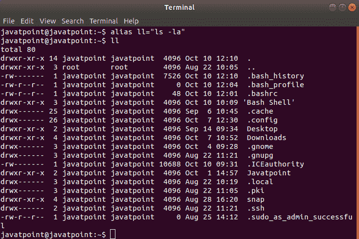
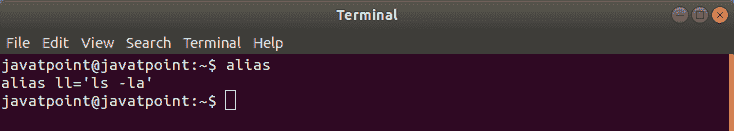
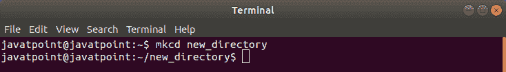

# Bash 别名

> 原文：<https://www.javatpoint.com/bash-alias>

在操作命令行界面时，我们会使用大多数命令。大多数命令都是习惯性的，人们可能每天都以同样的方式运行这些命令。然而，我们在 Bash 中有一个选项，可以在别名的帮助下创建自己的快捷方式，这将通过使用简称来消除无关的类型。

Bash Alias 用于为较长的命令设置快捷命令。alias 命令允许我们使用一个单词启动任何命令或设置命令。例如，我们可以将命令“cc”设置为“clear”命令的快捷方式。使用“cc + enter”比键入“clear”命令要快得多。

别名通常在 **~/内声明。bash_profile** 或 **~/。bashrc 文件**。

“一**。bash_profile** 和**。bashrc** 文件被称为 bash shell 的配置文件。所有的 bash 配置，比如所有的终端会话，配置包括环境变量、默认目录、颜色、bash 主题等。，存储在配置文件中。配置文件的名称通常是”。bashrc“对于终端会话”和“**”。bash_profile** “用于登录外壳。”

## Bash 别名结构

bash 别名包含以下结构:

```

alias [alias_name]="[command_to_alias]"

```

一个新的别名用“*别名*关键字定义在一个新的行上。我们需要定义我们想要与别名一起使用的快捷命令，后跟一个等号。然后，我们在引号中键入要运行的完整命令。相邻元素和等号之间不应有间距。这是一件需要记住的重要事情；否则，该命令将被破坏。

## 创建一个 Bash 别名

在 bash 中创建别名非常简单。我们可以按照上面显示的结构在命令行中声明别名。

现在让我们从一个简单的 bash 别名开始。许多人用来获得所有文件和目录(包括隐藏文件)列表的常用命令之一是“ **ls -la** ”。通过在终端中键入以下命令，我们可以创建快捷方式“ **ll** ”来执行“ **ls -la** ”的操作:

```

alias ll="ls -la"

```

现在，如果我们在终端中键入别名“ **ll** ，我们将收到所有文件和目录的长格式列表，类似于“ **ls -la** ”命令。



#### 注意:需要注意的是，如果我们通过终端使用这种方式设置别名，那么别名将只对当前 shell 会话可用。当我们打开一个新的终端窗口时，别名将不可用。

如果我们想使定义的别名持久化，我们必须将它添加到一个文件中，当 shell 会话启动时读取该文件。最常见的选择是 **~/。bash_profile** 或 **~/。bashrc** ，正如我们之前提到的。我们需要打开这些文件并在其中添加别名。


为别名分配这样的名称是一个很好的做法，这样容易记住。还建议添加一个注释，声明与 bash 别名相关的整个函数，以供将来参考。

如果我们想。bashrc 文件更加模块化，那么我们可以把别名放在单独的文件中，即 **~/。bash _ aliases】。我们需要确保代码出现在 **~/。bashrc** 文件:**

```

if [ -e $HOME/.bash_aliases ]; then
source $HOME/.bash_aliases
fi

```

## 移除/删除 Bash 别名

要删除别名，我们需要使用以下结构:

```

unalias [alias_name]="[command_to_alias]"

```

要删除上面创建的“ll”别名，我们可以使用 unalias 命令:

```

unalias ll

```


“ll”别名将被删除。

如果别名在 **~/中声明。bash_profile** 或 **~/。bashrc** ，只需使用文本编辑器编辑文件，并从那里删除那些别名。

## 列出 Bash 别名

我们可以在终端中使用“**别名**”命令列出所有配置的别名，无需任何参数:

```

alias

```

它看起来像这样:



## 带参数的 Bash 别名(Bash 函数)

在某些情况下，我们可能需要接受一个或多个参数的别名。在这种情况下，bash 函数是有用的。

以下是创建 bash 函数的语法。它可以用两种不同的格式声明:

```

function_name  () {
	[commands]
}

```

或者

```

function function_name {
	[commands]
}

```

要将任意数量的参数传递给 bash 函数，我们只需将它们放在由空格分隔的函数名之后。传递的参数可以是$1、$2、$3 等。它通常取决于参数在函数名之后的对应位置。$0 变量保留给函数名。

现在，我们将创建一个简单的 bash 函数，它将创建一个目录，然后在不使用“mkdir”和“cd”命令的情况下导航到该目录:

```

mkcd ()
{
mkdir -p -- "$1" && cd -p -- "$1"
}

```

就像别名一样，我们需要将函数添加到 **~/。bashrc** 文件并运行**源码~/。bash_profile** 重新加载文件。这里，“与”运算符(& &)确保只有在第一个命令成功执行时，第二个命令才会运行。双破折号(-)确保我们不会向命令传递额外的参数。

现在，我们可以创建一个新目录，然后使用以下命令移动到该目录:

```

mkcd new_directory

```



因此，别名是减少长命令重复输入量的一个很好的选择。

* * *